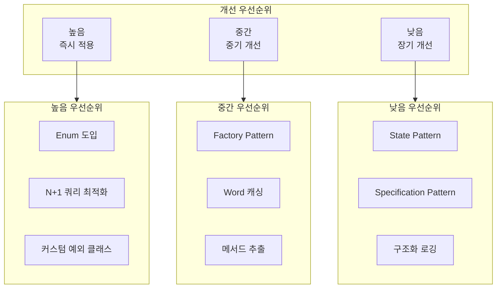
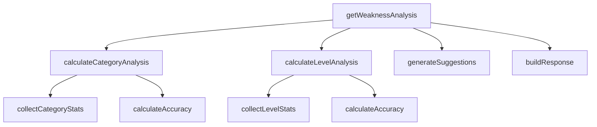
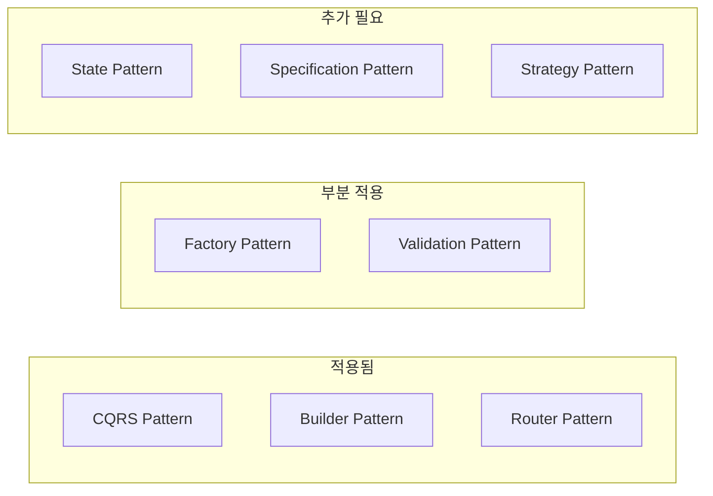
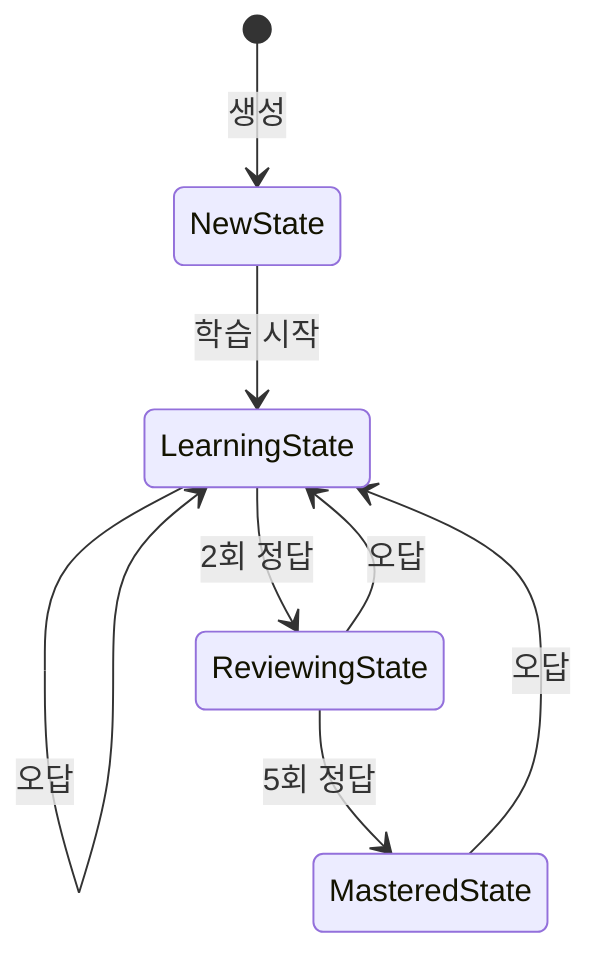
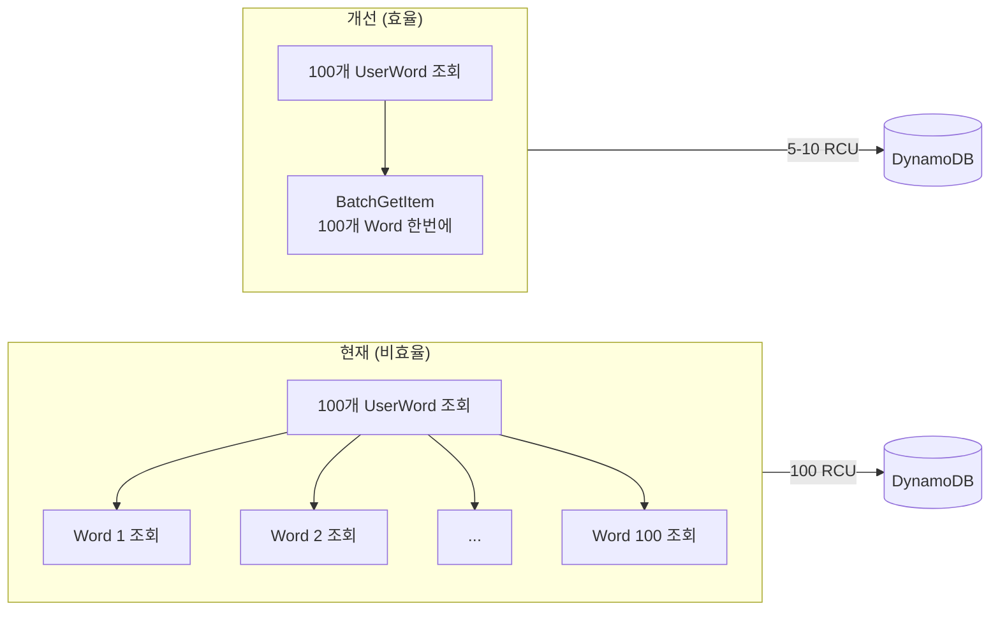
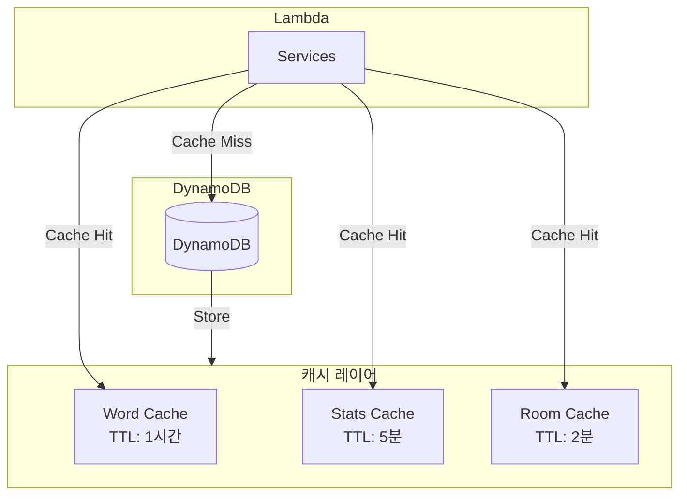
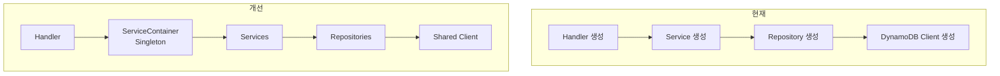
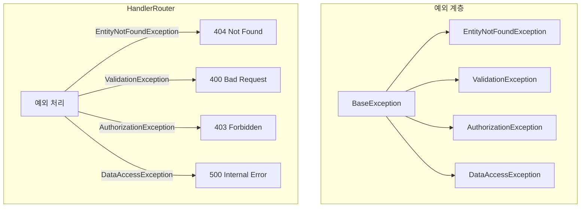
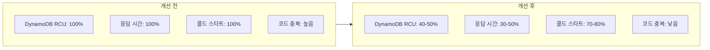

# Code Improvement Guide

## Overview

프로젝트 코드 분석을 통해 도출된 리팩토링, 디자인 패턴, 성능 최적화 방안입니다.



---

## 1. 리팩토링 필요 영역

### 1.1 중복 코드 패턴

#### UserWord 생성 로직 중복

**위치**: `UserWordService.java`, `UserWordCommandService.java`

```java
// 동일한 코드가 두 곳에서 반복
userWord = UserWord.builder()
        .pk("USER#" + userId)
        .sk("WORD#" + wordId)
        .gsi1pk("USER#" + userId + "#REVIEW")
        .gsi2pk("USER#" + userId + "#STATUS")
        .userId(userId)
        .wordId(wordId)
        .status("NEW")
        .interval(1)
        .easeFactor(2.5)
        .repetitions(0)
        .correctCount(0)
        .incorrectCount(0)
        .createdAt(now)
        .build();
```

**개선안**: Factory 메서드로 추출

```java
public class UserWordFactory {
    public static UserWord createNew(String userId, String wordId) {
        String now = Instant.now().toString();
        return UserWord.builder()
                .pk("USER#" + userId)
                .sk("WORD#" + wordId)
                .gsi1pk("USER#" + userId + "#REVIEW")
                .gsi2pk("USER#" + userId + "#STATUS")
                .userId(userId)
                .wordId(wordId)
                .status(WordStatus.NEW.name())
                .interval(1)
                .easeFactor(2.5)
                .repetitions(0)
                .correctCount(0)
                .incorrectCount(0)
                .createdAt(now)
                .build();
    }
}
```

---

#### 검증 로직 중복

**위치**: `DailyStudyService.java`, `DailyStudyCommandService.java`

```java
// 하드코딩된 검증
if (!level.equals("BEGINNER") && !level.equals("INTERMEDIATE") && !level.equals("ADVANCED")) {
    throw new IllegalArgumentException("Invalid level");
}
```

**개선안**: Enum 도입

```java
public enum StudyLevel {
    BEGINNER, INTERMEDIATE, ADVANCED;

    public static boolean isValid(String value) {
        return Arrays.stream(values())
                .anyMatch(l -> l.name().equals(value));
    }

    public static StudyLevel fromString(String value) {
        return Arrays.stream(values())
                .filter(l -> l.name().equals(value))
                .findFirst()
                .orElseThrow(() -> new IllegalArgumentException("Invalid level: " + value));
    }
}

// 사용
if (!StudyLevel.isValid(level)) {
    throw new ValidationException("Invalid level");
}
```

---

### 1.2 하드코딩된 값들

| 위치 | 하드코딩 값 | 권장 |
|------|-----------|------|
| `UserWordService.java` | `"USER#"`, `"WORD#"`, `"DATE#"` | DynamoDbKeyPrefix 클래스 |
| `DailyStudyService.java` | `NEW_WORDS_COUNT = 50` | Config 클래스 |
| `ChatRoomHandler.java` | `"beginner"`, `6`, `false` | ChatRoomDefaults 클래스 |
| `UserWordRepository.java` | `limit * 3` | 상수로 추출 |

**개선안**: 상수 클래스 생성

```java
public final class DynamoDbKeyPrefix {
    public static final String USER = "USER#";
    public static final String WORD = "WORD#";
    public static final String ROOM = "ROOM#";
    public static final String TOKEN = "TOKEN#";
    public static final String CONN = "CONN#";
    public static final String MSG = "MSG#";
    public static final String DATE = "DATE#";
    public static final String STATUS = "STATUS#";

    private DynamoDbKeyPrefix() {}
}

public final class StudyConfig {
    public static final int NEW_WORDS_COUNT = 50;
    public static final int REVIEW_WORDS_COUNT = 5;
    public static final double DEFAULT_EASE_FACTOR = 2.5;
    public static final int INITIAL_INTERVAL = 1;

    private StudyConfig() {}
}
```

---

### 1.3 긴 메서드 분할

#### StatsService.getWeaknessAnalysis() - 125줄



**개선안**: 메서드 추출

```java
public Map<String, Object> getWeaknessAnalysis(String userId) {
    List<UserWord> allUserWords = fetchAllUserWords(userId);
    Map<String, Word> wordMap = fetchWordMap(allUserWords);

    Map<String, Map<String, Object>> categoryAnalysis = calculateCategoryAnalysis(allUserWords, wordMap);
    Map<String, Map<String, Object>> levelAnalysis = calculateLevelAnalysis(allUserWords, wordMap);
    List<String> suggestions = generateSuggestions(categoryAnalysis, levelAnalysis);

    return buildWeaknessResponse(categoryAnalysis, levelAnalysis, suggestions);
}

private double calculateAccuracy(int correct, int incorrect) {
    int total = correct + incorrect;
    return total > 0 ? (correct * 100.0 / total) : 0;
}
```

---

## 2. 디자인 패턴

### 2.1 현재 적용된 패턴



#### CQRS (Command Query Responsibility Segregation)

**잘 적용됨**:
- `UserWordCommandService` / `UserWordQueryService`
- `WordCommandService` / `WordQueryService`
- `TestCommandService` / `TestQueryService`

**문제점**: 중복 로직이 있는 통합 Service 클래스 존재

---

### 2.2 적용 가능한 패턴

#### State Pattern - 학습 상태 관리

**현재 문제**:

```java
// 상태 전환 로직이 서비스에 혼재
if (userWord.getRepetitions() >= 5) {
    userWord.setStatus("MASTERED");
} else if (userWord.getRepetitions() >= 2) {
    userWord.setStatus("REVIEWING");
} else {
    userWord.setStatus("LEARNING");
}
```

**개선안**:



```java
public interface WordLearningState {
    WordLearningState processAnswer(boolean isCorrect, UserWord userWord);
    String getStatusName();
}

public class LearningState implements WordLearningState {
    @Override
    public WordLearningState processAnswer(boolean isCorrect, UserWord userWord) {
        if (isCorrect) {
            userWord.setRepetitions(userWord.getRepetitions() + 1);
            if (userWord.getRepetitions() >= 2) {
                return new ReviewingState();
            }
        } else {
            userWord.setRepetitions(0);
            userWord.setEaseFactor(Math.max(1.3, userWord.getEaseFactor() - 0.2));
        }
        return this;
    }

    @Override
    public String getStatusName() {
        return "LEARNING";
    }
}
```

---

#### Strategy Pattern - 검증 전략

```java
public interface ValidationStrategy {
    boolean validate(String value);
    String getErrorMessage();
}

public class LevelValidationStrategy implements ValidationStrategy {
    private static final Set<String> VALID_LEVELS =
            Set.of("BEGINNER", "INTERMEDIATE", "ADVANCED");

    @Override
    public boolean validate(String value) {
        return VALID_LEVELS.contains(value);
    }

    @Override
    public String getErrorMessage() {
        return "Level must be one of: " + String.join(", ", VALID_LEVELS);
    }
}
```

---

#### Specification Pattern - 복잡한 쿼리

```java
public interface UserWordSpecification {
    QueryConditional toQueryConditional(String userId);
}

public class BookmarkedSpecification implements UserWordSpecification {
    @Override
    public QueryConditional toQueryConditional(String userId) {
        return QueryConditional.keyEqualTo(
                Key.builder().partitionValue("USER#" + userId + "#BOOKMARK").build());
    }
}

public class ReviewDueSpecification implements UserWordSpecification {
    private final String date;

    @Override
    public QueryConditional toQueryConditional(String userId) {
        return QueryConditional.sortLessThanOrEqualTo(
                Key.builder()
                        .partitionValue("USER#" + userId + "#REVIEW")
                        .sortValue("DATE#" + date)
                        .build());
    }
}

// 사용
public PaginatedResult<UserWord> findBySpec(UserWordSpecification spec, String userId, int limit) {
    QueryConditional conditional = spec.toQueryConditional(userId);
    // ...
}
```

---

## 3. 성능 최적화

### 3.1 DynamoDB 쿼리 최적화

#### N+1 쿼리 문제



**문제 코드** (`StatsService.java`):

```java
// N+1 문제: 각 UserWord마다 Word 개별 조회
allUserWords.stream().map(uw -> {
    wordRepository.findById(uw.getWordId()).ifPresent(word -> {
        // ...
    });
})
```

**개선안**:

```java
// BatchGetItem 사용
List<String> wordIds = allUserWords.stream()
        .map(UserWord::getWordId)
        .collect(Collectors.toList());

Map<String, Word> wordMap = wordRepository.findByIds(wordIds).stream()
        .collect(Collectors.toMap(Word::getWordId, w -> w));

// O(1) 조회
allUserWords.stream().forEach(uw -> {
    Word word = wordMap.get(uw.getWordId());
    if (word != null) {
        // ...
    }
});
```

**Repository 메서드 추가**:

```java
public List<Word> findByIds(List<String> wordIds) {
    if (wordIds == null || wordIds.isEmpty()) {
        return Collections.emptyList();
    }

    List<Key> keys = wordIds.stream()
            .map(id -> Key.builder()
                    .partitionValue("WORD#" + id)
                    .sortValue("METADATA")
                    .build())
            .collect(Collectors.toList());

    ReadBatch readBatch = ReadBatch.builder(Word.class)
            .mappedTableResource(table)
            .addGetItem(keys.toArray(new Key[0]))
            .build();

    BatchGetResultPageIterable result = enhancedClient.batchGetItem(r -> r.readBatches(readBatch));

    return result.resultsForTable(table).stream().collect(Collectors.toList());
}
```

---

#### HashSet 활용

**문제 코드** (`DailyStudyService.java`):

```java
// O(n) 검색
if (!learnedWordIds.contains(word.getWordId())) {
    newWordIds.add(word.getWordId());
}
```

**개선안**:

```java
// O(1) 검색
Set<String> learnedWordIdSet = new HashSet<>(learnedWordIds);
Set<String> newWordIdSet = new HashSet<>();

for (Word word : wordPage.getItems()) {
    if (!learnedWordIdSet.contains(word.getWordId())
            && !newWordIdSet.contains(word.getWordId())) {
        newWordIdSet.add(word.getWordId());
    }
}
```

---

### 3.2 캐싱 전략



#### Word 데이터 캐싱

```java
public class WordCache {
    private static final LoadingCache<String, Optional<Word>> CACHE =
            CacheBuilder.newBuilder()
                    .expireAfterWrite(1, TimeUnit.HOURS)
                    .maximumSize(10000)
                    .build(new CacheLoader<String, Optional<Word>>() {
                        @Override
                        public Optional<Word> load(String wordId) {
                            return wordRepository.findById(wordId);
                        }
                    });

    private final WordRepository wordRepository;

    public Optional<Word> get(String wordId) {
        try {
            return CACHE.get(wordId);
        } catch (ExecutionException e) {
            return wordRepository.findById(wordId);
        }
    }

    public void invalidate(String wordId) {
        CACHE.invalidate(wordId);
    }
}
```

**예상 효과**:
- DynamoDB RCU 30-40% 감소
- 응답 시간 50-70% 단축

---

#### 통계 캐싱

```java
public class StatsCache {
    private static final Map<String, CachedStats> CACHE = new ConcurrentHashMap<>();
    private static final long TTL_MS = 5 * 60 * 1000; // 5분

    public Map<String, Object> getOrCompute(String userId, Supplier<Map<String, Object>> compute) {
        CachedStats cached = CACHE.get(userId);

        if (cached != null && !cached.isExpired()) {
            return cached.getStats();
        }

        Map<String, Object> stats = compute.get();
        CACHE.put(userId, new CachedStats(stats));
        return stats;
    }

    private static class CachedStats {
        private final Map<String, Object> stats;
        private final long timestamp;

        boolean isExpired() {
            return System.currentTimeMillis() - timestamp > TTL_MS;
        }
    }
}
```

---

### 3.3 콜드 스타트 최적화



**개선안**: ServiceContainer Singleton

```java
public class ServiceContainer {
    private static final ServiceContainer INSTANCE = new ServiceContainer();

    private final UserWordCommandService userWordCommandService;
    private final UserWordQueryService userWordQueryService;
    private final WordQueryService wordQueryService;
    private final TestCommandService testCommandService;
    // ...

    private ServiceContainer() {
        this.userWordCommandService = new UserWordCommandService();
        this.userWordQueryService = new UserWordQueryService();
        this.wordQueryService = new WordQueryService();
        this.testCommandService = new TestCommandService();
    }

    public static ServiceContainer getInstance() {
        return INSTANCE;
    }

    public UserWordCommandService getUserWordCommandService() {
        return userWordCommandService;
    }
    // ... getters
}

// Handler에서 사용
public class UserWordHandler {
    private final UserWordCommandService commandService;
    private final UserWordQueryService queryService;

    public UserWordHandler() {
        ServiceContainer container = ServiceContainer.getInstance();
        this.commandService = container.getUserWordCommandService();
        this.queryService = container.getUserWordQueryService();
    }
}
```

---

### 3.4 배치 처리 개선

#### Word 배치 저장

```java
public void saveBatch(List<Word> words) {
    if (words == null || words.isEmpty()) {
        return;
    }

    // DynamoDB BatchWriteItem 제한: 25개
    List<List<Word>> batches = Lists.partition(words, 25);

    for (List<Word> batch : batches) {
        WriteBatch.Builder<Word> writeBatchBuilder = WriteBatch.builder(Word.class)
                .mappedTableResource(table);

        for (Word word : batch) {
            writeBatchBuilder.addPutItem(word);
        }

        enhancedClient.batchWriteItem(r -> r.writeBatches(writeBatchBuilder.build()));
    }
}
```

---

## 4. 코드 품질

### 4.1 예외 처리 표준화



**예외 클래스 정의**:

```java
public abstract class BaseException extends RuntimeException {
    private final String errorCode;

    protected BaseException(String errorCode, String message) {
        super(message);
        this.errorCode = errorCode;
    }

    public String getErrorCode() {
        return errorCode;
    }
}

public class EntityNotFoundException extends BaseException {
    public EntityNotFoundException(String entity, String id) {
        super("NOT_FOUND", String.format("%s not found: %s", entity, id));
    }
}

public class ValidationException extends BaseException {
    public ValidationException(String message) {
        super("VALIDATION_ERROR", message);
    }
}
```

**HandlerRouter에서 처리**:

```java
private APIGatewayProxyResponseEvent handleException(Exception e) {
    if (e instanceof EntityNotFoundException) {
        return createResponse(404, ApiResponse.error(e.getMessage()));
    }
    if (e instanceof ValidationException) {
        return createResponse(400, ApiResponse.error(e.getMessage()));
    }
    if (e instanceof AuthorizationException) {
        return createResponse(403, ApiResponse.error(e.getMessage()));
    }

    logger.error("Unexpected error", e);
    return createResponse(500, ApiResponse.error("Internal server error"));
}
```

---

### 4.2 RequestValidator 활용 확대

```java
public class RequestValidator {
    private final List<String> errors = new ArrayList<>();

    public static RequestValidator create() {
        return new RequestValidator();
    }

    public RequestValidator requireNotEmpty(String value, String fieldName) {
        if (value == null || value.trim().isEmpty()) {
            errors.add(fieldName + " is required");
        }
        return this;
    }

    public RequestValidator requireInRange(Integer value, int min, int max, String fieldName) {
        if (value != null && (value < min || value > max)) {
            errors.add(fieldName + " must be between " + min + " and " + max);
        }
        return this;
    }

    public RequestValidator requireValidEnum(String value, Class<? extends Enum<?>> enumClass, String fieldName) {
        if (value != null) {
            boolean valid = Arrays.stream(enumClass.getEnumConstants())
                    .anyMatch(e -> e.name().equals(value));
            if (!valid) {
                errors.add(fieldName + " must be one of: " +
                        Arrays.toString(enumClass.getEnumConstants()));
            }
        }
        return this;
    }

    public ValidationResult build() {
        return new ValidationResult(errors);
    }
}

// 사용 예시
private APIGatewayProxyResponseEvent updateUserWord(APIGatewayProxyRequestEvent request) {
    String userId = getQueryParam(request, "userId");
    String wordId = getPathParam(request, "wordId");
    String difficulty = getQueryParam(request, "difficulty");

    ValidationResult validation = RequestValidator.create()
            .requireNotEmpty(userId, "userId")
            .requireNotEmpty(wordId, "wordId")
            .requireValidEnum(difficulty, Difficulty.class, "difficulty")
            .build();

    if (validation.isInvalid()) {
        return createResponse(400, ApiResponse.error(validation.getFirstError()));
    }

    // 비즈니스 로직
}
```

---

### 4.3 로깅 개선

#### 구조화된 로깅

```java
public class StructuredLogger {
    private static final Gson GSON = new Gson();
    private final Logger logger;

    public StructuredLogger(Class<?> clazz) {
        this.logger = LoggerFactory.getLogger(clazz);
    }

    public void info(String event, Map<String, Object> data) {
        if (logger.isInfoEnabled()) {
            Map<String, Object> log = new HashMap<>(data);
            log.put("event", event);
            log.put("timestamp", Instant.now().toString());
            logger.info("{}", GSON.toJson(log));
        }
    }

    public void error(String event, Map<String, Object> data, Throwable t) {
        Map<String, Object> log = new HashMap<>(data);
        log.put("event", event);
        log.put("timestamp", Instant.now().toString());
        log.put("errorType", t.getClass().getSimpleName());
        log.put("errorMessage", t.getMessage());
        logger.error("{}", GSON.toJson(log), t);
    }
}

// 사용
private static final StructuredLogger slog = new StructuredLogger(UserWordService.class);

public UserWord updateUserWord(String userId, String wordId, boolean isCorrect) {
    // ...
    slog.info("user_word_updated", Map.of(
            "userId", userId,
            "wordId", wordId,
            "isCorrect", isCorrect,
            "newStatus", userWord.getStatus()
    ));
    return userWord;
}
```

---

## 5. 개선 우선순위 및 일정

### 5.1 높음 우선순위 (즉시 적용)

| 항목 | 영향도 | 예상 소요 |
|------|--------|----------|
| Enum 도입 (StudyLevel, Difficulty, WordStatus) | 높음 | 4시간 |
| N+1 쿼리 최적화 (BatchGetItem, HashSet) | 높음 | 2시간 |
| 커스텀 예외 클래스 | 중간 | 1시간 |

### 5.2 중간 우선순위 (중기 개선)

| 항목 | 영향도 | 예상 소요 |
|------|--------|----------|
| Factory Pattern (UserWord, Word) | 중간 | 2시간 |
| Word 캐싱 (Guava LoadingCache) | 높음 | 3시간 |
| 메서드 추출 (StatsService, TestService) | 중간 | 3시간 |
| ServiceContainer Singleton | 중간 | 2시간 |

### 5.3 낮음 우선순위 (장기 개선)

| 항목 | 영향도 | 예상 소요 |
|------|--------|----------|
| State Pattern (WordLearningState) | 낮음 | 5시간 |
| Specification Pattern (쿼리 추상화) | 낮음 | 4시간 |
| 구조화 로깅 | 낮음 | 2시간 |
| RequestValidator 확대 적용 | 낮음 | 2시간 |

---

## 6. 예상 효과



| 지표 | 현재 | 개선 후 | 감소율 |
|------|------|--------|--------|
| DynamoDB RCU | 100 | 40-50 | 50-60% |
| 평균 응답 시간 | 200ms | 80-100ms | 50-60% |
| 콜드 스타트 시간 | 3s | 2-2.5s | 20-30% |
| 코드 라인 수 (중복) | 500+ | 200- | 60%+ |

---

**버전**: 1.0.0
**최종 업데이트**: 2026-01-09
**팀**: MZC 2nd Project Team
