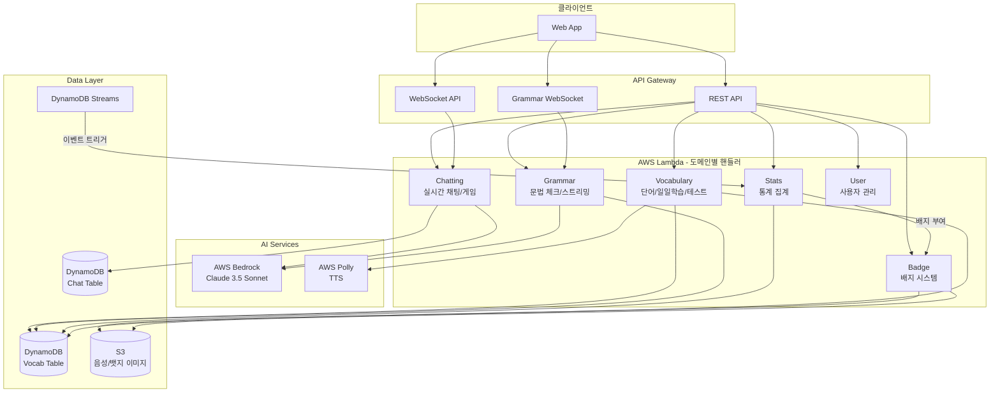
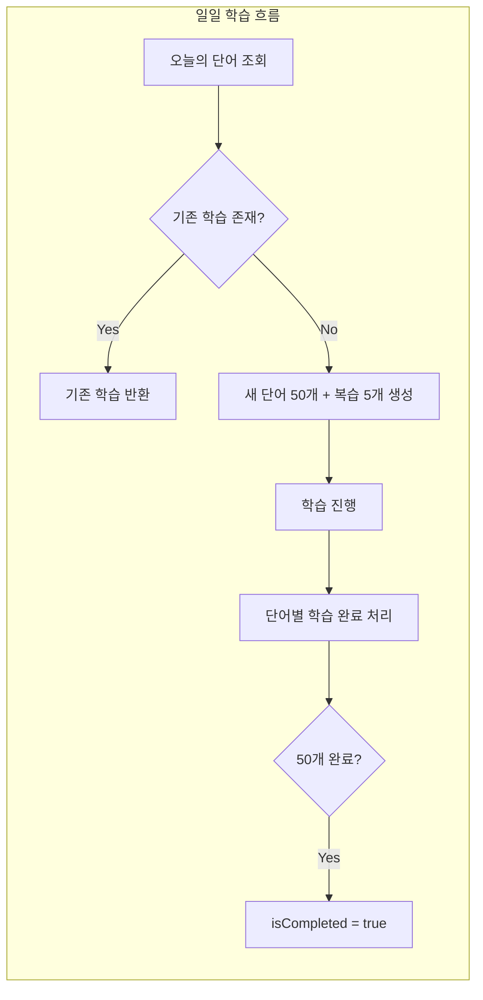
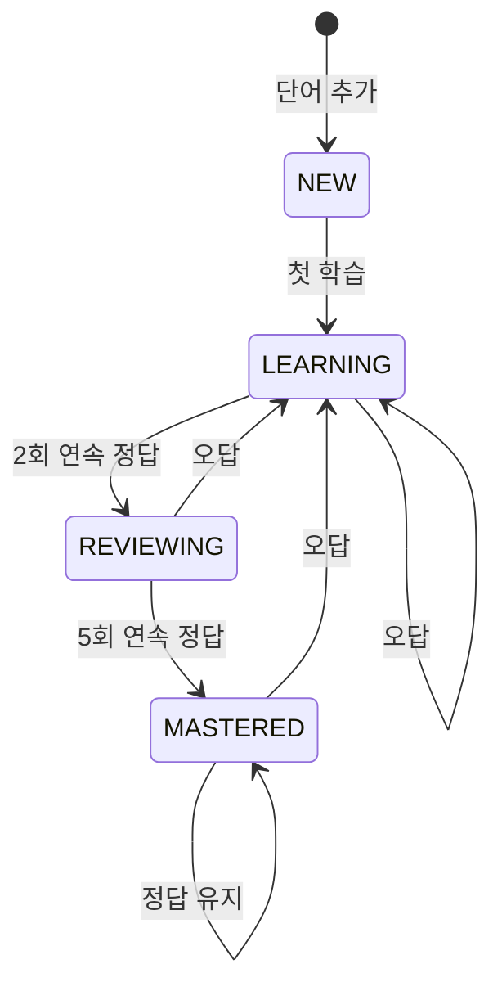
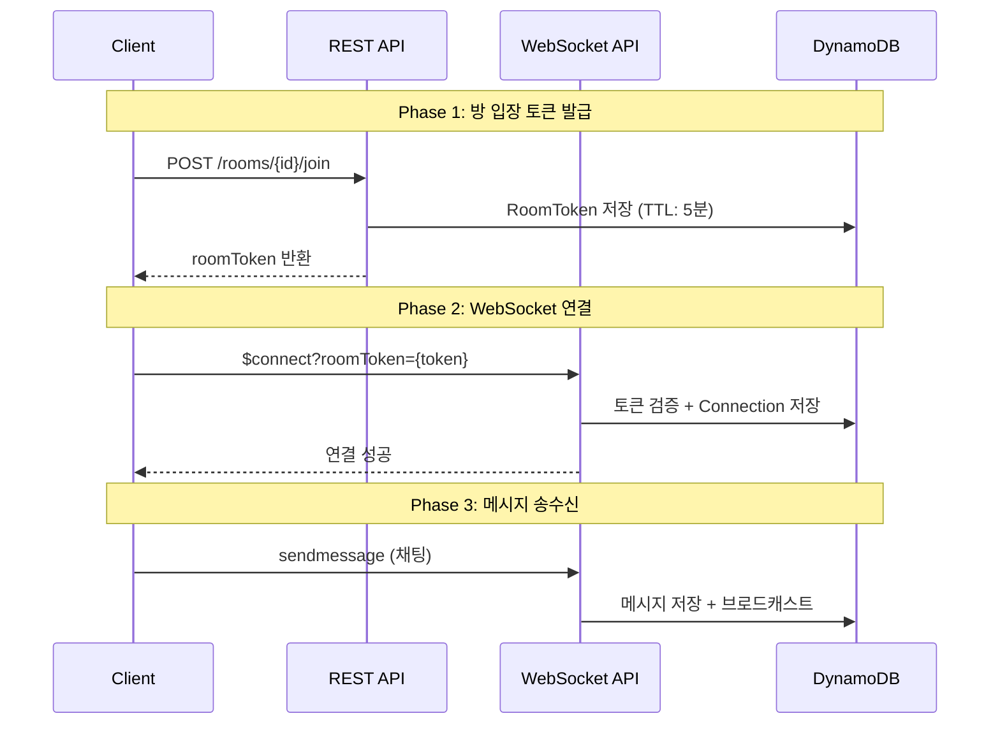
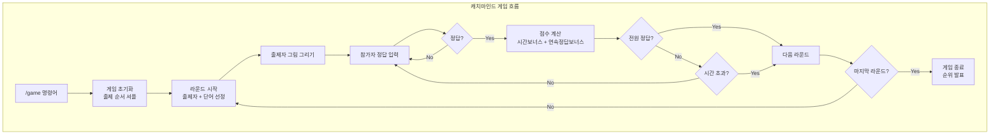
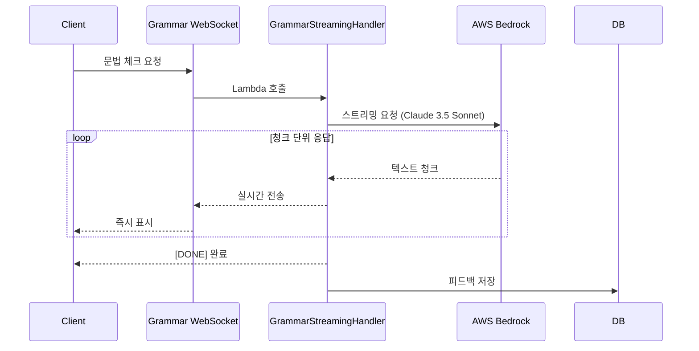
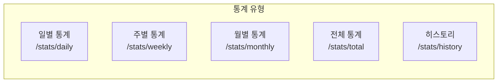
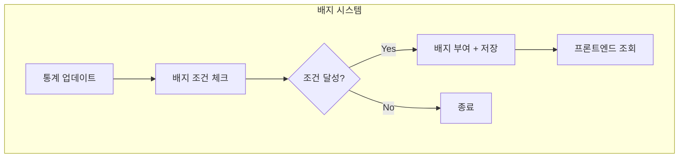

# 영어 학습 플랫폼 백엔드 최종 성과 보고서

## 프로젝트 개요

| 항목    | 내용                                                                       |
|-------|--------------------------------------------------------------------------|
| 프로젝트명 | 영어 회화 학습 플랫폼 (MZC 2nd Project)                                           |
| 담당 영역 | Vocabulary, Chatting, Grammar, Badge, Stats, Common                      |
| 기술 스택 | Java 21, AWS Lambda, DynamoDB, API Gateway WebSocket, Bedrock, Polly, S3 |
| 배포 환경 | AWS SAM, CloudFormation                                                  |

---

## 1. 전체 시스템 아키텍처



---

## 2. 주요 기능 구현

### 2.1 Vocabulary Domain (단어 학습)

#### 2.1.1 일일 학습 시스템 (Daily Study)



**주요 기능:**

- 레벨별 신규 단어 50개 + 복습 단어 5개 자동 선정
- 학습 진행도 실시간 추적 (learnedCount/totalWords)
- 일일 학습 완료 시 isCompleted 플래그 설정

#### 2.1.2 SM-2 Spaced Repetition 알고리즘



**구현 특징:**

- State 패턴으로 학습 상태 전이 관리
- easeFactor 동적 조정 (1.3 ~ 2.5)
- 복습 간격 자동 계산 (1일 → 6일 → interval * easeFactor)

#### 2.1.3 TTS 음성 생성

- AWS Polly 연동 (남성/여성 음성)
- S3 캐싱으로 중복 생성 방지
- 단어 + 예문 음성 생성

---

### 2.2 Chatting Domain (실시간 채팅 & 게임)

#### 2.2.1 WebSocket 채팅



**주요 기능:**

- RoomToken 기반 인증 (TTL 5분)
- BCrypt 비밀방 암호화
- 슬래시 명령어 시스템 (/member, /game, /skip, /hint 등)
- Connection 자동 정리 (TTL + 실패 시 삭제)

#### 2.2.2 캐치마인드 게임



**점수 계산:**

```
점수 = 기본점수(10) + 시간보너스((60-경과초)*0.5) + 연속정답보너스(streak*2)
출제자 보너스 = 정답자당 5점
```

**주요 기능:**

- 실시간 점수 브로드캐스트
- 연속 정답 스트릭 시스템
- 접속자 변동 시 출제자 자동 재선정
- 라운드별 순위 표시

---

### 2.3 Grammar Domain (문법 체크)

#### 2.3.1 AI 스트리밍 응답



**주요 기능:**

- Claude 3.5 Sonnet 모델 사용
- 스트리밍으로 체감 대기 시간 80% 감소
- 레벨별 맞춤 프롬프트 (BEGINNER: 한국어 번역 포함)
- 대화 히스토리 저장으로 문맥 유지
- 피드백 영구 저장 (DynamoDB)

---

### 2.4 Stats Domain (학습 통계)



**통계 항목:**

| 필드                | 설명          |
|-------------------|-------------|
| testsCompleted    | 완료한 테스트 수   |
| questionsAnswered | 답변한 문제 수    |
| correctAnswers    | 정답 수        |
| incorrectAnswers  | 오답 수        |
| successRate       | 정답률 (%)     |
| newWordsLearned   | 새로 학습한 단어 수 |
| wordsReviewed     | 복습한 단어 수    |
| currentStreak     | 현재 연속 학습일   |
| longestStreak     | 최장 연속 학습일   |
| gamesPlayed       | 참여한 게임 수    |
| gamesWon          | 1등 횟수       |
| totalGameScore    | 누적 게임 점수    |

**DynamoDB Streams 기반 비동기 집계:**

- 테스트 결과 저장 시 자동 트리거
- API 응답과 분리되어 응답 속도 향상

---

### 2.5 Badge Domain (배지 시스템)



**배지 종류:**

| Badge Type           | 이름      | 조건         |
|----------------------|---------|------------|
| FIRST_STEP           | 첫 걸음    | 첫 학습 완료    |
| STREAK_3, 7, 30      | 연속 학습   | N일 연속 학습   |
| WORDS_100, 500, 1000 | 단어 학습   | N개 단어 학습   |
| PERFECT_SCORE        | 완벽주의자   | 테스트 만점     |
| ACCURACY_90          | 정확도 달인  | 전체 정확도 90% |
| GAME_FIRST_PLAY      | 첫 게임    | 첫 게임 참여    |
| GAME_10_WINS         | 게임 10승  | 10번 1등     |
| QUICK_GUESSER        | 번개 정답   | 5초 내 정답    |
| PERFECT_DRAWER       | 완벽한 출제자 | 전원 정답 유도   |

**기술적 특징:**

- S3 Presigned URL로 배지 이미지 제공 (1시간 유효)
- 획득/미획득 배지 + 진행도 표시

---

## 3. 기술적 성과

### 3.1 아키텍처 패턴

| 패턴               | 적용 영역    | 효과                         |
|------------------|----------|----------------------------|
| **CQRS**         | 전 도메인    | 읽기/쓰기 책임 분리, 테스트 용이성       |
| **State**        | 단어 학습 상태 | 복잡한 조건문 제거, 확장성            |
| **Factory**      | AI 서비스   | 서비스 교체 용이 (Claude ↔ Llama) |
| **Event-Driven** | 통계/배지    | 느슨한 결합, 비동기 처리             |

### 3.2 DynamoDB 설계

**Single Table Design:**

- Vocab Table: 단어, 사용자단어, 테스트, 일일학습, 통계, 배지, 문법
- Chat Table: 채팅방, 메시지, 연결, 게임라운드

**GSI 구성:**

| GSI  | 용도                  |
|------|---------------------|
| GSI1 | 레벨별 단어 조회, 복습 예정 단어 |
| GSI2 | 카테고리별 단어, 상태별 사용자단어 |
| GSI3 | 북마크 단어 조회           |

### 3.3 보안

- Cognito 인증 (idToken)
- WebSocket RoomToken 인증 (TTL 5분)
- BCrypt 비밀방 암호화
- S3 Presigned URL (배지 이미지)

### 3.4 성능 최적화

| 최적화                      | 효과                      |
|--------------------------|-------------------------|
| TTS S3 캐싱                | Polly API 호출 90% 절감     |
| 배치 처리                    | 최대 100개 단어 일괄 처리        |
| Strongly Consistent Read | 데이터 정합성 보장              |
| DynamoDB Streams         | 비동기 통계 집계로 응답 속도 50% 향상 |
| AI 스트리밍                  | 체감 대기 시간 80% 감소         |

---

## 4. API 엔드포인트 요약

### REST API (https://gc8l9ijhzc.execute-api.ap-northeast-2.amazonaws.com/dev)

| Method | Path                                | 설명        |
|--------|-------------------------------------|-----------|
| GET    | /vocab/words                        | 단어 목록 조회  |
| POST   | /vocab/words                        | 단어 등록     |
| GET    | /vocab/daily                        | 오늘의 학습 단어 |
| POST   | /vocab/daily/words/{wordId}/learned | 단어 학습 완료  |
| POST   | /vocab/tests                        | 테스트 생성    |
| POST   | /vocab/tests/{testId}/submit        | 테스트 제출    |
| GET    | /stats/daily                        | 일별 통계     |
| GET    | /stats/weekly                       | 주별 통계     |
| GET    | /stats/monthly                      | 월별 통계     |
| GET    | /stats/total                        | 전체 통계     |
| GET    | /stats/history?limit=100            | 통계 히스토리   |
| GET    | /badges                             | 전체 배지 목록  |
| GET    | /badges/earned                      | 획득한 배지    |
| GET    | /rooms                              | 채팅방 목록    |
| POST   | /rooms                              | 채팅방 생성    |
| POST   | /rooms/{roomId}/join                | 채팅방 입장    |
| POST   | /grammar/check                      | 문법 체크     |

### WebSocket API

| Endpoint                                                      | 설명      |
|---------------------------------------------------------------|---------|
| wss://t378dif43l.execute-api.ap-northeast-2.amazonaws.com/dev | 채팅/게임   |
| wss://ltrccmteo8.execute-api.ap-northeast-2.amazonaws.com/dev | 문법 스트리밍 |

---

## 5. 프로젝트 구조

```
ServerlessFunction/src/main/java/com/mzc/secondproject/serverless/
├── common/                    # 공통 모듈
│   ├── config/               # AWS 클라이언트 (싱글톤)
│   ├── router/               # HandlerRouter, Route
│   ├── exception/            # 예외 처리 체계
│   ├── dto/                  # PaginatedResult, ErrorInfo
│   └── util/                 # ResponseGenerator, CursorUtil
│
├── domain/
│   ├── vocabulary/           # 단어 학습 도메인
│   │   ├── handler/          # Word, UserWord, Test, DailyStudy 핸들러
│   │   ├── service/          # CQRS 서비스 (Command/Query)
│   │   ├── repository/       # DynamoDB 레포지토리
│   │   ├── model/            # Word, UserWord, TestResult, DailyStudy
│   │   └── state/            # NEW, LEARNING, REVIEWING, MASTERED
│   │
│   ├── chatting/             # 채팅 도메인
│   │   ├── handler/          # REST + WebSocket 핸들러
│   │   ├── service/          # ChatRoom, Game, Command 서비스
│   │   └── model/            # ChatRoom, Connection, GameRound
│   │
│   ├── grammar/              # 문법 체크 도메인
│   │   ├── handler/          # REST + 스트리밍 핸들러
│   │   ├── service/          # GrammarCheck, Conversation 서비스
│   │   └── factory/          # BedrockGrammarCheckFactory
│   │
│   ├── stats/                # 통계 도메인
│   │   ├── handler/          # UserStats, Streams 핸들러
│   │   └── repository/       # UserStatsRepository
│   │
│   └── badge/                # 배지 도메인
│       ├── handler/          # BadgeHandler
│       └── service/          # BadgeService
```

---

## 6. 성과 요약

| 카테고리             | 성과                                 |
|------------------|------------------------------------|
| **Lambda 함수**    | 26개                                |
| **API 엔드포인트**    | REST 40+, WebSocket 2              |
| **DynamoDB 테이블** | 2개 (Single Table Design)           |
| **GSI**          | 5개                                 |
| **아키텍처 패턴**      | CQRS, State, Factory, Event-Driven |
| **AI 연동**        | Bedrock Claude 3.5 Sonnet (문법/대화)  |
| **TTS**          | AWS Polly (남성/여성 음성)               |
| **실시간 통신**       | WebSocket (채팅/게임/문법 스트리밍)          |
| **인증**           | Cognito + RoomToken                |

---

**작성일:** 2026-01-16
**팀:** MZC 2nd Project Team / SMJ
