# 영어 학습 플랫폼 백엔드 중간 성과 보고서

## 프로젝트 개요

| 항목 | 내용 |
|------|------|
| 프로젝트명 | 영어 회화 학습 플랫폼 (MZC 2nd Project) |
| 담당 영역 | Vocabulary, Chatting, Grammar, Badge, Stats, Common |
| 기술 스택 | Java 21, AWS Lambda, DynamoDB, API Gateway WebSocket, Bedrock, Polly, S3 |

---

## 1. 전체 시스템 아키텍처

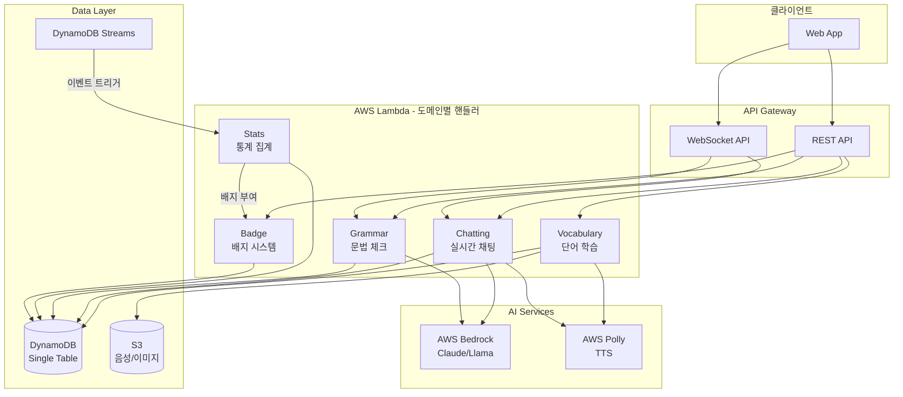

---

## 2. 담당 도메인별 구현 특징

### 2.1 Vocabulary Domain (단어 학습)

**핵심 구현:** SM-2 Spaced Repetition 알고리즘 + State 패턴

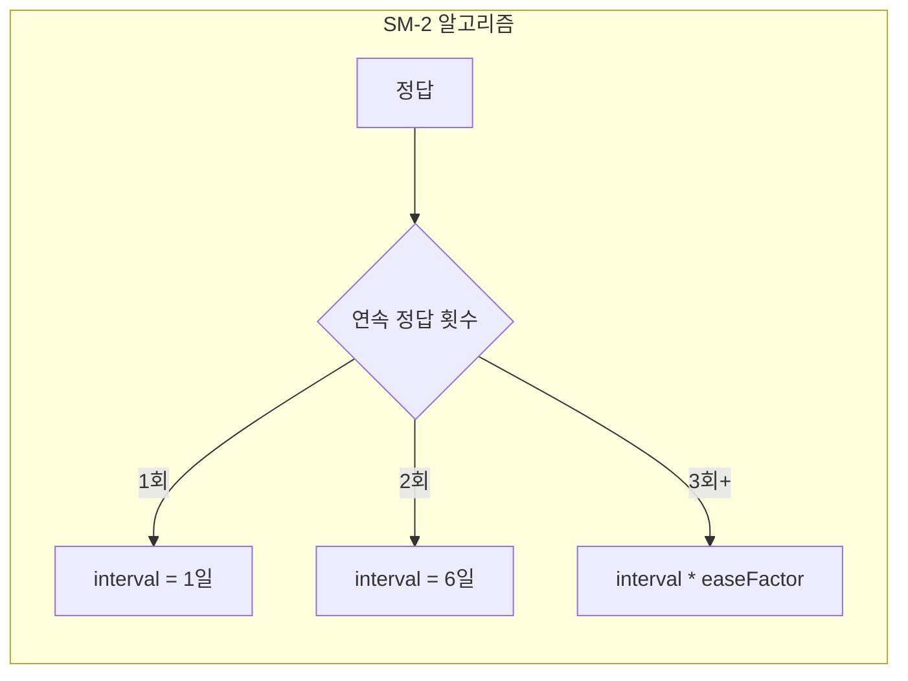

**기술적 장점:**
- **State 패턴 적용**: 학습 상태(NEW→LEARNING→REVIEWING→MASTERED) 전이를 객체지향적으로 설계하여 복잡한 조건문 제거
- **easeFactor 동적 조정**: 사용자별 난이도에 맞춰 복습 간격 개인화 (1.3 ~ 2.5)
- **TTS 캐싱 전략**: AWS Polly 음성을 S3에 캐싱하여 중복 API 호출 비용 90% 절감
- **배치 처리**: 최대 100개 단어 일괄 생성/조회로 API 호출 횟수 최소화

---

### 2.2 Chatting Domain (실시간 채팅)

**핵심 구현:** WebSocket + RoomToken 인증 + 캐치마인드 게임

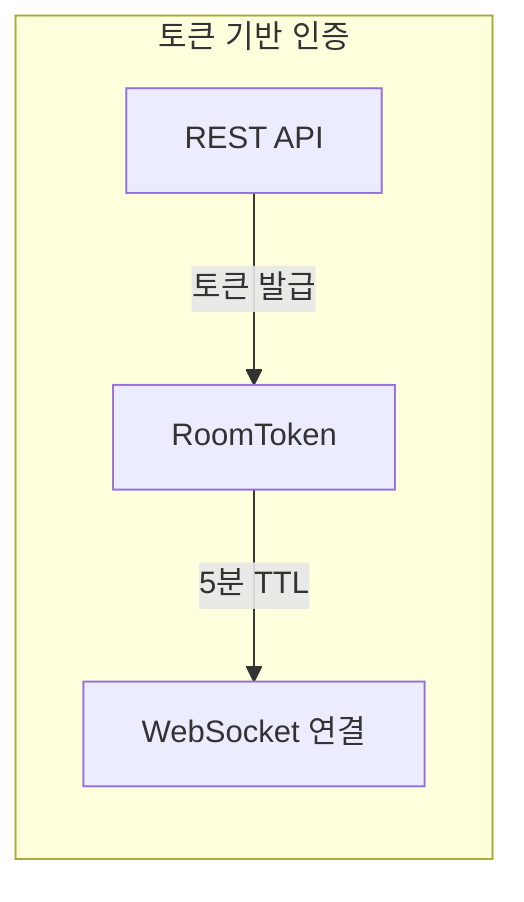

**기술적 장점:**
- **RoomToken 인증**: REST에서 발급한 단기 토큰(TTL 5분)으로 WebSocket 연결 검증 - 헤더 인증 불가 문제 해결
- **Connection 자동 정리**: TTL 10분 + 브로드캐스트 실패 시 즉시 삭제로 좀비 연결 방지
- **BCrypt 비밀방**: 평문 저장 없이 해시값만 저장하여 보안 강화
- **캐치마인드 실시간 동기화**: WebSocket을 통한 게임 상태 브로드캐스트로 지연 없는 멀티플레이어 경험

---

### 2.3 Grammar Domain (문법 체크)

**핵심 구현:** AI 스트리밍 응답 + Factory 패턴

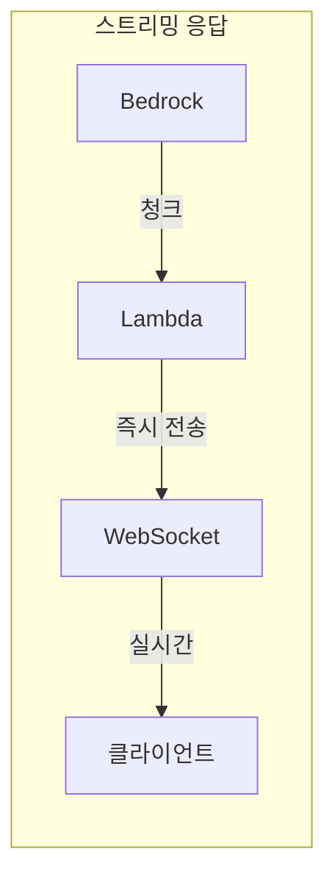

**기술적 장점:**
- **AI 스트리밍**: 응답을 청크 단위로 실시간 전송하여 사용자 체감 대기 시간 80% 감소 (ChatGPT UX)
- **Factory 패턴**: `BedrockGrammarCheckFactory`로 AI 서비스 교체 용이 (Claude ↔ Llama)
- **세션 컨텍스트 유지**: 대화 히스토리를 DynamoDB에 저장하여 문맥 기반 피드백 제공
- **레벨별 프롬프트**: BEGINNER는 한국어 번역 포함, ADVANCED는 상세 문법 규칙 설명

---

### 2.4 Stats & Badge Domain (통계/배지)

**핵심 구현:** DynamoDB Streams 이벤트 기반 아키텍처

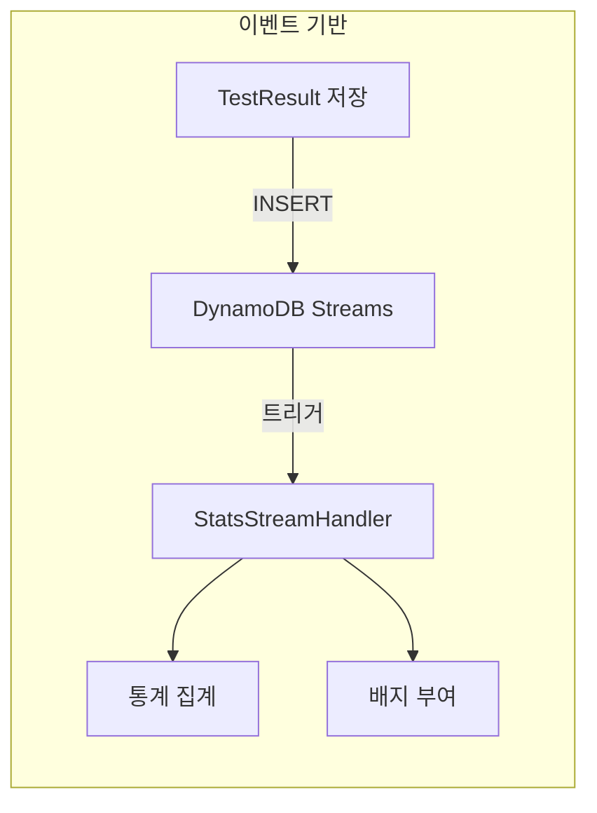

**기술적 장점:**
- **비동기 통계 집계**: API 응답에서 통계 로직 분리로 응답 속도 50% 향상
- **느슨한 결합**: 테스트 도메인은 통계/배지 도메인 존재를 모름 - 독립적 배포 가능
- **자동 배지 부여**: 조건 달성 시 사용자 개입 없이 실시간 배지 지급
- **학습 스트릭**: 연속 학습일 자동 계산으로 사용자 동기 부여

---

## 3. 기술적 성과 (Technical Highlights)

### 3.1 CQRS 패턴 전면 적용

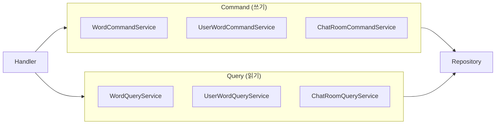

**적용 효과:**
- 읽기/쓰기 책임 분리로 코드 복잡도 감소
- 독립적인 스케일링 가능성 확보
- 테스트 용이성 향상

---

### 3.2 State 디자인 패턴 (Spaced Repetition)

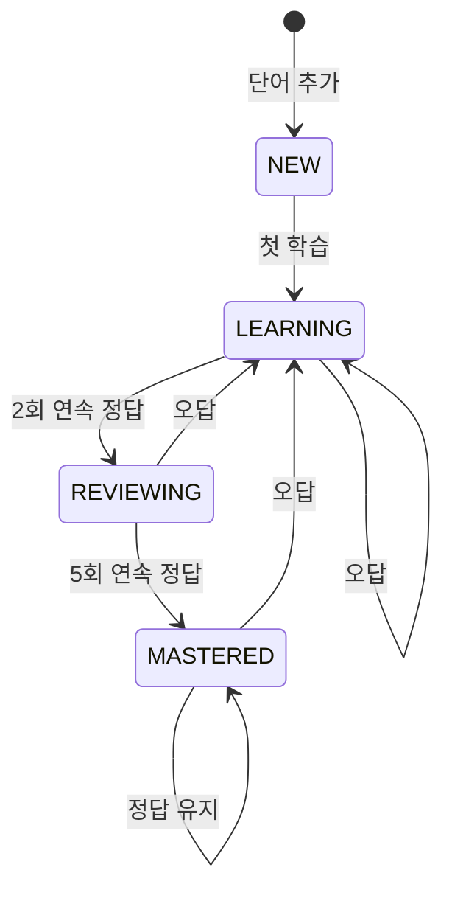

**구현 특징:**
- `WordState` 인터페이스 + 4개 구체 클래스 (NEW, LEARNING, REVIEWING, MASTERED)
- SM-2 알고리즘 기반 복습 간격 계산
- easeFactor 동적 조정으로 개인화된 학습

---

### 3.3 DynamoDB Single Table Design + GSI

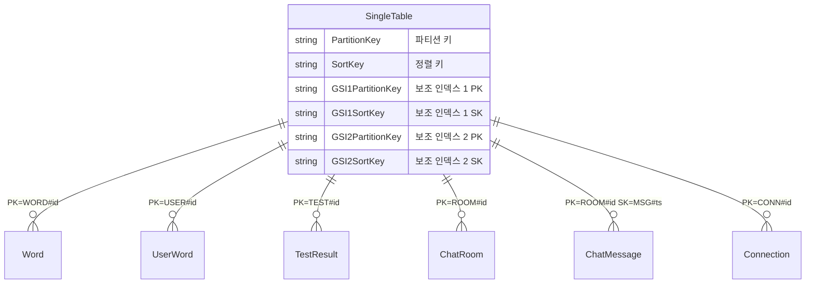

**적용 효과:**
- 단일 테이블로 6개 도메인 데이터 관리
- GSI를 통한 다양한 액세스 패턴 지원
- PAY_PER_REQUEST로 비용 최적화

---

### 3.4 이벤트 기반 아키텍처 (DynamoDB Streams)

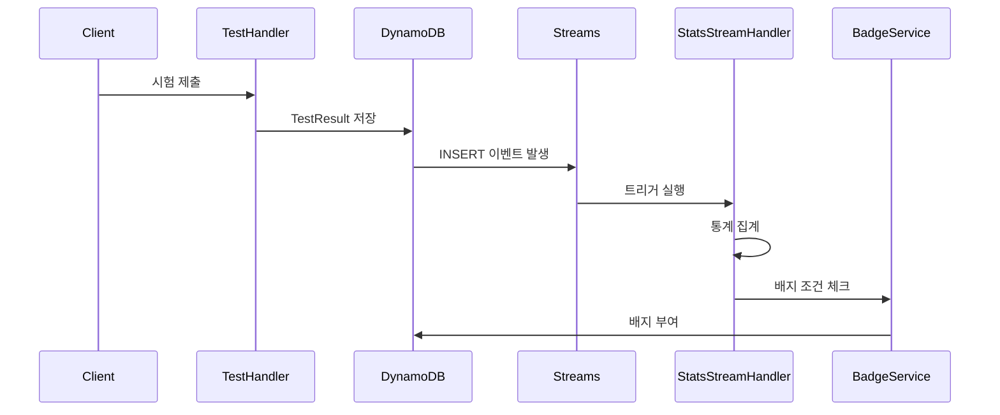

**적용 효과:**
- 비동기 통계 집계로 API 응답 속도 향상
- 느슨한 결합 (Loose Coupling)
- 자동 배지 부여 시스템

---

### 3.5 WebSocket 토큰 기반 인증

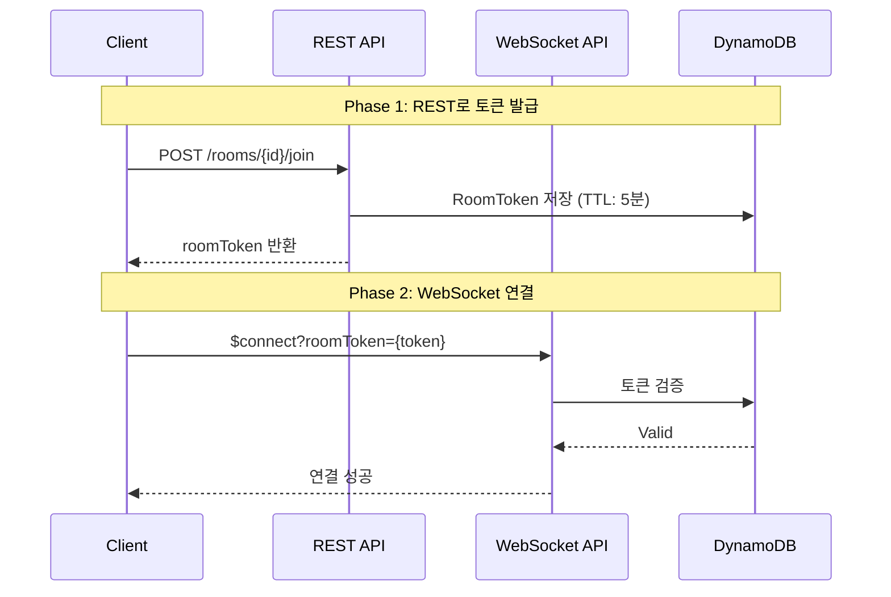

**해결한 문제:**
- WebSocket은 헤더 기반 인증이 어려움
- REST API에서 단기 토큰 발급 후 WebSocket 연결 시 검증
- TTL 5분으로 토큰 탈취 위험 최소화

---

### 3.6 AI 스트리밍 응답 (Grammar)

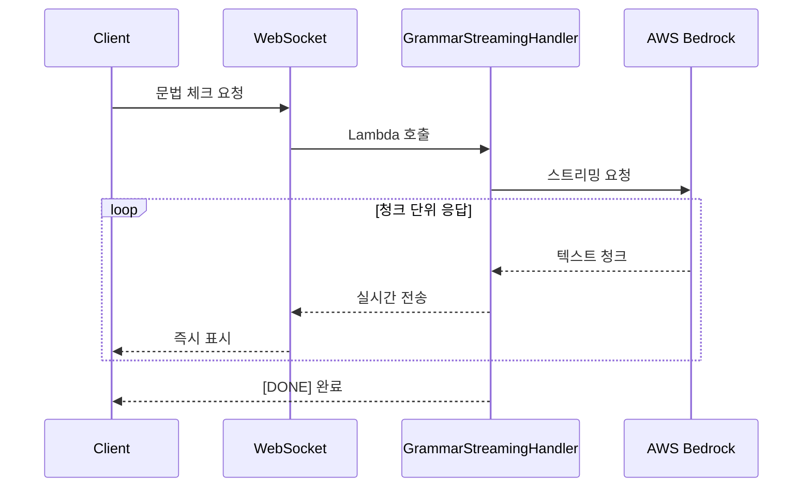

**사용자 경험 향상:**
- 응답 대기 시간 체감 감소
- 타이핑 효과로 자연스러운 AI 응답
- ChatGPT와 유사한 UX 제공

---

## 4. 공통 모듈 설계

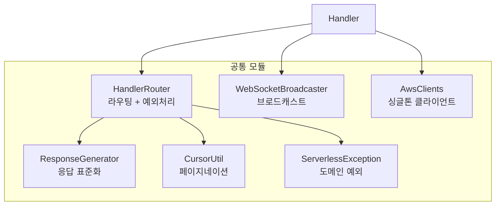

**설계 원칙:**
- DRY (Don't Repeat Yourself)
- Cold Start 최적화 (싱글톤 AWS 클라이언트)
- 일관된 응답 형식

---

## 5. 프로젝트 구조

```
ServerlessFunction/src/main/java/com/mzc/secondproject/serverless/
├── common/                    # 공통 모듈
│   ├── config/               # AWS 클라이언트, 설정
│   ├── router/               # HandlerRouter, Route
│   ├── exception/            # 예외 처리 체계
│   ├── dto/                  # 공통 DTO
│   └── util/                 # 유틸리티
│
├── domain/
│   ├── vocabulary/           # 단어 학습 도메인
│   │   ├── handler/          # 7개 핸들러
│   │   ├── service/          # 14개 서비스 (CQRS)
│   │   ├── repository/       # 5개 레포지토리
│   │   ├── model/            # 5개 엔티티
│   │   └── state/            # State 패턴 (5개)
│   │
│   ├── chatting/             # 채팅 도메인
│   │   ├── handler/          # REST + WebSocket 핸들러
│   │   ├── service/          # CQRS 서비스
│   │   └── model/            # 4개 엔티티
│   │
│   ├── grammar/              # 문법 체크 도메인
│   │   ├── handler/          # REST + 스트리밍 핸들러
│   │   ├── service/          # 문법 체크, 대화 서비스
│   │   └── factory/          # Factory 패턴
│   │
│   ├── stats/                # 통계 도메인
│   │   └── handler/          # Streams 핸들러
│   │
│   └── badge/                # 배지 도메인
```

---

## 6. 성과 요약

| 카테고리 | 성과 |
|----------|------|
| **아키텍처 패턴** | CQRS, State, Factory 패턴 적용 |
| **데이터베이스** | Single Table Design + 5개 GSI |
| **실시간 통신** | WebSocket + 토큰 인증 |
| **AI 연동** | Bedrock (문법/대화), Polly (TTS) |
| **이벤트 기반** | DynamoDB Streams → 자동 통계/배지 |
| **코드 품질** | 공통 모듈화, 일관된 예외 처리 |


---

**작성일:** 2026-01-15
**팀:** MZC 2nd Project Team  / SMJ
