# Chatting Server 가이드 문서

## 1. 개요

### 1.1 목적

Chatting Server는 영어 회화 학습 플랫폼의 실시간 채팅 기능을 담당하는 서버리스 마이크로서비스이다. 사용자들이 영어 난이도별 채팅방에 참여하여 실시간으로 대화하고, AI 응답 및 TTS 기능을 활용할 수 있다.

### 1.2 주요 기능

| 기능 | 설명 |
|------|------|
| 채팅방 관리 | 생성, 조회, 입장, 퇴장, 삭제 |
| 실시간 메시징 | WebSocket 기반 양방향 통신 |
| 토큰 인증 | REST → WebSocket 전환 시 RoomToken 검증 |
| 난이도별 필터링 | BEGINNER, INTERMEDIATE, ADVANCED |
| AI 응답 | AWS Bedrock 기반 AI 메시지 생성 |
| TTS (음성 합성) | AWS Polly 기반 음성 변환 |
| 비밀방 | BCrypt 암호화 비밀번호 지원 |

### 1.3 기술 스택

| 구분 | 기술 |
|------|------|
| Platform | AWS Lambda (Serverless) |
| Language | Java 21 (Eclipse Temurin) |
| Database | AWS DynamoDB (Single Table Design) |
| Real-time | API Gateway WebSocket |
| AI | AWS Bedrock (Claude/Llama) |
| TTS | AWS Polly |
| Storage | AWS S3 (음성 캐시) |

---

## 2. 시스템 아키텍처

### 2.1 전체 구조

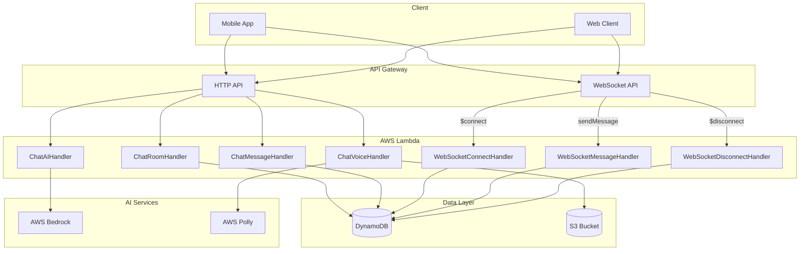

### 2.2 레이어 아키텍처

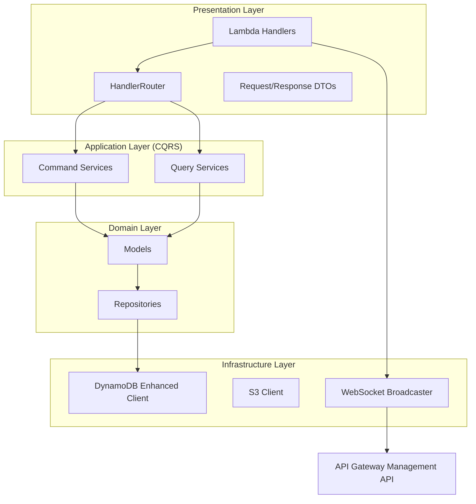

### 2.3 채팅방 생성 흐름

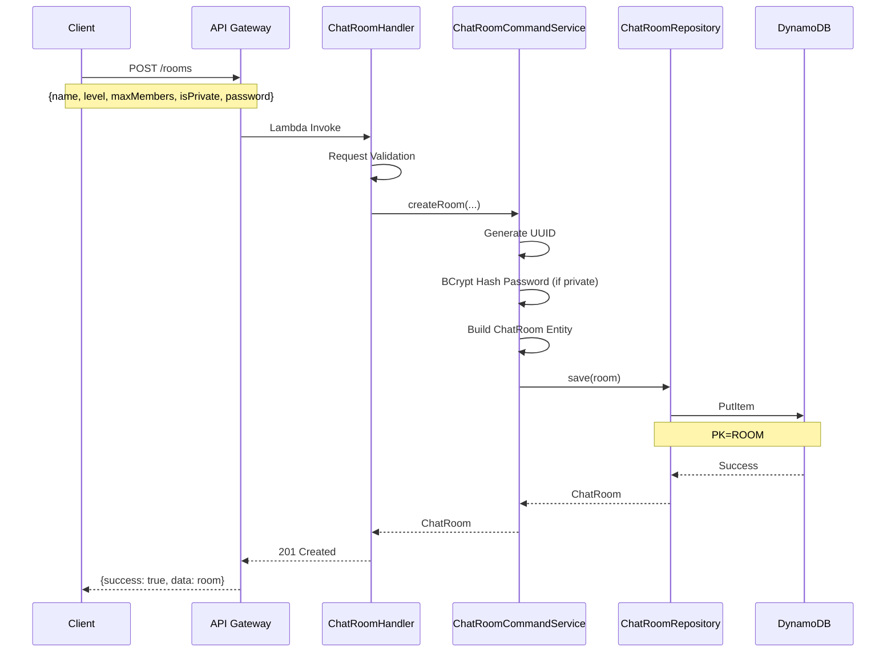

### 2.4 채팅방 입장 및 WebSocket 연결 흐름

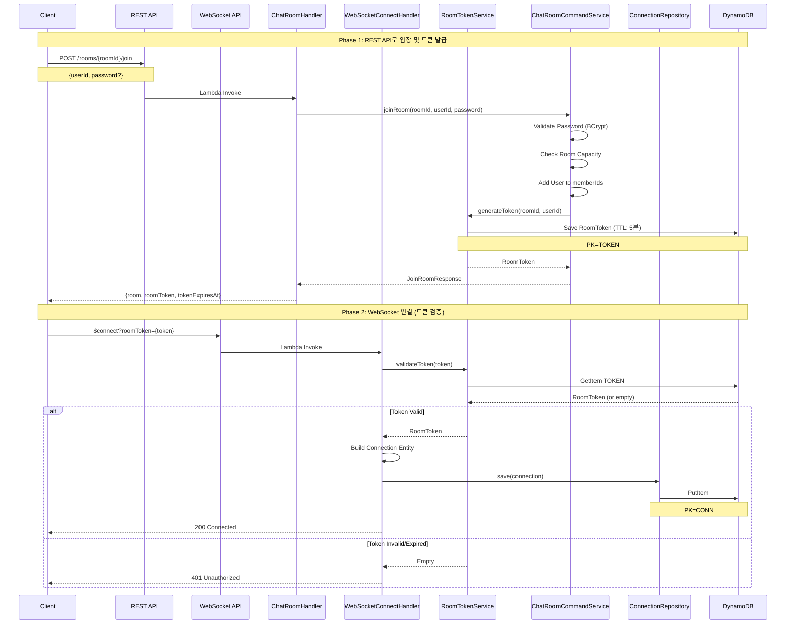

### 2.5 메시지 전송 및 브로드캐스트 흐름

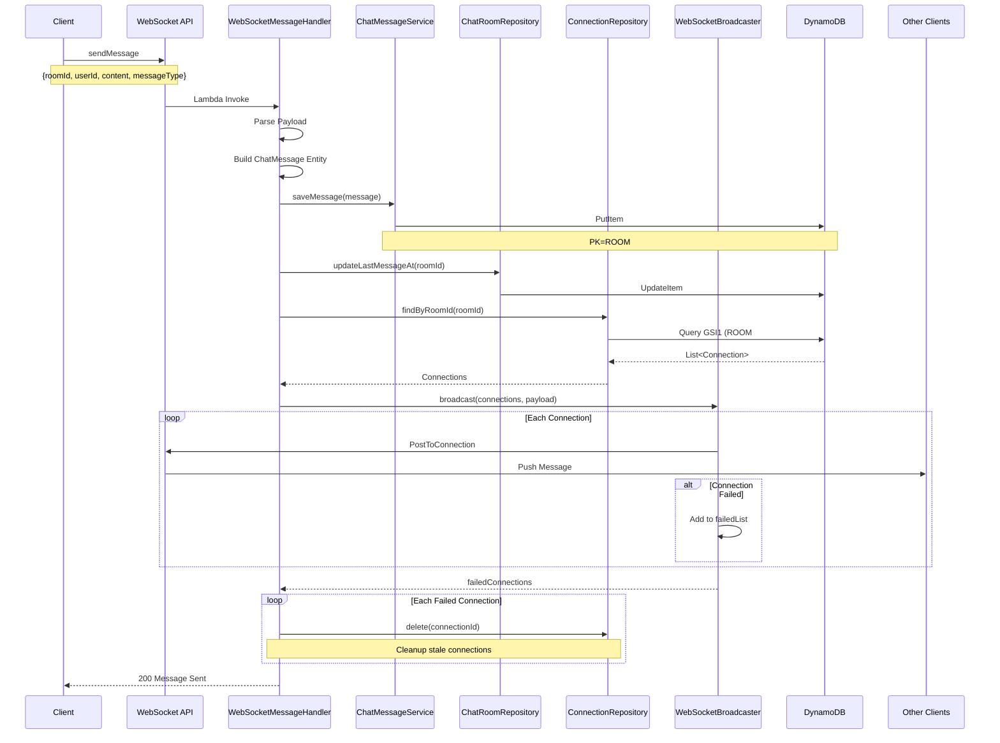

### 2.6 WebSocket 연결 해제 흐름

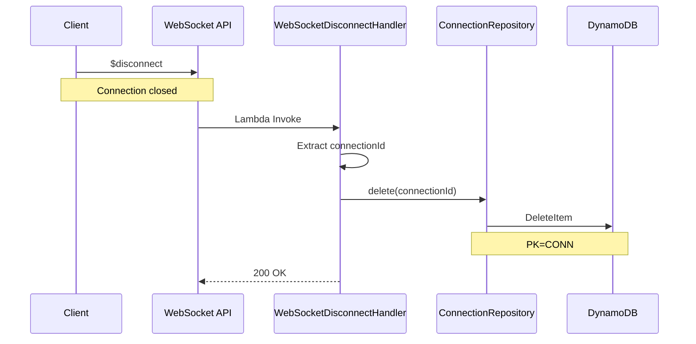

---

## 3. 데이터 모델

### 3.1 ERD (DynamoDB Single Table Design)

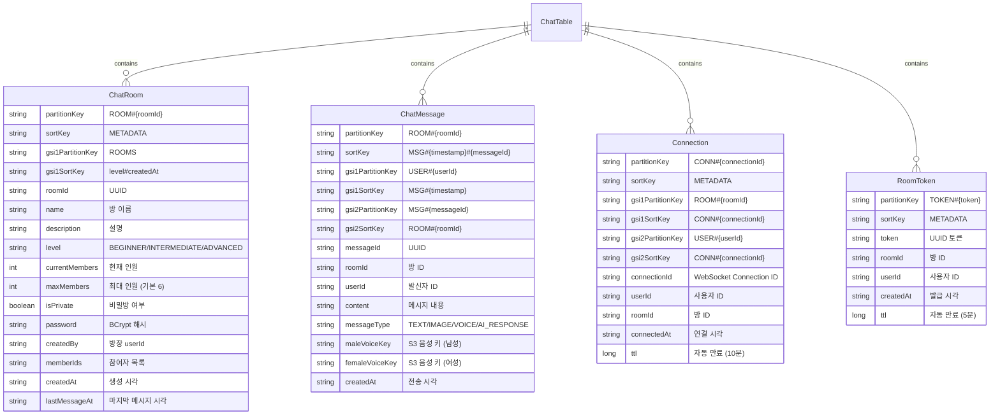

### 3.2 테이블 상세

#### ChatRoom (채팅방)

| 필드 | 타입 | 필수 | 설명 |
|------|------|------|------|
| PK | String | Y | ROOM#{roomId} |
| SK | String | Y | METADATA |
| GSI1PK | String | Y | ROOMS (전체 조회용) |
| GSI1SK | String | Y | {level}#{createdAt} (정렬) |
| roomId | String | Y | UUID |
| name | String | Y | 채팅방 이름 |
| description | String | N | 설명 |
| level | String | Y | beginner, intermediate, advanced |
| currentMembers | Integer | Y | 현재 참여 인원 |
| maxMembers | Integer | Y | 최대 인원 (기본: 6) |
| isPrivate | Boolean | Y | 비밀방 여부 |
| password | String | N | BCrypt 해시 비밀번호 |
| createdBy | String | Y | 방장 userId |
| memberIds | List | Y | 참여자 userId 목록 |
| createdAt | String | Y | ISO 8601 형식 |
| lastMessageAt | String | Y | 마지막 메시지 시각 |

#### ChatMessage (채팅 메시지)

| 필드 | 타입 | 필수 | 설명 |
|------|------|------|------|
| PK | String | Y | ROOM#{roomId} |
| SK | String | Y | MSG#{timestamp}#{messageId} |
| GSI1PK | String | Y | USER#{userId} |
| GSI1SK | String | Y | MSG#{timestamp} |
| GSI2PK | String | Y | MSG#{messageId} |
| GSI2SK | String | Y | ROOM#{roomId} |
| messageId | String | Y | UUID |
| roomId | String | Y | 채팅방 ID |
| userId | String | Y | 발신자 ID |
| content | String | Y | 메시지 내용 |
| messageType | String | Y | TEXT, IMAGE, VOICE, AI_RESPONSE |
| maleVoiceKey | String | N | S3 음성 파일 키 (남성) |
| femaleVoiceKey | String | N | S3 음성 파일 키 (여성) |
| createdAt | String | Y | ISO 8601 형식 |

#### Connection (WebSocket 연결)

| 필드 | 타입 | 필수 | 설명 |
|------|------|------|------|
| PK | String | Y | CONN#{connectionId} |
| SK | String | Y | METADATA |
| GSI1PK | String | Y | ROOM#{roomId} |
| GSI1SK | String | Y | CONN#{connectionId} |
| GSI2PK | String | Y | USER#{userId} |
| GSI2SK | String | Y | CONN#{connectionId} |
| connectionId | String | Y | API Gateway Connection ID |
| userId | String | Y | 사용자 ID |
| roomId | String | Y | 채팅방 ID |
| connectedAt | String | Y | 연결 시각 |
| ttl | Long | Y | DynamoDB TTL (10분 후 자동 삭제) |

#### RoomToken (입장 토큰)

| 필드 | 타입 | 필수 | 설명 |
|------|------|------|------|
| PK | String | Y | TOKEN#{token} |
| SK | String | Y | METADATA |
| token | String | Y | UUID 토큰 |
| roomId | String | Y | 채팅방 ID |
| userId | String | Y | 사용자 ID |
| createdAt | String | Y | 발급 시각 |
| ttl | Long | Y | DynamoDB TTL (5분 후 자동 삭제) |

### 3.3 GSI (Global Secondary Index) 설계

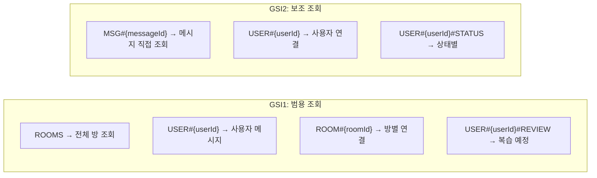

---

## 4. API 명세

### 4.1 채팅방 생성

#### POST /rooms

**Request**

```json
{
  "name": "English Beginners",
  "description": "영어 초보자를 위한 채팅방",
  "level": "beginner",
  "maxMembers": 6,
  "isPrivate": false,
  "password": null,
  "createdBy": "user123"
}
```

**Response (201 Created)**

```json
{
  "success": true,
  "message": "Room created",
  "data": {
    "roomId": "550e8400-e29b-41d4-a716-446655440000",
    "name": "English Beginners",
    "description": "영어 초보자를 위한 채팅방",
    "level": "beginner",
    "currentMembers": 1,
    "maxMembers": 6,
    "isPrivate": false,
    "createdBy": "user123",
    "memberIds": ["user123"],
    "createdAt": "2026-01-09T10:00:00Z",
    "lastMessageAt": "2026-01-09T10:00:00Z"
  }
}
```

### 4.2 채팅방 목록 조회

#### GET /rooms

**Query Parameters**

| 파라미터 | 타입 | 필수 | 설명 |
|---------|------|------|------|
| level | String | N | 난이도 필터 (beginner, intermediate, advanced) |
| userId | String | N | 사용자 ID (joined 필터 시 필수) |
| joined | String | N | "true"면 가입된 방만 조회 |
| cursor | String | N | 페이징 커서 |
| limit | Integer | N | 페이지 크기 (기본: 10, 최대: 20) |

**Response (200 OK)**

```json
{
  "success": true,
  "message": "Rooms retrieved",
  "data": {
    "rooms": [
      {
        "roomId": "...",
        "name": "English Beginners",
        "level": "beginner",
        "currentMembers": 3,
        "maxMembers": 6,
        "isPrivate": false,
        "lastMessageAt": "2026-01-09T10:30:00Z"
      }
    ],
    "nextCursor": "eyJQSyI6IlJPT00jLi4uIiwiU0siOiJNRVRBREFUQSJ9",
    "hasMore": true
  }
}
```

### 4.3 채팅방 상세 조회

#### GET /rooms/{roomId}

**Response (200 OK)**

```json
{
  "success": true,
  "message": "Room retrieved",
  "data": {
    "roomId": "550e8400-e29b-41d4-a716-446655440000",
    "name": "English Beginners",
    "description": "영어 초보자를 위한 채팅방",
    "level": "beginner",
    "currentMembers": 3,
    "maxMembers": 6,
    "isPrivate": false,
    "createdBy": "user123",
    "memberIds": ["user123", "user456", "user789"],
    "createdAt": "2026-01-09T10:00:00Z",
    "lastMessageAt": "2026-01-09T10:30:00Z"
  }
}
```

### 4.4 채팅방 입장

#### POST /rooms/{roomId}/join

**Request**

```json
{
  "userId": "user456",
  "password": "secret123"
}
```

**Response (200 OK)**

```json
{
  "success": true,
  "message": "Joined room",
  "data": {
    "room": {
      "roomId": "...",
      "name": "English Beginners",
      "currentMembers": 4
    },
    "roomToken": "a1b2c3d4-e5f6-7890-abcd-ef1234567890",
    "tokenExpiresAt": 1704793800
  }
}
```

### 4.5 채팅방 퇴장

#### POST /rooms/{roomId}/leave

**Request**

```json
{
  "userId": "user456"
}
```

**Response (200 OK)**

```json
{
  "success": true,
  "message": "Left room",
  "data": {
    "roomId": "...",
    "currentMembers": 3
  }
}
```

### 4.6 채팅방 삭제

#### DELETE /rooms/{roomId}?userId={userId}

**Response (200 OK)**

```json
{
  "success": true,
  "message": "Room deleted",
  "data": null
}
```

### 4.7 WebSocket 엔드포인트

#### $connect

**Query Parameter**

| 파라미터 | 타입 | 필수 | 설명 |
|---------|------|------|------|
| roomToken | String | Y | joinRoom에서 발급받은 토큰 |

**연결 URL 예시**

```
wss://api.example.com/ws?roomToken=a1b2c3d4-e5f6-7890-abcd-ef1234567890
```

#### sendMessage (Action)

**Payload**

```json
{
  "action": "sendMessage",
  "roomId": "550e8400-e29b-41d4-a716-446655440000",
  "userId": "user456",
  "content": "Hello everyone!",
  "messageType": "TEXT"
}
```

**Broadcast Payload (수신)**

```json
{
  "messageId": "msg-uuid-here",
  "roomId": "550e8400-e29b-41d4-a716-446655440000",
  "userId": "user456",
  "content": "Hello everyone!",
  "messageType": "TEXT",
  "createdAt": "2026-01-09T10:35:00Z"
}
```

---

## 5. 비즈니스 규칙

### 5.1 채팅방 상태 전이

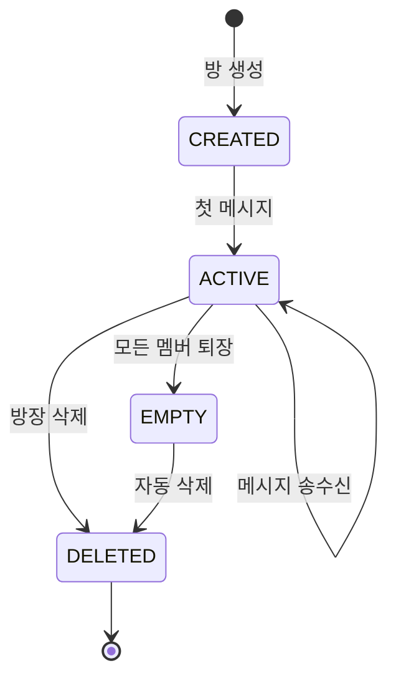

### 5.2 토큰 상태 전이

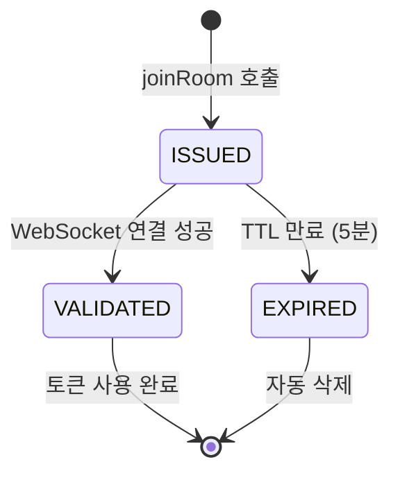

### 5.3 접근 제어

| 기능 | 조건 |
|------|------|
| 방 생성 | 모든 사용자 |
| 방 조회 | 모든 사용자 |
| 방 입장 | 비밀방인 경우 비밀번호 필요 |
| 방 퇴장 | 참여 멤버만 |
| 방 삭제 | 방장(createdBy)만 |
| WebSocket 연결 | 유효한 roomToken 필요 |

### 5.4 비밀번호 처리

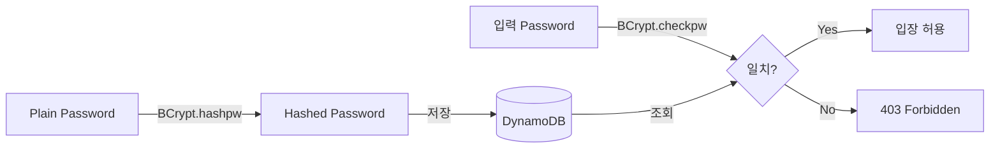

### 5.5 제한 사항

| 항목 | 제한 |
|------|------|
| 최대 참여 인원 | 기본 6명, 최대 설정 가능 |
| 방 목록 페이지 크기 | 최대 20 |
| RoomToken 유효 시간 | 5분 (300초) |
| Connection TTL | 10분 (600초) |
| 비밀번호 | BCrypt 해시 |

---

## 6. 에러 코드

### 6.1 HTTP 에러

| HTTP Code | 설명 | 예시 |
|-----------|------|------|
| 400 | 잘못된 요청 | 필수 파라미터 누락 |
| 401 | 인증 실패 | 유효하지 않은 토큰 |
| 403 | 권한 없음 | 비밀번호 불일치, 방장 아님 |
| 404 | 리소스 없음 | 존재하지 않는 방 |
| 409 | 충돌 | 정원 초과 |
| 500 | 서버 오류 | 내부 오류 |

### 6.2 에러 응답 형식

```json
{
  "success": false,
  "error": "Room not found"
}
```

---

## 7. 환경 설정

### 7.1 환경 변수 (template.yaml)

```yaml
Environment:
  Variables:
    CHAT_TABLE_NAME: ChatTable
    CHAT_BUCKET_NAME: group2-englishstudy
    ROOM_TOKEN_TTL_SECONDS: "300"
    AWS_REGION_NAME: ap-northeast-2
```

### 7.2 DynamoDB 테이블 설정

```yaml
ChatTable:
  Type: AWS::DynamoDB::Table
  Properties:
    TableName: ChatTable
    BillingMode: PAY_PER_REQUEST
    AttributeDefinitions:
      - AttributeName: PK
        AttributeType: S
      - AttributeName: SK
        AttributeType: S
      - AttributeName: GSI1PK
        AttributeType: S
      - AttributeName: GSI1SK
        AttributeType: S
      - AttributeName: GSI2PK
        AttributeType: S
      - AttributeName: GSI2SK
        AttributeType: S
    KeySchema:
      - AttributeName: PK
        KeyType: HASH
      - AttributeName: SK
        KeyType: RANGE
    GlobalSecondaryIndexes:
      - IndexName: GSI1
        KeySchema:
          - AttributeName: GSI1PK
            KeyType: HASH
          - AttributeName: GSI1SK
            KeyType: RANGE
        Projection:
          ProjectionType: ALL
      - IndexName: GSI2
        KeySchema:
          - AttributeName: GSI2PK
            KeyType: HASH
          - AttributeName: GSI2SK
            KeyType: RANGE
        Projection:
          ProjectionType: ALL
    TimeToLiveSpecification:
      AttributeName: ttl
      Enabled: true
```

### 7.3 API Gateway WebSocket 설정

```yaml
WebSocketApi:
  Type: AWS::ApiGatewayV2::Api
  Properties:
    Name: ChatWebSocketApi
    ProtocolType: WEBSOCKET
    RouteSelectionExpression: "$request.body.action"

Routes:
  - $connect → WebSocketConnectHandler
  - $disconnect → WebSocketDisconnectHandler
  - sendMessage → WebSocketMessageHandler
```

---

## 8. 프로젝트 구조

```
domain/chatting/
├── handler/
│   ├── ChatRoomHandler.java           # REST API - 채팅방 CRUD
│   ├── ChatMessageHandler.java        # REST API - 메시지 조회
│   ├── ChatAIHandler.java             # REST API - AI 응답
│   ├── ChatVoiceHandler.java          # REST API - TTS
│   └── websocket/
│       ├── WebSocketConnectHandler.java    # $connect
│       ├── WebSocketMessageHandler.java    # sendMessage
│       └── WebSocketDisconnectHandler.java # $disconnect
│
├── service/
│   ├── ChatRoomCommandService.java    # 방 변경 (CQRS Command)
│   ├── ChatRoomQueryService.java      # 방 조회 (CQRS Query)
│   ├── ChatMessageService.java        # 메시지 저장/조회
│   ├── RoomTokenService.java          # 토큰 발급/검증
│   └── BedrockService.java            # AI 응답 생성
│
├── repository/
│   ├── ChatRoomRepository.java        # 채팅방 데이터 접근
│   ├── ChatMessageRepository.java     # 메시지 데이터 접근
│   ├── ConnectionRepository.java      # WebSocket 연결 데이터 접근
│   └── RoomTokenRepository.java       # 토큰 데이터 접근
│
├── model/
│   ├── ChatRoom.java                  # 채팅방 엔티티
│   ├── ChatMessage.java               # 메시지 엔티티
│   ├── Connection.java                # 연결 엔티티
│   └── RoomToken.java                 # 토큰 엔티티
│
└── dto/
    ├── request/
    │   ├── CreateRoomRequest.java
    │   ├── JoinRoomRequest.java
    │   ├── LeaveRoomRequest.java
    │   └── SendMessageRequest.java
    └── response/
        └── JoinRoomResponse.java
```

---

## 9. 테스트

### 9.1 테스트 시나리오

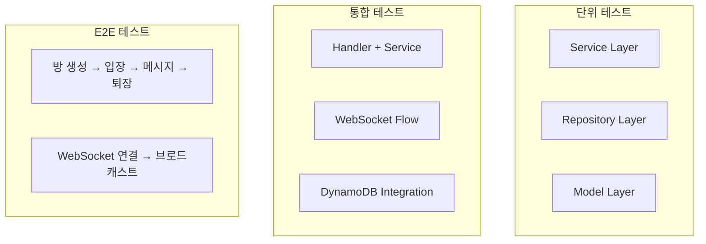

### 9.2 로컬 테스트

```bash
# SAM Local 실행
sam local start-api

# WebSocket 테스트 (wscat)
wscat -c "wss://localhost:3001?roomToken=test-token"
```

---

## 10. 구현 현황

### Phase 1 - 핵심 기능 (완료)

- [x] 채팅방 CRUD
- [x] REST API Handler
- [x] CQRS 패턴 적용
- [x] 커서 기반 페이징

### Phase 2 - 실시간 통신 (완료)

- [x] WebSocket 연결/해제
- [x] 메시지 브로드캐스트
- [x] RoomToken 인증
- [x] Connection 관리

### Phase 3 - 고급 기능 (완료)

- [x] 비밀방 (BCrypt)
- [x] 난이도별 필터링
- [x] AI 응답 (Bedrock)
- [x] TTS (Polly)

### Phase 4 - 최적화 (진행 중)

- [ ] 연결 상태 모니터링
- [ ] 메시지 캐싱
- [ ] 알림 기능 (SNS)

---

**버전**: 1.0.0
**최종 업데이트**: 2026-01-09
**팀**: MZC 2nd Project Team
