# Badge Domain 세부 보고서

## 1. 개요

Badge 도메인은 사용자의 학습 성취도에 따라 배지를 자동으로 부여하는 시스템입니다. 이벤트 기반 아키텍처를 통해 Stats, Vocabulary, Chatting 도메인과 연동되어 실시간으로 배지를 체크하고
부여합니다.

---

## 2. 전체 아키텍처

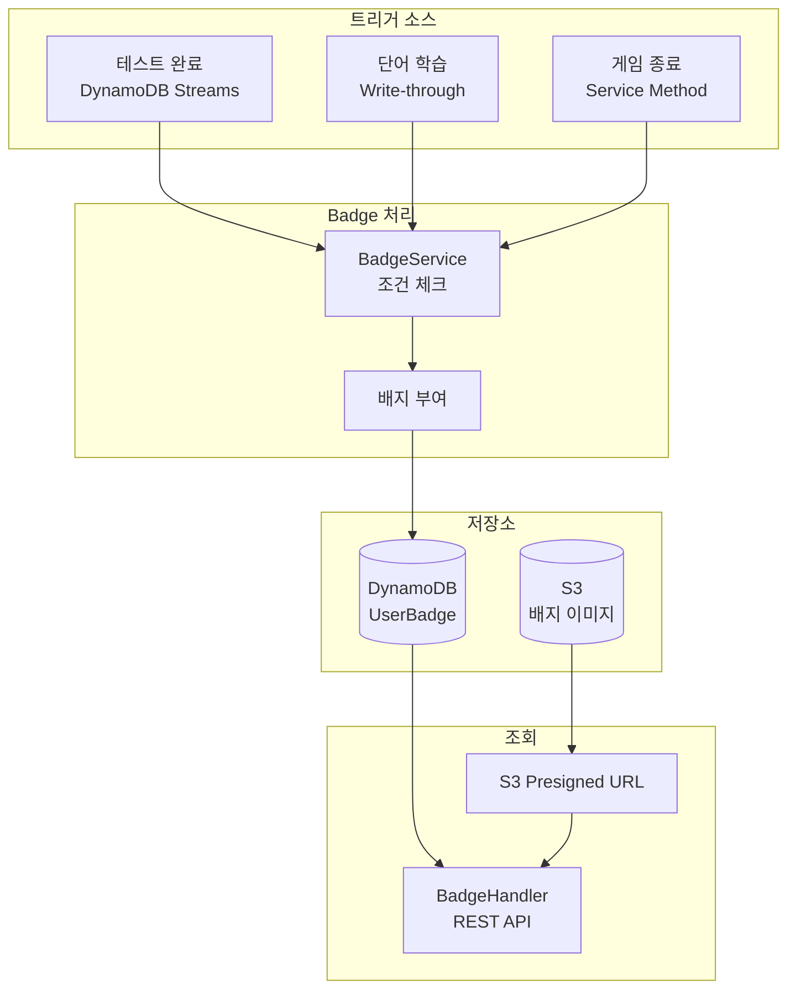

---

## 3. 배지 종류

### 3.1 배지 카테고리

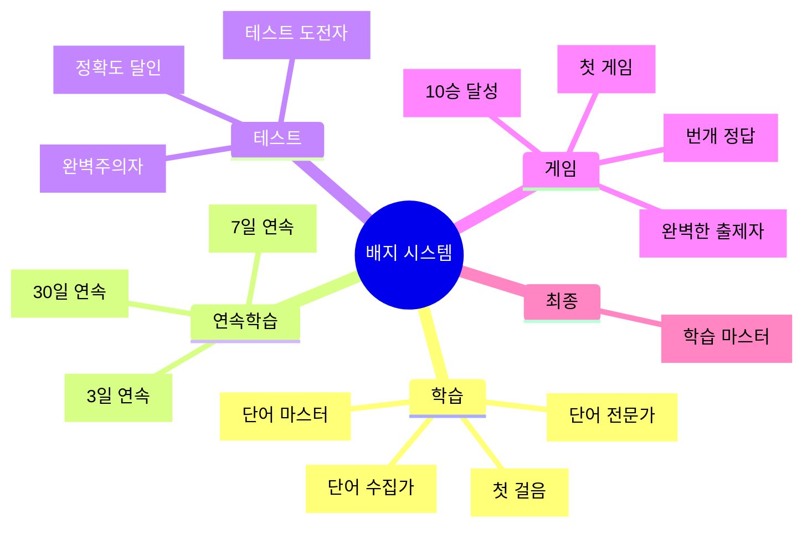

### 3.2 배지 상세

| Badge Type      | 이름        | 설명                 | 카테고리            | 조건                    |
|-----------------|-----------|--------------------|-----------------|-----------------------|
| FIRST_STEP      | 첫 걸음      | 첫 학습을 완료했습니다       | FIRST_STUDY     | testsCompleted >= 1   |
| STREAK_3        | 3일 연속 학습  | 3일 연속으로 학습했습니다     | STREAK          | currentStreak >= 3    |
| STREAK_7        | 일주일 연속 학습 | 7일 연속으로 학습했습니다     | STREAK          | currentStreak >= 7    |
| STREAK_30       | 한 달 연속 학습 | 30일 연속으로 학습했습니다    | STREAK          | currentStreak >= 30   |
| WORDS_100       | 단어 수집가    | 100개의 단어를 학습했습니다   | WORDS_LEARNED   | totalWords >= 100     |
| WORDS_500       | 단어 전문가    | 500개의 단어를 학습했습니다   | WORDS_LEARNED   | totalWords >= 500     |
| WORDS_1000      | 단어 마스터    | 1000개의 단어를 학습했습니다  | WORDS_LEARNED   | totalWords >= 1000    |
| PERFECT_SCORE   | 완벽주의자     | 테스트에서 만점을 받았습니다    | PERFECT_TEST    | incorrectAnswers == 0 |
| TEST_10         | 테스트 도전자   | 10회의 테스트를 완료했습니다   | TESTS_COMPLETED | testsCompleted >= 10  |
| ACCURACY_90     | 정확도 달인    | 전체 정확도 90%를 달성했습니다 | ACCURACY        | successRate >= 90     |
| GAME_FIRST_PLAY | 첫 게임      | 첫 게임에 참여했습니다       | GAMES_PLAYED    | gamesPlayed >= 1      |
| GAME_10_WINS    | 게임 10승    | 게임에서 10번 1등을 했습니다  | GAMES_WON       | gamesWon >= 10        |
| QUICK_GUESSER   | 번개 정답     | 5초 내에 정답을 맞췄습니다    | QUICK_GUESSES   | quickGuesses >= 1     |
| PERFECT_DRAWER  | 완벽한 출제자   | 출제 시 전원이 정답을 맞췄습니다 | PERFECT_DRAWS   | perfectDraws >= 1     |
| MASTER          | 학습 마스터    | 모든 업적을 달성했습니다      | ALL_BADGES      | 모든 배지 획득              |

---

## 4. 배지 부여 흐름

### 4.1 테스트 완료 시

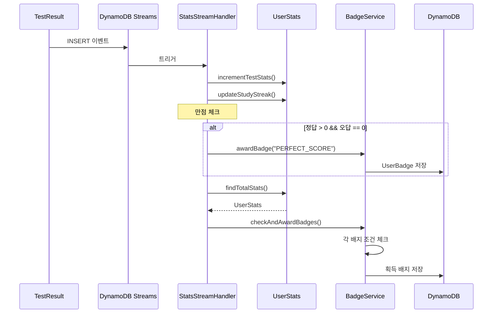

### 4.2 단어 학습 시

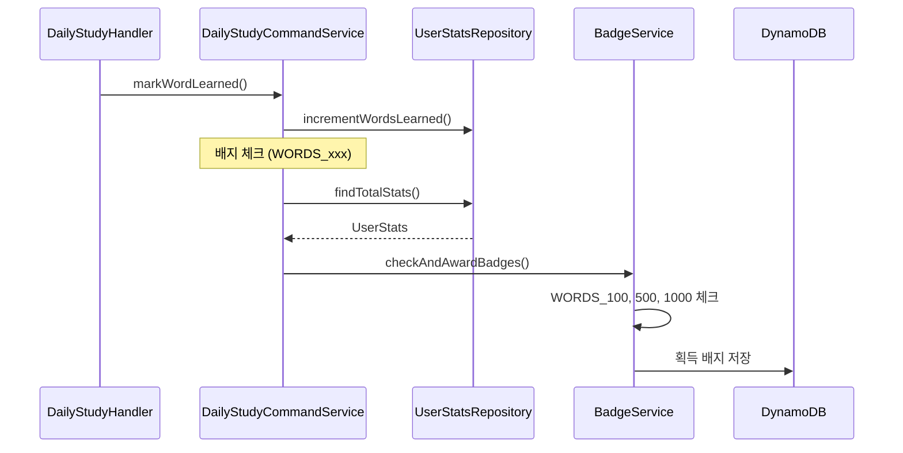

### 4.3 게임 종료 시

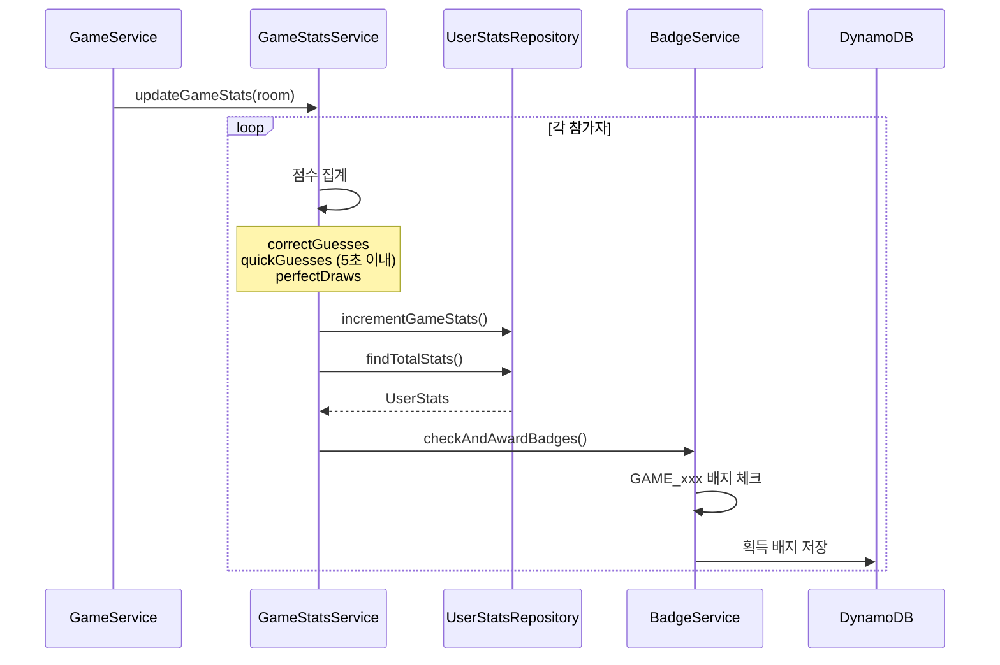

---

## 5. 배지 조건 체크 로직

### 5.1 카테고리별 조건

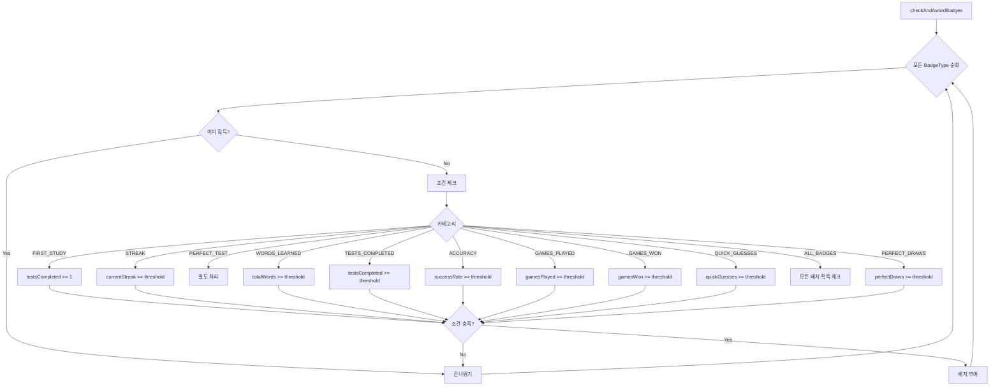

### 5.2 Switch Expression 패턴

```java
private boolean checkBadgeCondition(BadgeType type, UserStats stats) {
	return switch (type.getCategory()) {
		case "FIRST_STUDY" -> stats.getTestsCompleted() != null && stats.getTestsCompleted() >= 1;
		
		case "STREAK" -> stats.getCurrentStreak() != null &&
				stats.getCurrentStreak() >= type.getThreshold();
		
		case "WORDS_LEARNED" -> {
			int total = (stats.getNewWordsLearned() != null ? stats.getNewWordsLearned() : 0)
					+ (stats.getWordsReviewed() != null ? stats.getWordsReviewed() : 0);
			yield total >= type.getThreshold();
		}
		
		case "ACCURACY" -> {
			if (stats.getQuestionsAnswered() == null || stats.getQuestionsAnswered() == 0)
				yield false;
			double accuracy = (stats.getCorrectAnswers() * 100.0) / stats.getQuestionsAnswered();
			yield accuracy >= type.getThreshold();
		}
		
		case "TESTS_COMPLETED" -> stats.getTestsCompleted() != null &&
				stats.getTestsCompleted() >= type.getThreshold();
		
		case "GAMES_PLAYED" -> stats.getGamesPlayed() != null &&
				stats.getGamesPlayed() >= type.getThreshold();
		
		case "GAMES_WON" -> stats.getGamesWon() != null &&
				stats.getGamesWon() >= type.getThreshold();
		
		case "QUICK_GUESSES" -> stats.getQuickGuesses() != null &&
				stats.getQuickGuesses() >= type.getThreshold();
		
		case "PERFECT_DRAWS" -> stats.getPerfectDraws() != null &&
				stats.getPerfectDraws() >= type.getThreshold();
		
		case "PERFECT_TEST" -> false;  // 별도 처리 (StatsStreamHandler)
		case "ALL_BADGES" -> false;    // 특수 로직 필요
		
		default -> false;
	};
}
```

---

## 6. API 엔드포인트

### 6.1 REST API

| Method | Endpoint       | 설명             | 응답          |
|--------|----------------|----------------|-------------|
| GET    | /badges        | 전체 배지 목록 + 진행도 | BadgeInfo[] |
| GET    | /badges/earned | 획득한 배지만 조회     | UserBadge[] |

### 6.2 전체 배지 조회 응답

```json
{
  "message": "Badges retrieved",
  "data": {
    "badges": [
      {
        "badgeType": "FIRST_STEP",
        "name": "첫 걸음",
        "description": "첫 학습을 완료했습니다",
        "imageUrl": "https://...presigned.../badges/first_step.png",
        "category": "FIRST_STUDY",
        "threshold": 1,
        "progress": 1,
        "earned": true,
        "earnedAt": "2026-01-16T10:30:45.123Z"
      },
      {
        "badgeType": "WORDS_100",
        "name": "단어 수집가",
        "description": "100개의 단어를 학습했습니다",
        "imageUrl": "https://...presigned.../badges/words_100.png",
        "category": "WORDS_LEARNED",
        "threshold": 100,
        "progress": 45,
        "earned": false,
        "earnedAt": null
      }
    ],
    "totalCount": 16,
    "earnedCount": 8
  }
}
```

### 6.3 획득 배지 조회 응답

```json
{
  "message": "Earned badges retrieved",
  "data": {
    "badges": [
      {
        "badgeType": "FIRST_STEP",
        "name": "첫 걸음",
        "description": "첫 학습을 완료했습니다",
        "imageUrl": "https://...presigned.../badges/first_step.png",
        "category": "FIRST_STUDY",
        "threshold": 1,
        "progress": 1,
        "earnedAt": "2026-01-16T10:30:45.123Z"
      }
    ],
    "count": 8
  }
}
```

---

## 7. 데이터 모델

### 7.1 UserBadge

```java

@DynamoDbBean
public class UserBadge {
	// 기본 키
	String pk;          // USER#{userId}#BADGE
	String sk;          // BADGE#{badgeType}
	
	// GSI (전체 배지 조회)
	String gsi1pk;      // BADGE#ALL
	String gsi1sk;      // EARNED#{earnedAt}
	
	// 메타데이터
	String odUserId;
	String badgeType;   // BadgeType enum 이름
	String name;
	String description;
	String imageUrl;
	String category;
	Integer threshold;
	Integer progress;   // 획득 시점 진행도
	
	// 타임스탬프
	String earnedAt;
	String createdAt;
}
```

### 7.2 DynamoDB 키 구조

| 필드     | 패턴                  | 예시                          |
|--------|---------------------|-----------------------------|
| PK     | USER#{userId}#BADGE | USER#abc123#BADGE           |
| SK     | BADGE#{badgeType}   | BADGE#STREAK_7              |
| GSI1PK | BADGE#ALL           | BADGE#ALL                   |
| GSI1SK | EARNED#{earnedAt}   | EARNED#2026-01-16T10:30:45Z |

### 7.3 BadgeType Enum

```java
public enum BadgeType {
	FIRST_STEP("첫 걸음", "첫 학습을 완료했습니다",
			"FIRST_STUDY", 1, "first_step.png"),
	STREAK_3("3일 연속 학습", "3일 연속으로 학습했습니다",
			"STREAK", 3, "streak_3.png"),
	STREAK_7("일주일 연속 학습", "7일 연속으로 학습했습니다",
			"STREAK", 7, "streak_7.png"),
	// ... 생략
	MASTER("학습 마스터", "모든 업적을 달성했습니다",
			"ALL_BADGES", 1, "master.png");
	
	private final String name;
	private final String description;
	private final String category;
	private final int threshold;
	private final String imageFile;
}
```

---

## 8. 진행도 계산

### 8.1 카테고리별 진행도

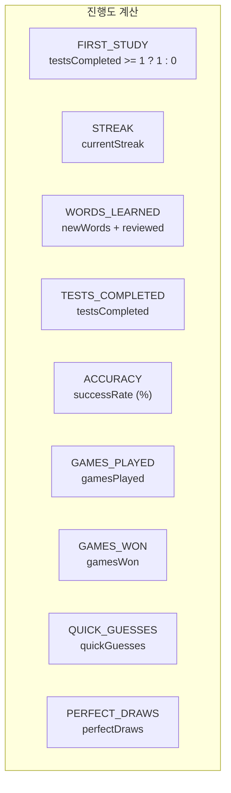

### 8.2 calculateProgress 메서드

```java
private int calculateProgress(BadgeType type, UserStats stats) {
	return switch (type.getCategory()) {
		case "FIRST_STUDY" -> (stats.getTestsCompleted() != null && stats.getTestsCompleted() >= 1) ? 1 : 0;
		
		case "STREAK" -> stats.getCurrentStreak() != null ? stats.getCurrentStreak() : 0;
		
		case "WORDS_LEARNED" -> {
			int newWords = stats.getNewWordsLearned() != null ? stats.getNewWordsLearned() : 0;
			int reviewed = stats.getWordsReviewed() != null ? stats.getWordsReviewed() : 0;
			yield newWords + reviewed;
		}
		
		case "TESTS_COMPLETED" -> stats.getTestsCompleted() != null ? stats.getTestsCompleted() : 0;
		
		case "ACCURACY" -> {
			if (stats.getQuestionsAnswered() == null || stats.getQuestionsAnswered() == 0)
				yield 0;
			yield (int) ((stats.getCorrectAnswers() * 100.0) / stats.getQuestionsAnswered());
		}
		
		case "GAMES_PLAYED" -> stats.getGamesPlayed() != null ? stats.getGamesPlayed() : 0;
		
		case "GAMES_WON" -> stats.getGamesWon() != null ? stats.getGamesWon() : 0;
		
		case "QUICK_GUESSES" -> stats.getQuickGuesses() != null ? stats.getQuickGuesses() : 0;
		
		case "PERFECT_DRAWS" -> stats.getPerfectDraws() != null ? stats.getPerfectDraws() : 0;
		
		default -> 0;
	};
}
```

---

## 9. 멱등성 보장

### 9.1 중복 부여 방지 흐름

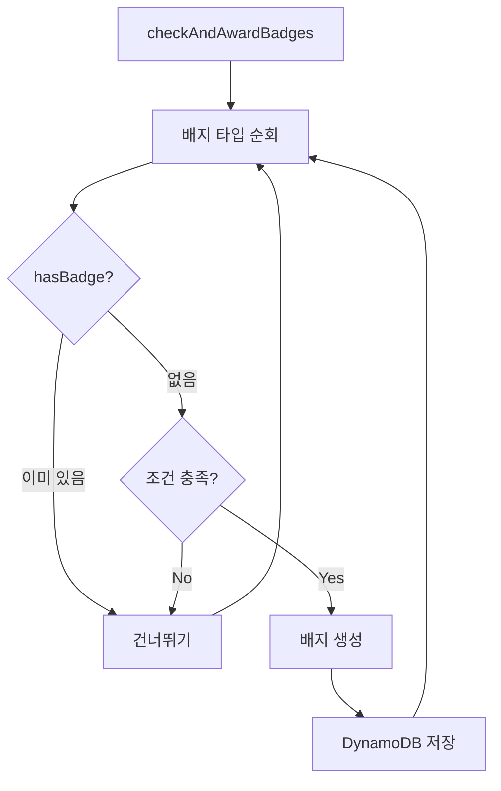

### 9.2 구현 코드

```java
public List<UserBadge> checkAndAwardBadges(String userId, UserStats stats) {
	List<UserBadge> newBadges = new ArrayList<>();
	String now = Instant.now().toString();
	
	for (BadgeType type : BadgeType.values()) {
		// 1. 이미 획득한 배지는 건너뛰기
		if (badgeRepository.hasBadge(userId, type.name())) {
			continue;
		}
		
		// 2. 조건 체크
		if (checkBadgeCondition(type, stats)) {
			// 3. 배지 생성 및 저장
			UserBadge badge = createBadge(userId, type, now);
			badgeRepository.save(badge);
			newBadges.add(badge);
		}
	}
	
	return newBadges;
}
```

---

## 10. S3 이미지 연동

### 10.1 Presigned URL 생성

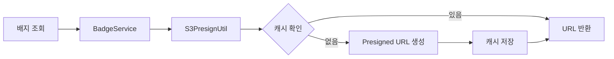

### 10.2 이미지 URL 생성

```java
// S3PresignUtil.java
public static String getBadgeImageUrl(String imageFile) {
	return getPresignedUrl("badges/" + imageFile);
}

// BadgeService - 배지 생성 시
private UserBadge createBadge(String userId, BadgeType type, String now) {
	return UserBadge.builder()
			.pk(BadgeKey.userBadgePk(userId))
			.sk(BadgeKey.badgeSk(type.name()))
			.gsi1pk(BadgeKey.BADGE_ALL)
			.gsi1sk(BadgeKey.earnedSk(now))
			.odUserId(userId)
			.badgeType(type.name())
			.name(type.getName())
			.description(type.getDescription())
			.imageUrl(S3PresignUtil.getBadgeImageUrl(type.getImageFile()))
			.category(type.getCategory())
			.threshold(type.getThreshold())
			.earnedAt(now)
			.createdAt(now)
			.build();
}
```

### 10.3 S3 버킷 구조

```
s3://group2-englishstudy/
└── badges/
    ├── first_step.png
    ├── streak_3.png
    ├── streak_7.png
    ├── streak_30.png
    ├── words_100.png
    ├── words_500.png
    ├── words_1000.png
    ├── perfect_score.png
    ├── test_10.png
    ├── accuracy_90.png
    ├── game_first.png
    ├── game_10_wins.png
    ├── quick_guesser.png
    ├── perfect_drawer.png
    └── master.png
```

---

## 11. Stats 도메인 연동

### 11.1 연동 포인트

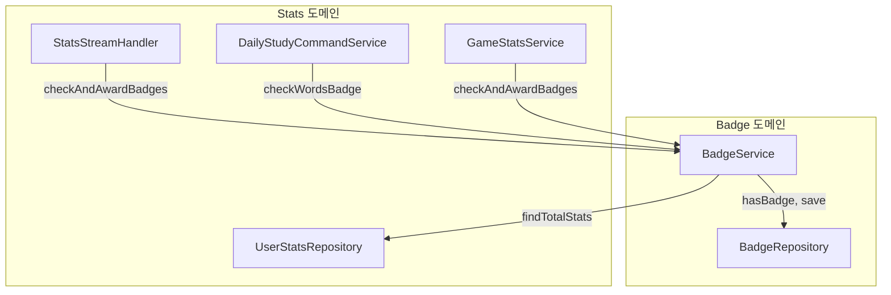

### 11.2 UserStats 필드와 배지 매핑

| UserStats 필드                       | 배지                               |
|------------------------------------|----------------------------------|
| testsCompleted                     | FIRST_STEP, TEST_10              |
| currentStreak                      | STREAK_3, STREAK_7, STREAK_30    |
| newWordsLearned + wordsReviewed    | WORDS_100, WORDS_500, WORDS_1000 |
| correctAnswers / questionsAnswered | ACCURACY_90                      |
| gamesPlayed                        | GAME_FIRST_PLAY                  |
| gamesWon                           | GAME_10_WINS                     |
| quickGuesses                       | QUICK_GUESSER                    |
| perfectDraws                       | PERFECT_DRAWER                   |

---

## 12. 파일 구조

```
domain/badge/
├── enums/
│   └── BadgeType.java              # 16가지 배지 정의
├── constants/
│   └── BadgeKey.java               # DynamoDB 키 생성
├── model/
│   └── UserBadge.java              # 배지 엔티티
├── repository/
│   └── BadgeRepository.java        # CRUD 연산
├── service/
│   └── BadgeService.java           # 조건 체크, 배지 부여
└── handler/
    └── BadgeHandler.java           # REST API

연동 파일:
├── domain/stats/handler/StatsStreamHandler.java
├── domain/vocabulary/service/DailyStudyCommandService.java
└── domain/chatting/service/GameStatsService.java
```

---

## 13. 기술 스택

- **Runtime:** AWS Lambda (Java 21)
- **Database:** DynamoDB (Single Table Design)
- **Storage:** S3 (배지 이미지)
- **Event:** DynamoDB Streams, Write-through, Service Method
- **Pattern:** Event-driven, Idempotent, Switch Expression
- **Java 21 Features:** Enhanced Switch, Yield Statement

---

## 14. 배지 획득 시나리오

### 14.1 시나리오 예시

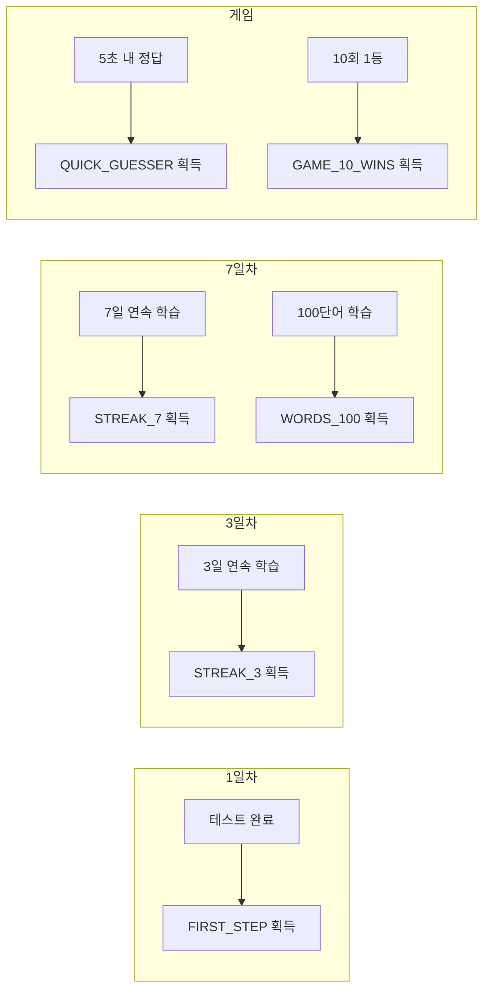

### 14.2 특수 배지 획득 조건

**PERFECT_SCORE (완벽주의자):**

- 테스트 제출 시 오답 0개이면 즉시 부여
- StatsStreamHandler에서 별도 처리

**QUICK_GUESSER (번개 정답):**

- 게임 중 5초(5000ms) 이내 정답 시
- GameStatsService에서 quickGuesses 카운트

**PERFECT_DRAWER (완벽한 출제자):**

- 출제 시 모든 참가자가 정답을 맞춘 경우
- 라운드 종료 시 endReason == "ALL_CORRECT"이면 카운트

**MASTER (학습 마스터):**

- 다른 모든 배지를 획득한 경우
- 특수 로직으로 모든 배지 보유 여부 확인
