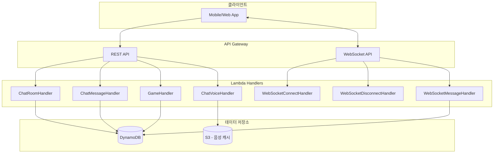
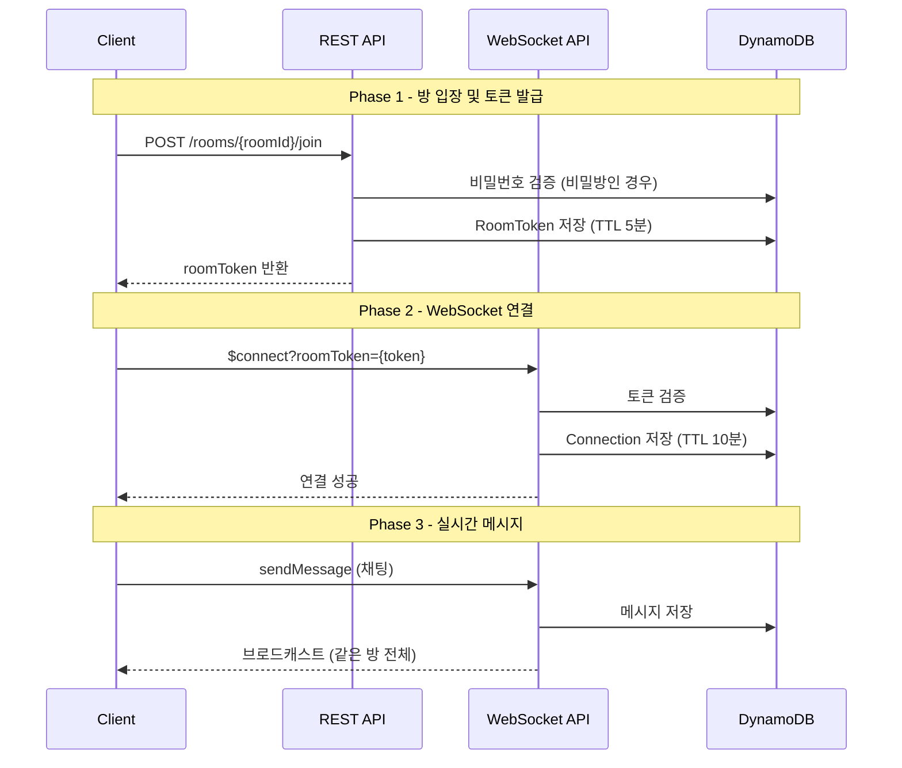
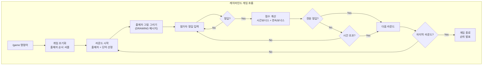
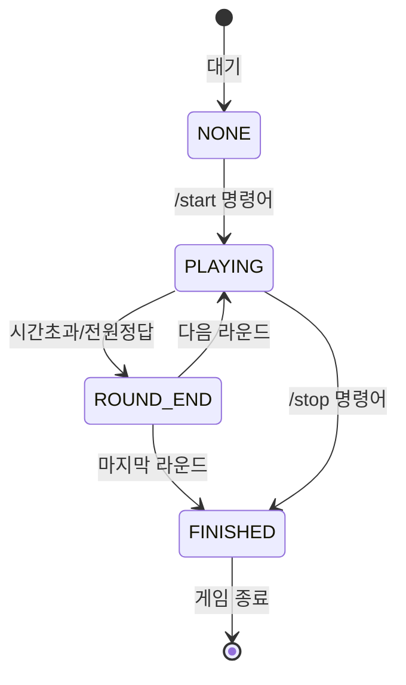
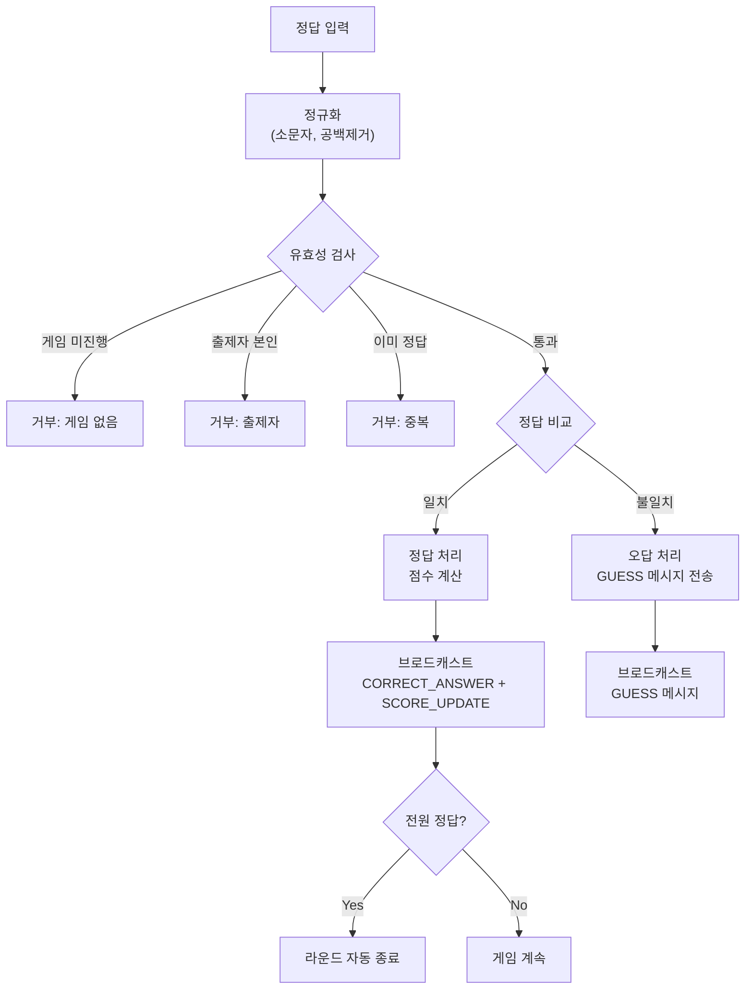

# Chatting Domain 세부 보고서

## 1. 개요

Chatting 도메인은 실시간 채팅과 캐치마인드 게임 기능을 제공하는 WebSocket 기반 시스템입니다. AWS API Gateway WebSocket과 Lambda를 활용하여 실시간 양방향 통신을 구현했습니다.

---

## 2. 전체 아키텍처



---

## 3. 채팅방 시스템

### 3.1 채팅방 입장 흐름



### 3.2 REST API 엔드포인트

| Method | Endpoint                      | 설명                        | 인증 |
|--------|-------------------------------|---------------------------|----|
| POST   | /chat/rooms                   | 채팅방 생성                    | O  |
| GET    | /chat/rooms                   | 채팅방 목록 (level, joined 필터) | O  |
| GET    | /chat/rooms/{roomId}          | 채팅방 상세                    | O  |
| POST   | /chat/rooms/{roomId}/join     | 채팅방 입장 (토큰 발급)            | O  |
| POST   | /chat/rooms/{roomId}/leave    | 채팅방 퇴장                    | O  |
| DELETE | /chat/rooms/{roomId}          | 채팅방 삭제 (방장만)              | O  |
| GET    | /chat/rooms/{roomId}/messages | 메시지 히스토리                  | O  |

### 3.3 WebSocket 이벤트

| Route       | 설명         | Payload                                  |
|-------------|------------|------------------------------------------|
| $connect    | 연결 (토큰 검증) | ?roomToken={token}                       |
| $disconnect | 연결 해제      | -                                        |
| sendMessage | 메시지 전송     | { roomId, userId, content, messageType } |

---

## 4. 캐치마인드 게임 시스템

### 4.1 게임 흐름



### 4.2 게임 API

| Method | Endpoint                         | 설명          |
|--------|----------------------------------|-------------|
| POST   | /chat/rooms/{roomId}/game/start  | 게임 시작 (방장만) |
| POST   | /chat/rooms/{roomId}/game/stop   | 게임 중지       |
| GET    | /chat/rooms/{roomId}/game/status | 게임 상태 조회    |
| GET    | /chat/rooms/{roomId}/game/scores | 점수판 조회      |

### 4.3 슬래시 명령어

| 명령어     | 설명             | 사용 가능  |
|---------|----------------|--------|
| /start  | 게임 시작          | 방장     |
| /stop   | 게임 중지          | 방장/시작자 |
| /score  | 점수판 보기         | 전체     |
| /member | 접속자 수          | 전체     |
| /hint   | 힌트 제공 (첫글자○○○) | 출제자    |
| /skip   | 라운드 스킵         | 출제자    |
| /help   | 명령어 도움말        | 전체     |

### 4.4 점수 계산 공식

```
점수 = 기본점수(10) + 시간보너스 + 연속보너스 + 출제자보너스

- 시간보너스: (60 - 경과초) × 0.5
- 연속보너스: streak × 2
- 출제자보너스: 정답자당 5점
```

**예시:**

- 30초에 정답 + 연속 3회: 10 + 15 + 6 = 31점
- 출제자가 3명 맞출 경우: 5 × 3 = 15점

### 4.5 게임 상태



---

## 5. WebSocket 메시지 타입

### 5.1 채팅 메시지

| Type        | 설명    | 저장 |
|-------------|-------|----|
| TEXT        | 일반 채팅 | O  |
| IMAGE       | 이미지   | O  |
| VOICE       | 음성    | O  |
| AI_RESPONSE | AI 응답 | O  |

### 5.2 게임 메시지

| Type           | 설명           | 저장 |
|----------------|--------------|----|
| DRAWING        | 그림 데이터 (실시간) | X  |
| DRAWING_CLEAR  | 그림 지우기       | X  |
| GUESS          | 오답 추측        | X  |
| CORRECT_ANSWER | 정답 알림        | X  |
| SCORE_UPDATE   | 점수 갱신        | X  |
| GAME_START     | 게임 시작        | X  |
| ROUND_START    | 라운드 시작       | X  |
| ROUND_END      | 라운드 종료       | X  |
| GAME_END       | 게임 종료        | X  |
| HINT           | 힌트           | X  |

### 5.3 실시간 점수 업데이트 메시지

```json
{
  "messageType": "SCORE_UPDATE",
  "roomId": "uuid",
  "scorerId": "user123",
  "scoreGained": 25,
  "ranking": [
    {
      "rank": 1,
      "userId": "user123",
      "score": 85,
      "change": 25
    },
    {
      "rank": 2,
      "userId": "user456",
      "score": 60,
      "change": 0
    }
  ],
  "currentRound": 3,
  "totalRounds": 5
}
```

---

## 6. 데이터 모델

### 6.1 ChatRoom

```java

@DynamoDbBean
public class ChatRoom {
	// 기본 정보
	String roomId, name, description;
	String level;              // beginner, intermediate, advanced
	Integer currentMembers, maxMembers;
	Boolean isPrivate;
	String password;           // BCrypt 암호화
	String createdBy;          // 방장
	List<String> memberIds;
	
	// 게임 상태
	String gameStatus;         // NONE, PLAYING, ROUND_END, FINISHED
	Integer currentRound, totalRounds;
	String currentDrawerId, currentWord;
	Long roundStartTime;
	Integer roundTimeLimit;    // 60초
	List<String> drawerOrder;
	Map<String, Integer> scores;
	Map<String, Integer> streaks;
	List<String> correctGuessers;
	Boolean hintUsed;
}
```

**DynamoDB Keys:**

- PK: `ROOM#{roomId}` | SK: `METADATA`
- GSI1: `ROOMS` | `{level}#{createdAt}` (레벨별 최신순)

### 6.2 Connection

```java

@DynamoDbBean
public class Connection {
	String connectionId;       // API Gateway 연결 ID
	String userId;
	String roomId;
	Long ttl;                  // 10분 (자동 삭제)
}
```

**DynamoDB Keys:**

- PK: `CONN#{connectionId}` | SK: `METADATA`
- GSI1: `ROOM#{roomId}` | `CONN#{connectionId}` (방별 연결)
- GSI2: `USER#{userId}` | `CONN#{connectionId}` (사용자별 연결)

### 6.3 GameRound

```java

@DynamoDbBean
public class GameRound {
	Integer roundNumber;
	String drawerId, word, wordEnglish;
	List<String> correctGuessers;
	Map<String, Long> guessTimes;      // 정답까지 걸린 시간
	Map<String, Integer> roundScores;
	Long startTime, endTime;
	String endReason;                   // TIME_UP, ALL_CORRECT, SKIP
	Long ttl;                           // 7일
}
```

### 6.4 RoomToken

```java

@DynamoDbBean
public class RoomToken {
	String token;              // UUID
	String roomId;
	String userId;
	Long ttl;                  // 5분
}
```

---

## 7. 서비스 레이어

### 7.1 CQRS 패턴

| Service                | 역할                   |
|------------------------|----------------------|
| ChatRoomCommandService | 채팅방 생성, 입장, 퇴장, 삭제   |
| ChatRoomQueryService   | 채팅방 조회, 목록           |
| GameService            | 게임 시작, 정답 체크, 라운드 종료 |
| GameStatsService       | 게임 종료 후 통계, 배지 처리    |
| CommandService         | 슬래시 명령어 처리           |
| RoomTokenService       | 토큰 발급 및 검증           |

### 7.2 게임 정답 체크 로직



---

## 8. 브로드캐스트 시스템

### 8.1 WebSocketBroadcaster

```java
public class WebSocketBroadcaster {
	public List<String> broadcast(
			List<Connection> connections,
			String payload
	) {
		// 1. 같은 방 모든 연결에 메시지 전송
		// 2. 실패한 연결 ID 반환 (Stale 정리용)
	}
}
```

### 8.2 브로드캐스트 유형

| 유형     | 대상     | 예시        |
|--------|--------|-----------|
| 전체     | 방 전체   | 채팅, 정답 알림 |
| 본인 제외  | 발신자 제외 | 그림 데이터    |
| 출제자 전용 | 출제자만   | 단어 정보     |

---

## 9. 파일 구조

```
domain/chatting/
├── handler/
│   ├── ChatRoomHandler.java
│   ├── ChatMessageHandler.java
│   ├── ChatVoiceHandler.java
│   ├── GameHandler.java
│   └── websocket/
│       ├── WebSocketConnectHandler.java
│       ├── WebSocketDisconnectHandler.java
│       └── WebSocketMessageHandler.java
├── service/
│   ├── ChatRoomCommandService.java
│   ├── ChatRoomQueryService.java
│   ├── ChatMessageService.java
│   ├── GameService.java
│   ├── GameStatsService.java
│   ├── CommandService.java
│   └── RoomTokenService.java
├── repository/
│   ├── ChatRoomRepository.java
│   ├── ChatMessageRepository.java
│   ├── ConnectionRepository.java
│   ├── GameRoundRepository.java
│   └── RoomTokenRepository.java
├── model/
│   ├── ChatRoom.java
│   ├── ChatMessage.java
│   ├── Connection.java
│   ├── GameRound.java
│   └── RoomToken.java
├── dto/
│   ├── request/
│   └── response/
│       └── ScoreUpdateMessage.java
└── enums/
    ├── GameStatus.java
    └── MessageType.java
```

---

## 10. 기술 스택

- **Runtime:** AWS Lambda (Java 21)
- **API:** API Gateway REST + WebSocket
- **Database:** DynamoDB (Single Table Design)
- **Auth:** Cognito + RoomToken
- **Encryption:** BCrypt (비밀방 암호)
- **TTS:** AWS Polly + S3 캐시
- **Pattern:** CQRS, Repository, Factory
