# Common Module 세부 보고서

## 1. 개요

Common 모듈은 모든 도메인에서 공유하는 유틸리티, 설정, 예외 처리, 라우팅 등을 제공하는 핵심 인프라 모듈입니다. Java 21의 최신 기능(Records, Sealed Interface, Pattern
Matching)을 적극 활용하여 타입 안전성과 코드 간결성을 확보했습니다.

---

## 2. 전체 패키지 구조

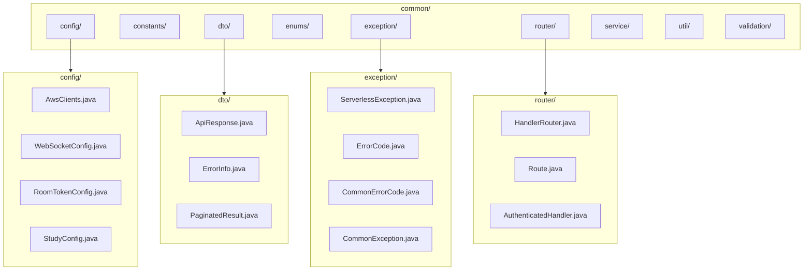

---

## 3. Handler 라우팅 시스템

### 3.1 HandlerRouter 아키텍처

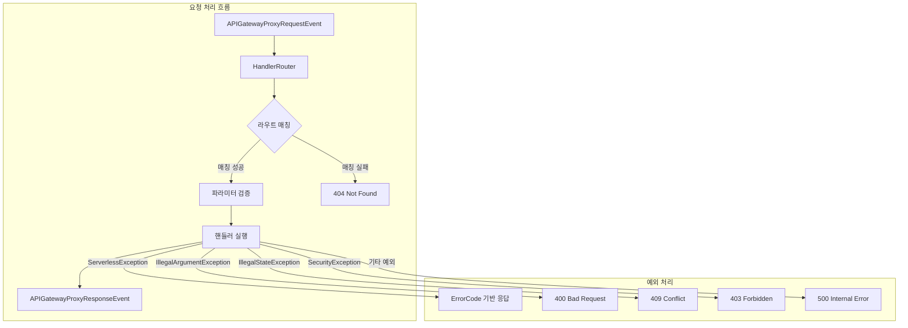

### 3.2 Route 정의 (Java 21 Record)

```java
// Route.java - Java 21 Record 활용
public record Route(
				String method,                                    // HTTP 메서드
				String pathPattern,                               // 경로 패턴 (e.g., "/rooms/{roomId}")
				Function<APIGatewayProxyRequestEvent,             // 핸들러 함수
						APIGatewayProxyResponseEvent> handler,
				List<String> requiredPathParams,                  // 필수 경로 파라미터
				List<String> requiredQueryParams                  // 필수 쿼리 파라미터
		) {
	// 경로 파라미터 자동 추출: {roomId} → roomId
	private static final Pattern PATH_PARAM_PATTERN =
			Pattern.compile("\\{([^}]+)}");
}
```

### 3.3 Route 팩토리 메서드

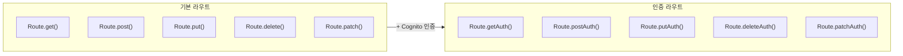

### 3.4 사용 예시

```java
// Handler에서 라우터 초기화
private HandlerRouter initRouter() {
	return new HandlerRouter().addRoutes(
			// 인증 필요 라우트 (Cognito userId 자동 추출)
			Route.postAuth("/grammar/check", this::checkGrammar),
			Route.getAuth("/grammar/sessions/{sessionId}", this::getSessionDetail),
			Route.deleteAuth("/grammar/sessions/{sessionId}", this::deleteSession),
			
			// 쿼리 파라미터 검증
			Route.getAuth("/rooms", this::getRooms)
					.requireQueryParams("level")
	);
}

// Lambda 핸들러 메서드
@Override
public APIGatewayProxyResponseEvent handleRequest(
		APIGatewayProxyRequestEvent request, Context context) {
	return router.route(request);
}
```

### 3.5 AuthenticatedHandler 인터페이스

```java
// 함수형 인터페이스 - Cognito 인증 요청 처리
@FunctionalInterface
public interface AuthenticatedHandler {
	APIGatewayProxyResponseEvent handle(
			APIGatewayProxyRequestEvent request,
			String userId   // Cognito sub claim에서 자동 추출
	);
}

// 사용 예시 - 람다 표현식으로 간결하게
Route.

postAuth("/rooms",(request, userId) ->{
CreateRoomRequest dto = parseBody(request, CreateRoomRequest.class);
ChatRoom room = roomService.createRoom(userId, dto);
    return ResponseGenerator.

created("Room created",room);
});
```

---

## 4. 예외 처리 시스템

### 4.1 ErrorCode 계층 구조 (Sealed Interface)

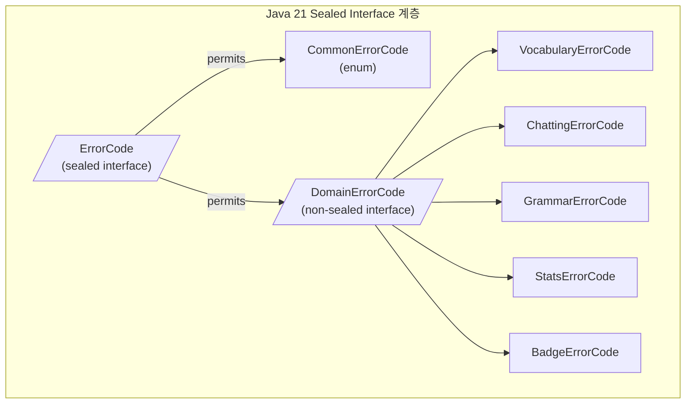

### 4.2 CommonErrorCode 정의

```java
public enum CommonErrorCode implements ErrorCode {
	// 인증/인가 (AUTH_xxx)
	UNAUTHORIZED("AUTH_001", "인증이 필요합니다", 401),
	FORBIDDEN("AUTH_002", "접근 권한이 없습니다", 403),
	INVALID_TOKEN("AUTH_003", "유효하지 않은 토큰입니다", 401),
	TOKEN_EXPIRED("AUTH_004", "토큰이 만료되었습니다", 401),
	
	// 검증 (VALIDATION_xxx)
	INVALID_INPUT("VALIDATION_001", "잘못된 입력입니다", 400),
	REQUIRED_FIELD_MISSING("VALIDATION_002", "필수 필드가 누락되었습니다", 400),
	INVALID_FORMAT("VALIDATION_003", "형식이 올바르지 않습니다", 400),
	VALUE_OUT_OF_RANGE("VALIDATION_004", "값이 허용 범위를 벗어났습니다", 400),
	
	// 리소스 (RESOURCE_xxx)
	RESOURCE_NOT_FOUND("RESOURCE_001", "리소스를 찾을 수 없습니다", 404),
	RESOURCE_ALREADY_EXISTS("RESOURCE_002", "이미 존재하는 리소스입니다", 409),
	METHOD_NOT_ALLOWED("RESOURCE_003", "허용되지 않는 메서드입니다", 405),
	
	// 시스템 (SYSTEM_xxx)
	INTERNAL_SERVER_ERROR("SYSTEM_001", "내부 서버 오류가 발생했습니다", 500),
	DATABASE_ERROR("SYSTEM_002", "데이터베이스 오류가 발생했습니다", 500),
	EXTERNAL_API_ERROR("SYSTEM_003", "외부 API 호출 오류가 발생했습니다", 502),
	SERVICE_UNAVAILABLE("SYSTEM_004", "서비스를 일시적으로 사용할 수 없습니다", 503);
	
	private final String code;
	private final String message;
	private final int statusCode;
}
```

### 4.3 예외 생성 팩토리 패턴

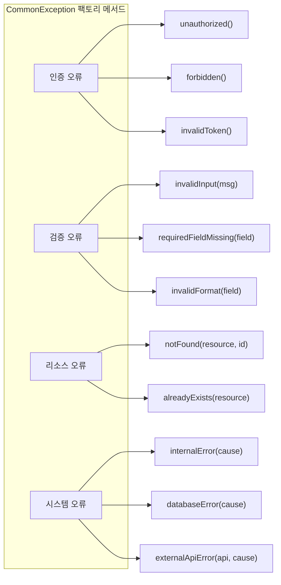

### 4.4 예외 사용 예시

```java
// 가독성 높은 예외 생성
throw CommonException.notFound("User","user123");
// → "User (ID: user123)를 찾을 수 없습니다", 404

throw CommonException.

invalidInput("Email format is invalid");
// → 400 INVALID_INPUT with custom message

throw CommonException.

alreadyExists("ChatRoom","room456");
// → "ChatRoom (ID: room456)가 이미 존재합니다", 409

// 상세 컨텍스트 추가 (메서드 체이닝)
throw CommonException.

internalError(cause)
    .

addDetail("operation","database_query")
    .

addDetail("table","users");
```

---

## 5. AWS 클라이언트 관리

### 5.1 Singleton 패턴 (Cold Start 최적화)

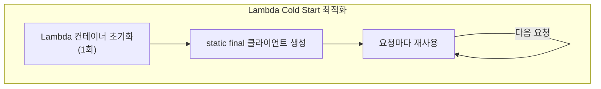

### 5.2 AwsClients.java 구조

```java
public final class AwsClients {
	// DynamoDB (Enhanced Client 포함)
	private static final DynamoDbClient DYNAMO_DB_CLIENT =
			DynamoDbClient.builder().build();
	private static final DynamoDbEnhancedClient DYNAMO_DB_ENHANCED_CLIENT =
			DynamoDbEnhancedClient.builder()
					.dynamoDbClient(DYNAMO_DB_CLIENT)
					.build();
	
	// S3 (Presigner 포함)
	private static final S3Client S3_CLIENT = S3Client.builder().build();
	private static final S3Presigner S3_PRESIGNER = S3Presigner.builder().build();
	
	// AI/ML 서비스
	private static final PollyClient POLLY_CLIENT = PollyClient.builder().build();
	private static final BedrockRuntimeClient BEDROCK_CLIENT =
			BedrockRuntimeClient.builder().build();
	private static final BedrockRuntimeAsyncClient BEDROCK_ASYNC_CLIENT =
			BedrockRuntimeAsyncClient.builder().build();
	private static final ComprehendClient COMPREHEND_CLIENT =
			ComprehendClient.builder().build();
	
	// SNS
	private static final SnsClient SNS_CLIENT = SnsClient.builder().build();
	
	// 팩토리 메서드
	public static DynamoDbClient dynamoDb() {
		return DYNAMO_DB_CLIENT;
	}
	
	public static DynamoDbEnhancedClient dynamoDbEnhanced() {
		return DYNAMO_DB_ENHANCED_CLIENT;
	}
	
	public static S3Client s3() {
		return S3_CLIENT;
	}
	
	public static S3Presigner s3Presigner() {
		return S3_PRESIGNER;
	}
	
	public static PollyClient polly() {
		return POLLY_CLIENT;
	}
	
	public static BedrockRuntimeClient bedrock() {
		return BEDROCK_CLIENT;
	}
	
	public static BedrockRuntimeAsyncClient bedrockAsync() {
		return BEDROCK_ASYNC_CLIENT;
	}
	
	public static ComprehendClient comprehend() {
		return COMPREHEND_CLIENT;
	}
	
	public static SnsClient sns() {
		return SNS_CLIENT;
	}
}
```

### 5.3 사용 예시

```java
// Service에서 사용
public class PollyService {
	public VoiceSynthesisResult synthesizeSpeech(String id, String text, String voice) {
		SynthesizeSpeechRequest request = SynthesizeSpeechRequest.builder()
				.text(text)
				.voiceId(VoiceId.MATTHEW)
				.engine("neural")
				.outputFormat(OutputFormat.MP3)
				.build();
		
		// Singleton 클라이언트 사용
		InputStream audioStream = AwsClients.polly().synthesizeSpeech(request);
		AwsClients.s3().putObject(putRequest, RequestBody.fromInputStream(audioStream, -1));
		
		return new VoiceSynthesisResult(s3Key, presignedUrl, false);
	}
}
```

---

## 6. DTO 패턴 (Java 21 Records)

### 6.1 ApiResponse (제네릭 응답 래퍼)

```java
// 불변 데이터 클래스 - Java 21 Record
public record ApiResponse<T>(
				boolean isSuccess,
				String message,
				T data,
				String error
		) {
	// 성공 응답 팩토리
	public static <T> ApiResponse<T> ok(String message, T data) {
		return new ApiResponse<>(true, message, data, null);
	}
	
	public static <T> ApiResponse<T> ok(T data) {
		return new ApiResponse<>(true, null, data, null);
	}
	
	// 실패 응답 팩토리
	public static <T> ApiResponse<T> fail(String errorMessage) {
		return new ApiResponse<>(false, null, null, errorMessage);
	}
}
```

**JSON 응답 예시:**

```json
{
  "isSuccess": true,
  "message": "Grammar checked successfully",
  "data": {
    "correctedSentence": "I am a student",
    "score": 85,
    "errors": [
      ...
    ]
  },
  "error": null
}
```

### 6.2 ErrorInfo (RFC 7807 준수)

```java
// Problem Details for HTTP APIs (RFC 7807)
public record ErrorInfo(
				String code,                    // e.g., "VOCABULARY.WORD_001"
				String message,                 // e.g., "단어를 찾을 수 없습니다"
				int status,                     // e.g., 404
				Map<String, Object> details     // Optional context
		) {
	public static ErrorInfo from(ErrorCode errorCode) { ...}
	
	public static ErrorInfo from(ServerlessException ex) { ...}
	
	public boolean isClientError() {
		return status >= 400 && status < 500;
	}
	
	public boolean isServerError() {
		return status >= 500 && status < 600;
	}
}
```

**JSON 에러 응답 예시:**

```json
{
  "code": "VOCABULARY.WORD_001",
  "message": "단어를 찾을 수 없습니다",
  "status": 404,
  "details": {
    "wordId": "abc-123",
    "userId": "user456"
  }
}
```

### 6.3 PaginatedResult (커서 페이지네이션)

```java
public record PaginatedResult<T>(
		List<T> items,
		String nextCursor       // Base64 인코딩된 DynamoDB lastEvaluatedKey
) {
	public boolean hasMore() {
		return nextCursor != null;
	}
}
```

---

## 7. 페이지네이션 유틸리티

### 7.1 CursorUtil 동작 흐름

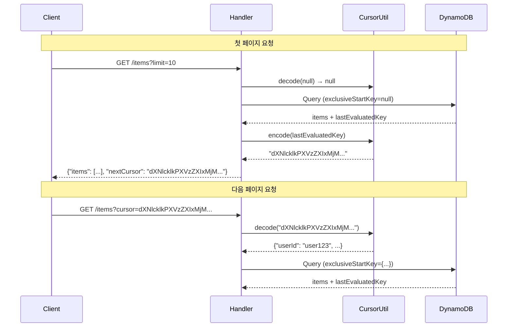

### 7.2 CursorUtil 구현

```java
public class CursorUtil {
	// DynamoDB lastEvaluatedKey → Base64 문자열
	public static String encode(Map<String, AttributeValue> lastEvaluatedKey) {
		if (lastEvaluatedKey == null || lastEvaluatedKey.isEmpty()) {
			return null;
		}
		
		StringBuilder sb = new StringBuilder();
		for (Map.Entry<String, AttributeValue> entry : lastEvaluatedKey.entrySet()) {
			if (sb.length() > 0) sb.append("|");
			sb.append(entry.getKey()).append("=").append(entry.getValue().s());
		}
		
		return Base64.getUrlEncoder().encodeToString(sb.toString().getBytes());
	}
	
	// Base64 문자열 → DynamoDB exclusiveStartKey
	public static Map<String, AttributeValue> decode(String cursor) {
		if (cursor == null || cursor.isEmpty()) {
			return null;
		}
		
		String decoded = new String(Base64.getUrlDecoder().decode(cursor));
		Map<String, AttributeValue> startKey = new HashMap<>();
		
		for (String pair : decoded.split("\\|")) {
			String[] kv = pair.split("=", 2);
			if (kv.length == 2) {
				startKey.put(kv[0], AttributeValue.builder().s(kv[1]).build());
			}
		}
		
		return startKey;
	}
}
```

---

## 8. 인증 유틸리티

### 8.1 Cognito 인증 흐름

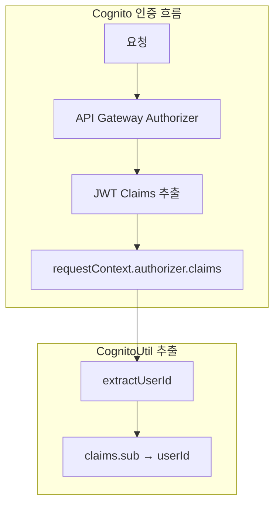

### 8.2 CognitoUtil.java

```java
public class CognitoUtil {
	// 기본 userId 추출 (sub claim)
	public static String extractUserId(APIGatewayProxyRequestEvent request) {
		Map<String, Object> authorizer = request.getRequestContext().getAuthorizer();
		if (authorizer == null) return null;
		
		Map<String, String> claims = (Map<String, String>) authorizer.get("claims");
		return claims != null ? claims.get("sub") : null;
	}
	
	// 선택적 claim 추출
	public static Optional<String> extractEmail(APIGatewayProxyRequestEvent request) {
		return extractClaim(request, "email");
	}
	
	public static Optional<String> extractNickname(APIGatewayProxyRequestEvent request) {
		return extractClaim(request, "custom:nickname");
	}
	
	public static Optional<String> extractClaim(
			APIGatewayProxyRequestEvent request, String claimName) {
		// ... claim 추출 로직
	}
	
	// 사용자 접근 권한 검증
	public static boolean validateUserAccess(
			APIGatewayProxyRequestEvent request, String pathUserId) {
		String tokenUserId = extractUserId(request);
		return tokenUserId != null && tokenUserId.equals(pathUserId);
	}
}
```

### 8.3 JwtUtil.java (WebSocket용)

```java
// WebSocket 연결 시 직접 JWT 파싱 (Authorizer 미사용)
public final class JwtUtil {
	public static Optional<String> extractUserId(String token) {
		// Bearer 제거
		if (token.startsWith("Bearer ")) {
			token = token.substring(7);
		}
		
		// JWT payload 추출 (헤더.페이로드.시그니처)
		String[] parts = token.split("\\.");
		if (parts.length != 3) return Optional.empty();
		
		// Base64 URL 디코딩
		String payload = new String(Base64.getUrlDecoder().decode(parts[1]));
		Map<String, Object> claims = gson.fromJson(payload, Map.class);
		
		return Optional.ofNullable((String) claims.get("sub"));
	}
	
	public static boolean isExpired(String token) {
		// exp claim 확인
	}
}
```

---

## 9. HTTP 응답 생성

### 9.1 ResponseGenerator.java

```java
public class ResponseGenerator {
	private static final Gson GSON = new GsonBuilder()
			.setDateFormat("yyyy-MM-dd'T'HH:mm:ss.SSS'Z'")
			.create();
	
	private static final Map<String, String> CORS_HEADERS = Map.of(
			"Content-Type", "application/json",
			"Access-Control-Allow-Origin", "*",
			"Access-Control-Allow-Methods", "GET,POST,PUT,DELETE,OPTIONS",
			"Access-Control-Allow-Headers", "Content-Type,Authorization"
	);
	
	// 성공 응답
	public static <T> APIGatewayProxyResponseEvent ok(String message, T data) {
		return buildResponse(200, ApiResponse.ok(message, data));
	}
	
	public static <T> APIGatewayProxyResponseEvent created(String message, T data) {
		return buildResponse(201, ApiResponse.ok(message, data));
	}
	
	public static APIGatewayProxyResponseEvent noContent() {
		return buildResponse(204, null);
	}
	
	// 에러 응답
	public static APIGatewayProxyResponseEvent fail(ErrorCode errorCode) {
		return buildResponse(errorCode.getStatusCode(), ErrorInfo.from(errorCode));
	}
	
	public static APIGatewayProxyResponseEvent badRequest(String message) {
		return fail(CommonErrorCode.INVALID_INPUT, message);
	}
	
	public static APIGatewayProxyResponseEvent notFound(String message) {
		return fail(CommonErrorCode.RESOURCE_NOT_FOUND, message);
	}
	
	// ... 기타 편의 메서드
	
	private static APIGatewayProxyResponseEvent buildResponse(int statusCode, Object body) {
		return new APIGatewayProxyResponseEvent()
				.withStatusCode(statusCode)
				.withHeaders(new HashMap<>(CORS_HEADERS))
				.withBody(body != null ? GSON.toJson(body) : null);
	}
	
	public static Gson gson() {
		return GSON;
	}
}
```

---

## 10. Bean Validation

### 10.1 BeanValidator 패턴

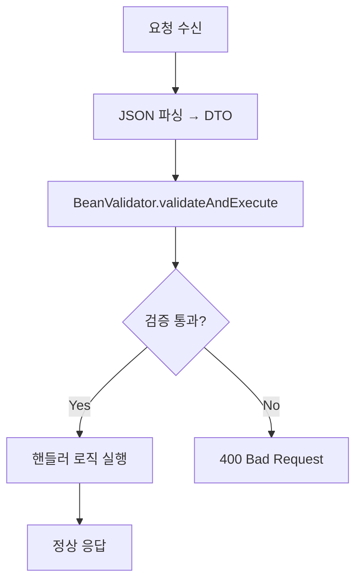

### 10.2 BeanValidator.java

```java
public final class BeanValidator {
	private static final Validator VALIDATOR;
	
	static {
		ValidatorFactory factory = Validation.buildDefaultValidatorFactory();
		VALIDATOR = factory.getValidator();
	}
	
	// 검증 + 실행 통합 패턴
	public static <T> APIGatewayProxyResponseEvent validateAndExecute(
			T object,
			Function<T, APIGatewayProxyResponseEvent> handler) {
		
		Optional<String> error = validate(object);
		if (error.isPresent()) {
			return ResponseGenerator.badRequest(error.get());
		}
		
		return handler.apply(object);
	}
	
	public static <T> Optional<String> validate(T object) {
		Set<ConstraintViolation<T>> violations = VALIDATOR.validate(object);
		if (violations.isEmpty()) {
			return Optional.empty();
		}
		
		String message = violations.stream()
				.map(ConstraintViolation::getMessage)
				.collect(Collectors.joining(", "));
		
		return Optional.of(message);
	}
}
```

### 10.3 DTO 검증 예시

```java
// 요청 DTO
public class CreateRoomRequest {
	@NotEmpty(message = "방 이름은 필수입니다")
	private String roomName;
	
	@NotNull(message = "난이도는 필수입니다")
	private String difficulty;
	
	@Min(value = 2, message = "최소 2명 이상이어야 합니다")
	@Max(value = 10, message = "최대 10명까지 가능합니다")
	private int maxMembers;
}

// Handler에서 사용
private APIGatewayProxyResponseEvent createRoom(
		APIGatewayProxyRequestEvent request, String userId) {
	
	CreateRoomRequest req = ResponseGenerator.gson()
			.fromJson(request.getBody(), CreateRoomRequest.class);
	
	return BeanValidator.validateAndExecute(req, dto -> {
		// 검증 통과 시에만 실행됨
		ChatRoom room = roomService.createRoom(userId, dto);
		return ResponseGenerator.created("방이 생성되었습니다", room);
	});
}
```

---

## 11. WebSocket 유틸리티

### 11.1 브로드캐스트 흐름

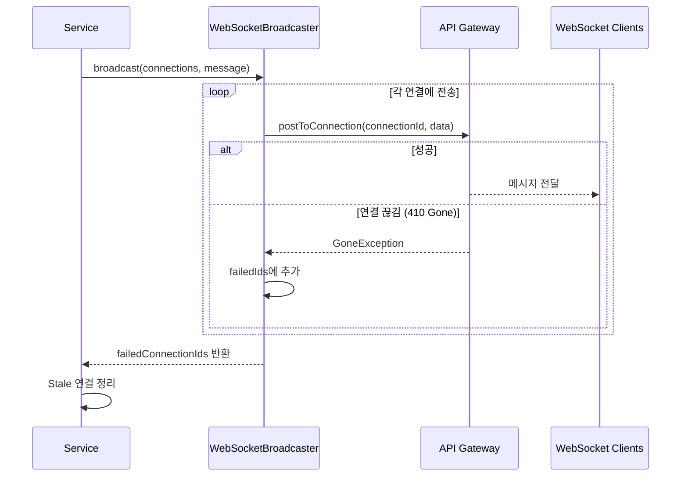

### 11.2 WebSocketBroadcaster.java

```java
public class WebSocketBroadcaster {
	private final ApiGatewayManagementApiClient apiClient;
	
	public WebSocketBroadcaster() {
		String endpoint = WebSocketConfig.websocketEndpoint();
		this.apiClient = ApiGatewayManagementApiClient.builder()
				.endpointOverride(URI.create(endpoint))
				.build();
	}
	
	// 단일 연결에 전송
	public boolean sendToConnection(String connectionId, String message) {
		try {
			apiClient.postToConnection(PostToConnectionRequest.builder()
					.connectionId(connectionId)
					.data(SdkBytes.fromUtf8String(message))
					.build());
			return true;
		} catch (GoneException e) {
			// 연결이 이미 끊김
			return false;
		}
	}
	
	// 다수 연결에 브로드캐스트
	public List<String> broadcast(List<Connection> connections, String message) {
		List<String> failedIds = new ArrayList<>();
		
		for (Connection conn : connections) {
			if (!sendToConnection(conn.getConnectionId(), message)) {
				failedIds.add(conn.getConnectionId());
			}
		}
		
		return failedIds;  // 실패한 연결 ID 반환 (정리용)
	}
}
```

### 11.3 WebSocket 응답 유틸리티

```java
public final class WebSocketResponseUtil {
	public static Map<String, Object> ok(String message) {
		return response(200, message);
	}
	
	public static Map<String, Object> unauthorized(String message) {
		return response(401, message);
	}
	
	public static Map<String, Object> badRequest(String message) {
		return response(400, message);
	}
	
	private static Map<String, Object> response(int statusCode, String body) {
		return Map.of(
				"statusCode", statusCode,
				"body", body
		);
	}
}
```

---

## 12. S3 Presigned URL

### 12.1 S3PresignUtil.java

```java
public class S3PresignUtil {
	private static final Duration DEFAULT_DURATION = Duration.ofHours(24);
	private static final String BUCKET_NAME = System.getenv("S3_BUCKET_NAME");
	
	// 내부 캐시 (Java 21 Record)
	private record CachedUrl(String url, long expiresAt) {
		boolean isExpired() {
			// 1시간 버퍼 두고 만료 체크
			return System.currentTimeMillis() > (expiresAt - 3600_000);
		}
	}
	
	private static final Map<String, CachedUrl> URL_CACHE = new ConcurrentHashMap<>();
	
	public static String getPresignedUrl(String key) {
		return getPresignedUrl(key, DEFAULT_DURATION);
	}
	
	public static String getPresignedUrl(String key, Duration duration) {
		CachedUrl cached = URL_CACHE.get(key);
		if (cached != null && !cached.isExpired()) {
			return cached.url();
		}
		
		GetObjectPresignRequest presignRequest = GetObjectPresignRequest.builder()
				.signatureDuration(duration)
				.getObjectRequest(r -> r.bucket(BUCKET_NAME).key(key))
				.build();
		
		String url = AwsClients.s3Presigner()
				.presignGetObject(presignRequest)
				.url()
				.toString();
		
		URL_CACHE.put(key, new CachedUrl(url,
				System.currentTimeMillis() + duration.toMillis()));
		
		return url;
	}
	
	// 배지 이미지 URL 생성 편의 메서드
	public static String getBadgeImageUrl(String imageFile) {
		return getPresignedUrl("badges/" + imageFile);
	}
}
```

---

## 13. AWS 서비스 래퍼

### 13.1 PollyService (TTS + S3 캐시)

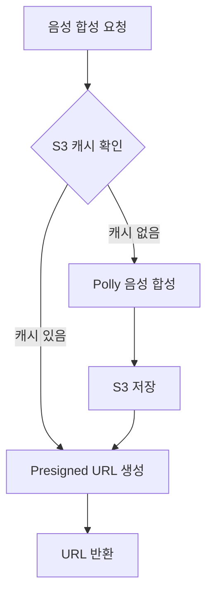

```java
public class PollyService {
	public VoiceSynthesisResult synthesizeSpeech(String id, String text, String voice) {
		String s3Key = generateS3Key(id, voice);
		
		// 캐시 확인
		if (existsInS3(s3Key)) {
			return new VoiceSynthesisResult(s3Key, getPresignedUrl(s3Key), true);
		}
		
		// Polly 음성 합성
		VoiceId voiceId = "MALE".equalsIgnoreCase(voice) ? VoiceId.MATTHEW : VoiceId.JOANNA;
		
		SynthesizeSpeechRequest request = SynthesizeSpeechRequest.builder()
				.text(text)
				.voiceId(voiceId)
				.engine("neural")           // Neural 음성 (고품질)
				.outputFormat(OutputFormat.MP3)
				.build();
		
		InputStream audioStream = AwsClients.polly().synthesizeSpeech(request);
		
		// S3 저장
		AwsClients.s3().putObject(
				PutObjectRequest.builder()
						.bucket(bucketName)
						.key(s3Key)
						.contentType("audio/mpeg")
						.build(),
				RequestBody.fromInputStream(audioStream, -1)
		);
		
		return new VoiceSynthesisResult(s3Key, getPresignedUrl(s3Key), false);
	}
	
	public String generateS3Key(String id, String voice) {
		String suffix = "MALE".equalsIgnoreCase(voice) ? "male" : "female";
		return s3KeyPrefix + id + "_" + suffix + ".mp3";
	}
}
```

### 13.2 ComprehendService (NLP 분석)

```java
public class ComprehendService {
	public ComprehendAnalysis analyze(String text) {
		// 감정 분석
		DetectSentimentResponse sentiment = AwsClients.comprehend()
				.detectSentiment(DetectSentimentRequest.builder()
						.text(text)
						.languageCode("en")
						.build());
		
		// 구문 분석 (품사 태깅)
		DetectSyntaxResponse syntax = AwsClients.comprehend()
				.detectSyntax(DetectSyntaxRequest.builder()
						.text(text)
						.languageCode("en")
						.build());
		
		// 핵심 구문 추출
		DetectKeyPhrasesResponse keyPhrases = AwsClients.comprehend()
				.detectKeyPhrases(DetectKeyPhrasesRequest.builder()
						.text(text)
						.languageCode("en")
						.build());
		
		// 문장 복잡도 계산
		String complexity = calculateComplexity(syntax.syntaxTokens());
		
		return ComprehendAnalysis.builder()
				.sentiment(sentiment.sentimentAsString())
				.syntax(mapTokens(syntax.syntaxTokens()))
				.keyPhrases(mapKeyPhrases(keyPhrases.keyPhrases()))
				.complexity(complexity)
				.build();
	}
	
	private String calculateComplexity(List<SyntaxToken> tokens) {
		Set<String> uniquePOS = tokens.stream()
				.map(t -> t.partOfSpeech().tagAsString())
				.collect(Collectors.toSet());
		
		if (uniquePOS.size() <= 3 && tokens.size() <= 5) return "BEGINNER";
		if (uniquePOS.size() <= 5 && tokens.size() <= 10) return "INTERMEDIATE";
		return "ADVANCED";
	}
}
```

---

## 14. 설정 클래스

### 14.1 StudyConfig (학습 알고리즘 상수)

```java
public final class StudyConfig {
	// SM-2 알고리즘 상수
	public static final int INITIAL_INTERVAL_DAYS = 1;
	public static final double DEFAULT_EASE_FACTOR = 2.5;
	public static final double MIN_EASE_FACTOR = 1.3;
	public static final int INITIAL_REPETITIONS = 0;
	
	// 테스트 설정
	public static final int DEFAULT_WORD_COUNT = 20;
	public static final int DAILY_TEST_WORD_COUNT = 10;
	
	// 복습 주기 (일)
	public static final int[] REVIEW_INTERVALS = {1, 3, 7, 14, 30};
	
	// 상태 기본값
	public static final String DEFAULT_WORD_STATUS = "NEW";
	public static final String DEFAULT_DIFFICULTY = "NORMAL";
	
	// 오류 제한
	public static final int MAX_WRONG_COUNT = 3;
}
```

### 14.2 DynamoDbKey (키 패턴 상수)

```java
public final class DynamoDbKey {
	// 기본 키
	public static final String PK = "PK";
	public static final String SK = "SK";
	
	// GSI 키
	public static final String GSI1_PK = "GSI1PK";
	public static final String GSI1_SK = "GSI1SK";
	public static final String GSI2_PK = "GSI2PK";
	public static final String GSI2_SK = "GSI2SK";
	
	// GSI 이름
	public static final String GSI1 = "GSI1";
	public static final String GSI2 = "GSI2";
	
	// 공통 접두사
	public static final String USER = "USER#";
	public static final String METADATA = "METADATA";
	
	// 헬퍼 메서드
	public static String userPk(String userId) {
		return USER + userId;  // "USER#user-123"
	}
}
```

---

## 15. Java 21 기능 활용

### 15.1 Records 활용

| 클래스             | 용도             |
|-----------------|----------------|
| ApiResponse     | 제네릭 API 응답 래퍼  |
| ErrorInfo       | RFC 7807 에러 응답 |
| PaginatedResult | 페이지네이션 결과      |
| Route           | HTTP 라우트 정의    |
| RouteEntry      | 라우터 내부 매칭      |
| CachedUrl       | S3 URL 캐시      |

### 15.2 Sealed Interface 활용

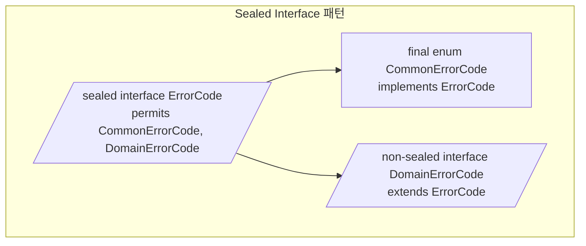

### 15.3 Pattern Matching 활용

```java
// instanceof 패턴 매칭
String code = errorCode instanceof DomainErrorCode domainCode
				? domainCode.getFullCode()      // "VOCABULARY.WORD_001"
				: errorCode.getCode();          // "AUTH_001"

// switch 표현식 (Enhanced)
return switch(type.

getCategory()){
		case"FIRST_STUDY"->stats.

getTestsCompleted() >=1;
		case"STREAK"->stats.

getCurrentStreak() >=type.

getThreshold();
    case"ACCURACY"->{
double accuracy = (double) stats.getCorrectAnswers() / stats.getQuestionsAnswered() * 100;
yield accuracy >=type.

getThreshold();
    }
default ->false;
		};
```

---

## 16. 디자인 패턴 요약

| 패턴                   | 적용 위치                  | 목적                |
|----------------------|------------------------|-------------------|
| **Singleton**        | AwsClients             | AWS SDK 클라이언트 재사용 |
| **Factory Method**   | Route, CommonException | 객체 생성 캡슐화         |
| **Strategy**         | AuthenticatedHandler   | 요청 처리 전략 분리       |
| **Router**           | HandlerRouter          | HTTP 요청 라우팅       |
| **Builder**          | ComprehendAnalysis     | 복잡한 객체 생성         |
| **Template Method**  | BeanValidator          | 검증-실행 흐름 템플릿      |
| **Sealed Interface** | ErrorCode 계층           | 구현 제한             |
| **Data Class**       | Records                | 불변 데이터 전송         |

---

## 17. 파일 구조

```
common/
├── config/
│   ├── AwsClients.java              # AWS SDK 클라이언트 싱글톤
│   ├── WebSocketConfig.java         # WebSocket 설정
│   ├── RoomTokenConfig.java         # 방 토큰 TTL 설정
│   └── StudyConfig.java             # 학습 알고리즘 상수
├── constants/
│   └── DynamoDbKey.java             # DynamoDB 키 패턴
├── dto/
│   ├── ApiResponse.java             # 제네릭 응답 래퍼 (Record)
│   ├── ErrorInfo.java               # RFC 7807 에러 (Record)
│   └── PaginatedResult.java         # 페이지네이션 (Record)
├── enums/
│   ├── Difficulty.java              # EASY, NORMAL, HARD
│   └── StudyLevel.java              # BEGINNER, INTERMEDIATE, ADVANCED
├── exception/
│   ├── ServerlessException.java     # 기본 예외 클래스
│   ├── ErrorCode.java               # Sealed Interface
│   ├── CommonErrorCode.java         # 공통 에러 코드
│   ├── DomainErrorCode.java         # 도메인 에러 인터페이스
│   └── CommonException.java         # 예외 팩토리
├── router/
│   ├── HandlerRouter.java           # HTTP 라우터
│   ├── Route.java                   # 라우트 정의 (Record)
│   └── AuthenticatedHandler.java    # 인증 핸들러 인터페이스
├── service/
│   ├── PollyService.java            # TTS + S3 캐시
│   └── ComprehendService.java       # NLP 분석
├── util/
│   ├── ResponseGenerator.java       # HTTP 응답 빌더
│   ├── CursorUtil.java              # 커서 페이지네이션
│   ├── CognitoUtil.java             # Cognito 인증 추출
│   ├── JwtUtil.java                 # JWT 직접 파싱
│   ├── WebSocketBroadcaster.java    # WebSocket 브로드캐스트
│   ├── WebSocketEventUtil.java      # WebSocket 이벤트 추출
│   ├── WebSocketResponseUtil.java   # WebSocket 응답 빌더
│   └── S3PresignUtil.java           # Presigned URL 생성
└── validation/
    └── BeanValidator.java           # Bean Validation 유틸
```

---

## 18. 기술 스택

- **Runtime:** AWS Lambda (Java 21)
- **Build:** Gradle
- **AWS SDK:** AWS SDK for Java v2
- **Validation:** Jakarta Bean Validation
- **JSON:** Gson
- **Pattern:** Singleton, Factory, Strategy, Router, Builder, Sealed Interface
- **Java 21 Features:** Records, Sealed Interface, Pattern Matching, Enhanced Switch
