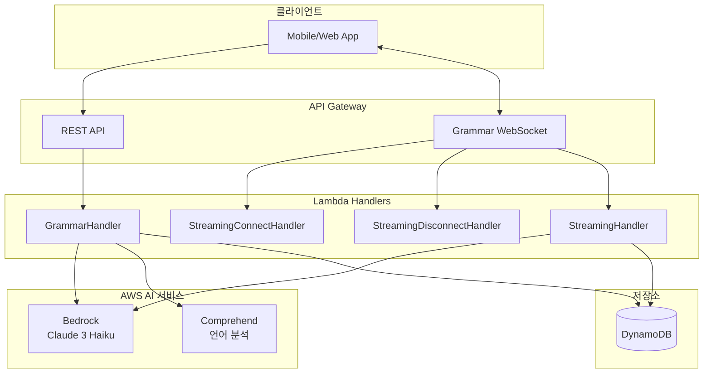
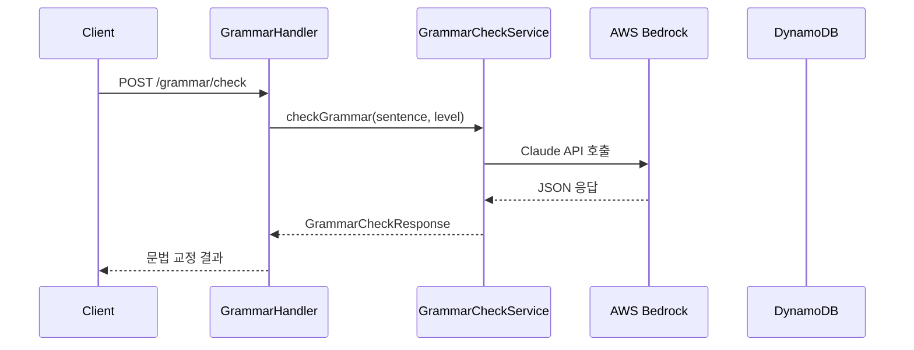
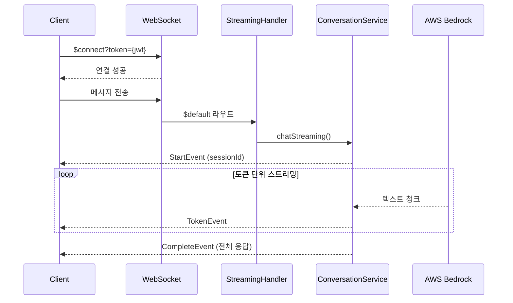
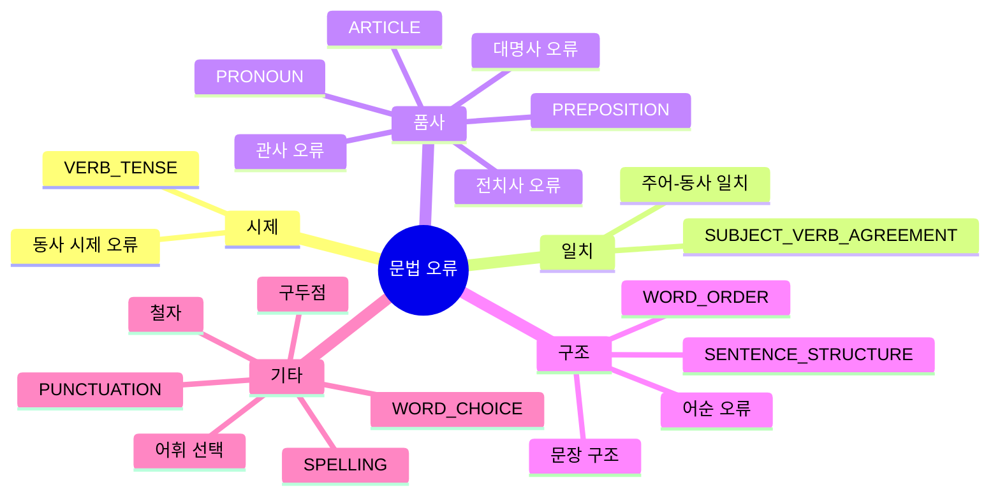
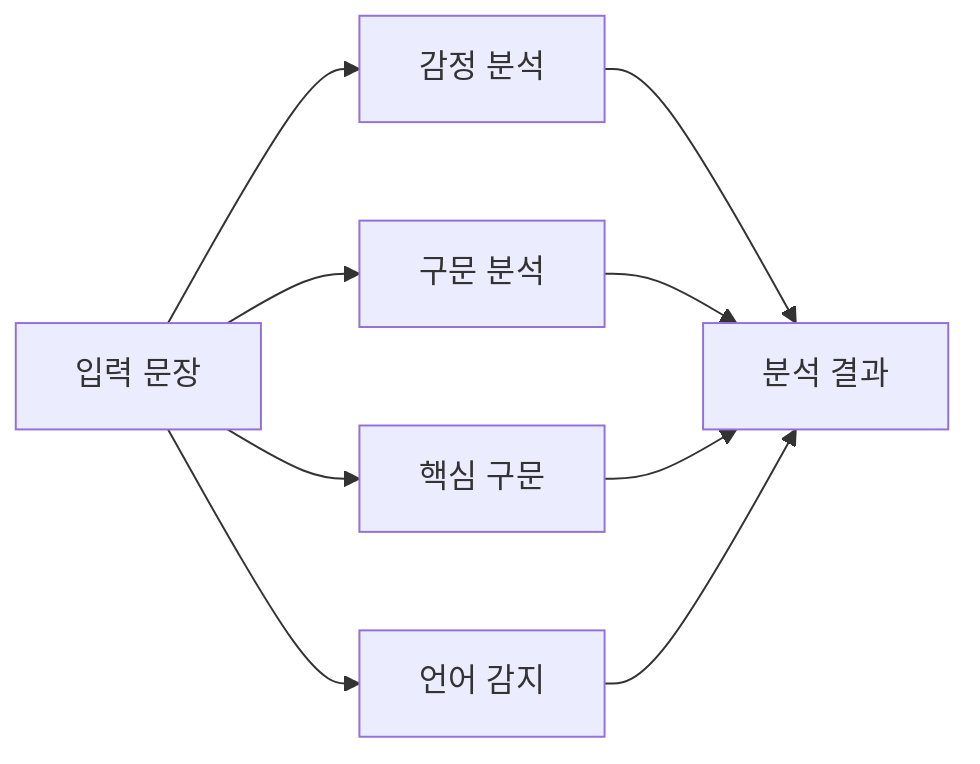

# Grammar Domain 세부 보고서

## 1. 개요

Grammar 도메인은 AWS Bedrock(Claude 3 Haiku)을 활용한 AI 기반 영어 문법 체크 시스템입니다. REST API와 WebSocket 스트리밍을 통해 실시간 문법 교정 및 대화형 학습을
제공합니다.

---

## 2. 전체 아키텍처



---

## 3. 문법 체크 흐름

### 3.1 동기식 문법 체크



### 3.2 스트리밍 대화



---

## 4. API 엔드포인트

### 4.1 REST API

| Method | Endpoint                      | 설명            |
|--------|-------------------------------|---------------|
| POST   | /grammar/check                | 문법 체크 (단일 문장) |
| POST   | /grammar/conversation         | 대화형 문법 학습     |
| GET    | /grammar/sessions             | 대화 세션 목록      |
| GET    | /grammar/sessions/{sessionId} | 세션 상세         |
| DELETE | /grammar/sessions/{sessionId} | 세션 삭제         |

### 4.2 WebSocket API

| Route       | 설명          |
|-------------|-------------|
| $connect    | JWT 토큰으로 연결 |
| $disconnect | 연결 해제       |
| $default    | 스트리밍 메시지 처리 |

---

## 5. 레벨별 문법 체크

### 5.1 학습 레벨

| 레벨           | 설명 | 피드백 스타일            |
|--------------|----|--------------------|
| BEGINNER     | 초급 | 한국어 번역 + 쉬운 설명     |
| INTERMEDIATE | 중급 | 영어 위주 설명           |
| ADVANCED     | 고급 | 상세한 문법 규칙 + 스타일 제안 |

### 5.2 오류 유형



---

## 6. 응답 포맷

### 6.1 문법 체크 응답

```json
{
  "originalSentence": "I goed to school yesterday",
  "correctedSentence": "I went to school yesterday",
  "score": 70,
  "isCorrect": false,
  "errors": [
    {
      "type": "VERB_TENSE",
      "original": "goed",
      "corrected": "went",
      "explanation": "'go'의 과거형은 'went'입니다 (불규칙 동사)",
      "startIndex": 2,
      "endIndex": 6
    }
  ],
  "feedback": "과거 시제를 잘 사용하려고 노력했네요! 불규칙 동사를 조금 더 연습해보세요."
}
```

### 6.2 대화 응답

```json
{
  "sessionId": "uuid",
  "grammarCheck": {
    /* 위와 동일 */
  },
  "aiResponse": "Great job! Your sentence structure is correct. Let's practice more complex sentences.",
  "conversationTip": "Try using 'had gone' for past perfect tense."
}
```

### 6.3 스트리밍 이벤트

```json
// StartEvent
{
  "type": "start",
  "sessionId": "uuid"
}

// TokenEvent (실시간)
{
  "type": "token",
  "token": "Great "
}
{
  "type": "token",
  "token": "job!"
}

// CompleteEvent (완료)
{
  "type": "complete",
  "sessionId": "uuid",
  "grammarCheck": {
    ...
  },
  "aiResponse": "...",
  "conversationTip": "..."
}

// ErrorEvent (오류 시)
{
  "type": "error",
  "message": "..."
}
```

---

## 7. AWS Bedrock 통합

### 7.1 Claude 3 Haiku 설정

```java
public class BedrockGrammarCheckFactory {
	private static final String MODEL_ID = "anthropic.claude-3-haiku-20240307-v1:0";
	private static final int MAX_TOKENS = 2048;
	private static final String API_VERSION = "bedrock-2023-05-31";
}
```

### 7.2 프롬프트 구조

**시스템 프롬프트 (초급):**

```
You are a friendly English grammar tutor for Korean speakers.
- Use simple English with Korean translations
- Be encouraging and supportive
- Explain grammar rules clearly
```

**사용자 프롬프트:**

```
Please check the grammar of this sentence: "{sentence}"

Return JSON:
{
  "correctedSentence": "...",
  "score": 0-100,
  "isCorrect": boolean,
  "errors": [...],
  "feedback": "..."
}
```

### 7.3 스트리밍 응답 파싱

```
[RESPONSE]
AI의 자연스러운 대화 응답
[/RESPONSE]

[GRAMMAR]
{ JSON 형식의 문법 체크 결과 }
[/GRAMMAR]

[TIP]
학습 팁
[/TIP]
```

---

## 8. 데이터 모델

### 8.1 GrammarSession

```java

@DynamoDbBean
public class GrammarSession {
	String sessionId;
	String userId;
	String level;              // BEGINNER, INTERMEDIATE, ADVANCED
	String topic;              // "Conversation Practice"
	Integer messageCount;
	String lastMessage;        // 마지막 메시지 (100자 제한)
	String createdAt;
	String updatedAt;
	Long ttl;                  // 30일
}
```

**DynamoDB Keys:**

- PK: `GSESSION#{userId}` | SK: `SESSION#{sessionId}`
- GSI1: `GSESSION#ALL` | `UPDATED#{timestamp}` (최신순 정렬)

### 8.2 GrammarMessage

```java

@DynamoDbBean
public class GrammarMessage {
	String messageId;
	String sessionId;
	String userId;
	String role;               // USER, ASSISTANT
	String content;            // 원본 메시지
	String correctedContent;   // 교정된 메시지 (USER만)
	String errorsJson;         // 오류 목록 JSON
	Integer grammarScore;
	String feedback;
	Boolean isCorrect;
	Long ttl;                  // 30일
}
```

**DynamoDB Keys:**

- PK: `GSESSION#{userId}` | SK: `MSG#{timestamp}#{messageId}`
- GSI1: `GSESSION#{sessionId}` | `MSG#{timestamp}`

### 8.3 GrammarConnection (WebSocket)

```java

@DynamoDbBean
public class GrammarConnection {
	String connectionId;       // API Gateway 연결 ID
	String userId;             // JWT에서 추출
	String connectedAt;
	Long ttl;                  // 연결 타임아웃
}
```

---

## 9. AWS Comprehend 분석 (선택적)



**분석 항목:**

- 감정: POSITIVE, NEGATIVE, NEUTRAL, MIXED
- 품사 태깅: NOUN, VERB, ADJ 등
- 핵심 구문 추출
- 문장 복잡도 추정

---

## 10. 서비스 레이어

### 10.1 서비스 구성

| Service                    | 역할             |
|----------------------------|----------------|
| GrammarCheckService        | 단일 문장 문법 체크    |
| GrammarConversationService | 대화형 학습 + 스트리밍  |
| GrammarSessionQueryService | 세션 조회, 삭제      |
| BedrockGrammarCheckFactory | Bedrock API 호출 |

### 10.2 대화 히스토리 관리

```java
// 최근 10개 메시지만 컨텍스트로 유지
private static final int MAX_HISTORY_MESSAGES = 10;

// 대화 히스토리 빌드
String buildConversationHistory(String sessionId) {
	// 최근 메시지 조회
	// USER: 내용 / ASSISTANT: 내용 형식으로 포맷
}
```

---

## 11. 파일 구조

```
domain/grammar/
├── handler/
│   ├── GrammarHandler.java
│   └── websocket/
│       ├── GrammarStreamingConnectHandler.java
│       ├── GrammarStreamingDisconnectHandler.java
│       └── GrammarStreamingHandler.java
├── service/
│   ├── GrammarCheckService.java
│   ├── GrammarConversationService.java
│   └── GrammarSessionQueryService.java
├── factory/
│   ├── GrammarCheckFactory.java (interface)
│   └── BedrockGrammarCheckFactory.java
├── repository/
│   ├── GrammarSessionRepository.java
│   └── GrammarConnectionRepository.java
├── model/
│   ├── GrammarSession.java
│   ├── GrammarMessage.java
│   └── GrammarConnection.java
├── dto/
│   ├── request/
│   │   ├── GrammarCheckRequest.java
│   │   └── ConversationRequest.java
│   └── response/
│       ├── GrammarCheckResponse.java
│       ├── ConversationResponse.java
│       ├── GrammarError.java
│       └── ComprehendAnalysis.java
├── streaming/
│   ├── StreamingCallback.java
│   ├── StreamingEvent.java (sealed interface)
│   └── StreamingRequest.java
├── enums/
│   ├── GrammarLevel.java
│   └── GrammarErrorType.java
└── constants/
    └── GrammarKey.java
```

---

## 12. 기술 스택

- **Runtime:** AWS Lambda (Java 21)
- **API:** API Gateway REST + WebSocket
- **AI:** AWS Bedrock (Claude 3 Haiku)
- **NLP:** AWS Comprehend (선택적)
- **Database:** DynamoDB
- **Auth:** JWT (Cognito)
- **Pattern:** Factory, Callback, Sealed Interface (Java 17+)
