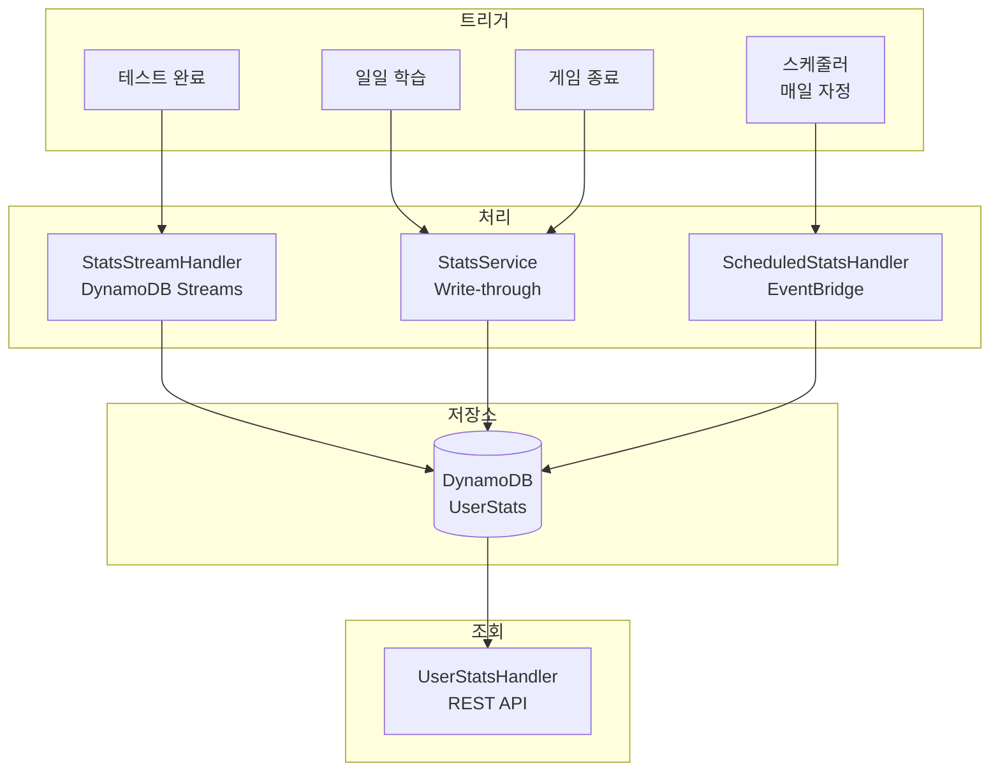
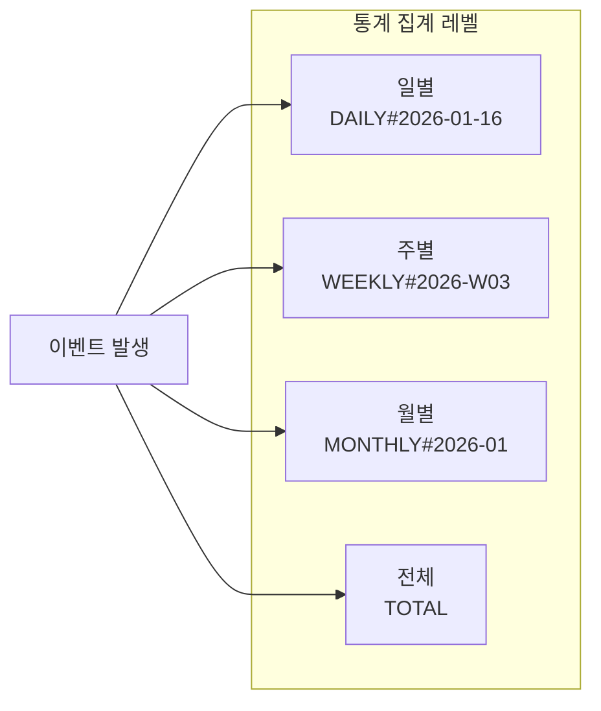
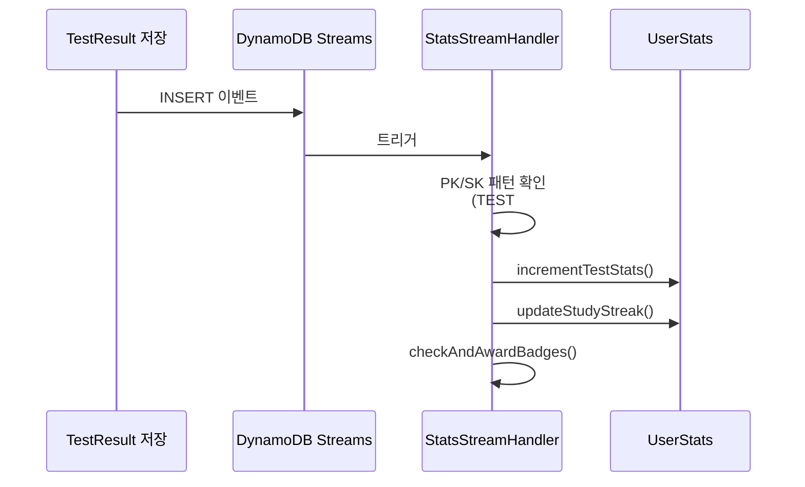
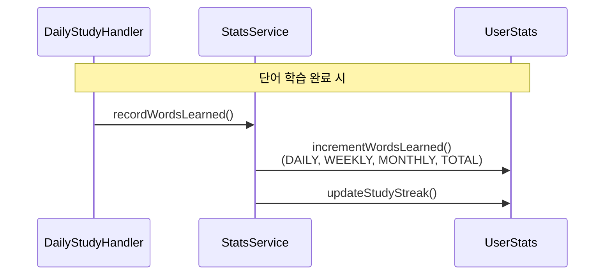
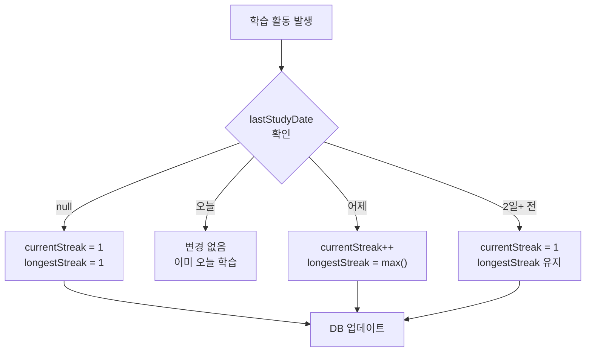
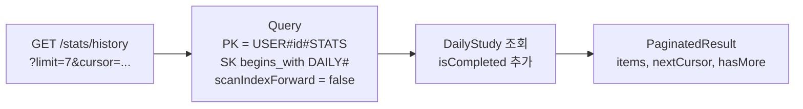
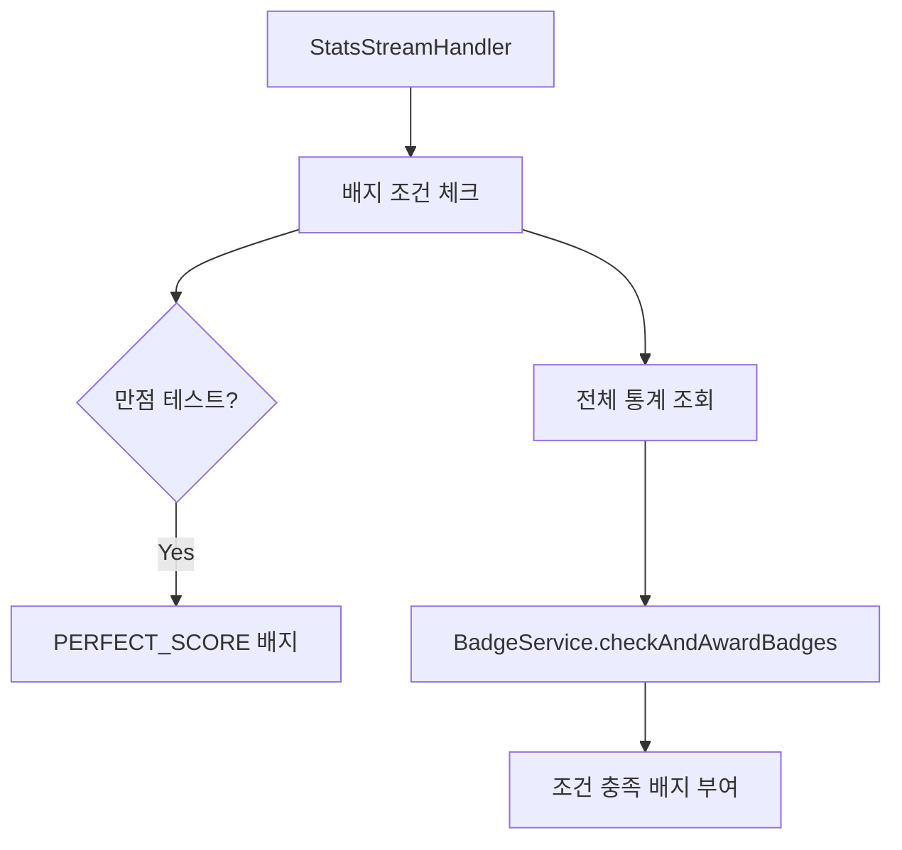

# Stats Domain 세부 보고서

## 1. 개요

Stats 도메인은 사용자의 학습 활동을 추적하고 통계를 집계하는 시스템입니다. DynamoDB Streams와 EventBridge를 활용한 이벤트 기반 아키텍처로 실시간 통계 업데이트를 제공합니다.

---

## 2. 전체 아키텍처



---

## 3. 통계 집계 방식

### 3.1 집계 레벨



### 3.2 Atomic Counter 패턴

```java
// 모든 레벨에 동시 업데이트 (원자적)
UpdateExpression:
SET correctAnswers = if_not_exists(correctAnswers, 0) + :correct,
incorrectAnswers =

if_not_exists(incorrectAnswers, 0) +:incorrect,
testsCompleted =

if_not_exists(testsCompleted, 0) +1,
updatedAt =:now
```

---

## 4. 이벤트 기반 통계 업데이트

### 4.1 DynamoDB Streams 처리



### 4.2 Write-through 패턴



---

## 5. API 엔드포인트

### 5.1 통계 조회 API

| Method | Endpoint       | 설명      | 파라미터             |
|--------|----------------|---------|------------------|
| GET    | /stats/daily   | 일별 통계   | ?date=YYYY-MM-DD |
| GET    | /stats/weekly  | 주별 통계   | ?week=YYYY-Www   |
| GET    | /stats/monthly | 월별 통계   | ?month=YYYY-MM   |
| GET    | /stats/total   | 전체 통계   | -                |
| GET    | /stats/history | 일별 히스토리 | ?cursor, ?limit  |

### 5.2 응답 예시

```json
{
  "periodType": "DAILY",
  "period": "2026-01-16",
  "testsCompleted": 3,
  "questionsAnswered": 45,
  "correctAnswers": 38,
  "incorrectAnswers": 7,
  "successRate": 84.44,
  "newWordsLearned": 50,
  "wordsReviewed": 5
}
```

**전체 통계 추가 필드:**

```json
{
  "currentStreak": 7,
  "longestStreak": 14,
  "lastStudyDate": "2026-01-16",
  "gamesPlayed": 10,
  "gamesWon": 3,
  "totalGameScore": 450
}
```

---

## 6. 연속 학습 (Streak) 시스템

### 6.1 스트릭 계산 로직



### 6.2 스트릭 리셋 (스케줄러)

```java
// EventBridge: 매일 자정 실행
@Scheduled
public void resetStreaks() {
	String yesterday = LocalDate.now().minusDays(1).toString();
	// lastStudyDate != yesterday인 사용자의 스트릭 리셋
	// 비용 최적화로 클라이언트 측 계산 권장
}
```

---

## 7. 데이터 모델

### 7.1 UserStats

```java

@DynamoDbBean
public class UserStats {
	// 키
	String pk;                   // USER#{userId}#STATS
	String sk;                   // DAILY#{date} | WEEKLY#{week} | MONTHLY#{month} | TOTAL
	
	// 메타데이터
	String userId;
	String periodType;           // DAILY, WEEKLY, MONTHLY, TOTAL
	String period;               // 2026-01-16, 2026-W03, 2026-01, TOTAL
	
	// 테스트 통계
	Integer testsCompleted;
	Integer questionsAnswered;
	Integer correctAnswers;
	Integer incorrectAnswers;
	Double successRate;
	
	// 학습 통계
	Integer newWordsLearned;
	Integer wordsReviewed;
	Integer wordsMastered;
	
	// 스트릭 (TOTAL만)
	Integer currentStreak;
	Integer longestStreak;
	String lastStudyDate;
	
	// 게임 통계 (TOTAL만)
	Integer gamesPlayed;
	Integer gamesWon;
	Integer correctGuesses;
	Integer totalGameScore;
	Integer quickGuesses;        // 5초 이내 정답
	Integer perfectDraws;        // 전원 정답 유도
	
	// 타임스탬프
	String createdAt;
	String updatedAt;
}
```

### 7.2 DynamoDB 키 구조

| 필드      | 패턴                     | 예시                |
|---------|------------------------|-------------------|
| PK      | USER#{userId}#STATS    | USER#abc123#STATS |
| SK (일별) | DAILY#{date}           | DAILY#2026-01-16  |
| SK (주별) | WEEKLY#{year}-W{week}  | WEEKLY#2026-W03   |
| SK (월별) | MONTHLY#{year}-{month} | MONTHLY#2026-01   |
| SK (전체) | TOTAL                  | TOTAL             |

---

## 8. 통계 메트릭

### 8.1 테스트 메트릭

| 메트릭               | 설명       | 업데이트 시점 |
|-------------------|----------|---------|
| testsCompleted    | 완료 테스트 수 | 테스트 제출  |
| questionsAnswered | 총 문제 수   | 테스트 제출  |
| correctAnswers    | 정답 수     | 테스트 제출  |
| incorrectAnswers  | 오답 수     | 테스트 제출  |
| successRate       | 정답률 (%)  | 조회 시 계산 |

### 8.2 학습 메트릭

| 메트릭             | 설명       | 업데이트 시점 |
|-----------------|----------|---------|
| newWordsLearned | 신규 학습 단어 | 일일학습 완료 |
| wordsReviewed   | 복습 단어    | 일일학습 완료 |
| wordsMastered   | 마스터 단어   | 상태 변경 시 |

### 8.3 게임 메트릭

| 메트릭            | 설명       | 업데이트 시점 |
|----------------|----------|---------|
| gamesPlayed    | 참여 게임 수  | 게임 종료   |
| gamesWon       | 1등 횟수    | 게임 종료   |
| correctGuesses | 정답 횟수    | 게임 종료   |
| totalGameScore | 누적 점수    | 게임 종료   |
| quickGuesses   | 5초 내 정답  | 게임 종료   |
| perfectDraws   | 전원 정답 유도 | 게임 종료   |

---

## 9. 히스토리 조회

### 9.1 페이지네이션



### 9.2 응답 구조

```json
{
  "history": [
    {
      "period": "2026-01-16",
      "testsCompleted": 2,
      "questionsAnswered": 30,
      "correctAnswers": 25,
      "incorrectAnswers": 5,
      "successRate": 83.33,
      "newWordsLearned": 50,
      "wordsReviewed": 5,
      "isCompleted": true
    }
  ],
  "nextCursor": "base64encoded...",
  "hasMore": true
}
```

---

## 10. 배지 연동

### 10.1 자동 배지 체크



### 10.2 배지 조건 예시

| 배지           | 조건       | 통계 필드                |
|--------------|----------|----------------------|
| STREAK_7     | 7일 연속 학습 | currentStreak >= 7   |
| ACCURACY_90  | 정확도 90%  | successRate >= 90    |
| TEST_10      | 10회 테스트  | testsCompleted >= 10 |
| GAME_10_WINS | 10번 1등   | gamesWon >= 10       |

---

## 11. 파일 구조

```
domain/stats/
├── handler/
│   ├── UserStatsHandler.java      (REST API)
│   ├── StatsStreamHandler.java    (DynamoDB Streams)
│   └── ScheduledStatsHandler.java (EventBridge)
├── service/
│   └── StatsService.java
├── repository/
│   └── UserStatsRepository.java
├── model/
│   └── UserStats.java
└── constants/
    └── StatsKey.java
```

---

## 12. 성능 최적화

| 최적화                      | 기법               | 효과                |
|--------------------------|------------------|-------------------|
| 원자적 업데이트                 | UpdateExpression | Race condition 방지 |
| 비동기 처리                   | DynamoDB Streams | API 응답 속도 향상      |
| Cursor 페이지네이션            | lastEvaluatedKey | 대용량 히스토리 처리       |
| Strongly Consistent Read | 히스토리 조회          | 데이터 정합성           |

---

## 13. 기술 스택

- **Runtime:** AWS Lambda (Java 21)
- **Database:** DynamoDB (Single Table Design)
- **Event:** DynamoDB Streams, EventBridge
- **Pattern:** Atomic Counter, Write-through, Event-driven
