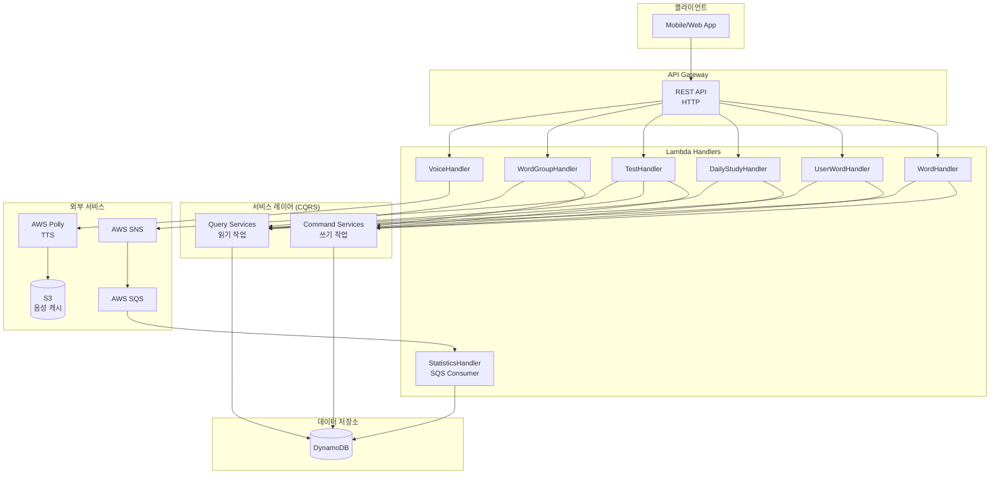
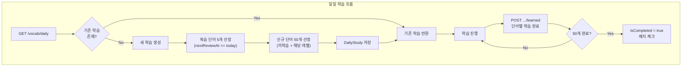
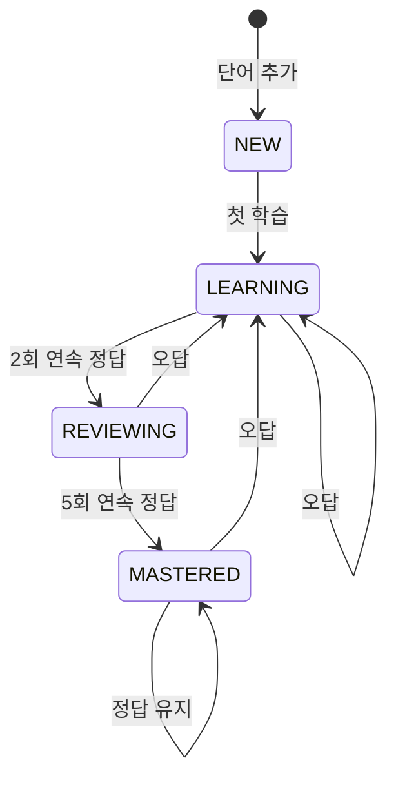
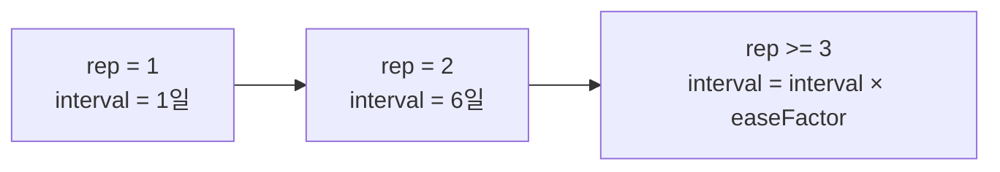
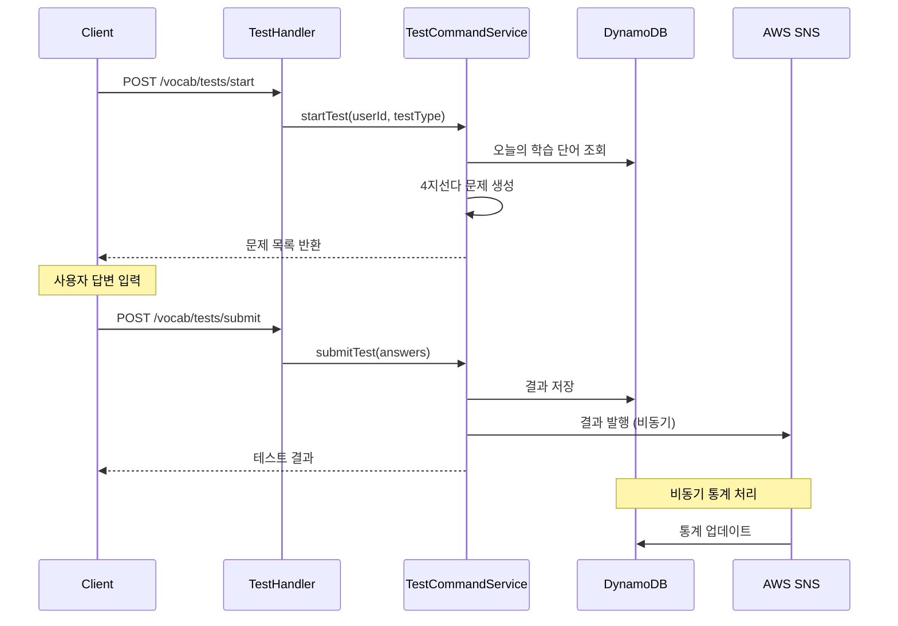
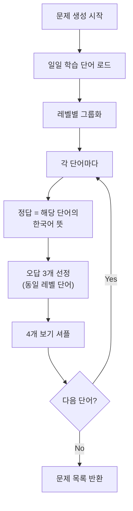
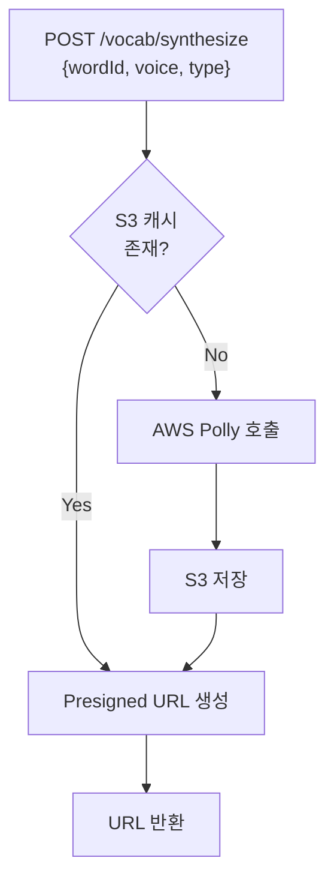
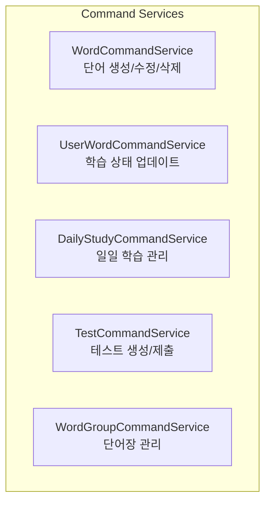
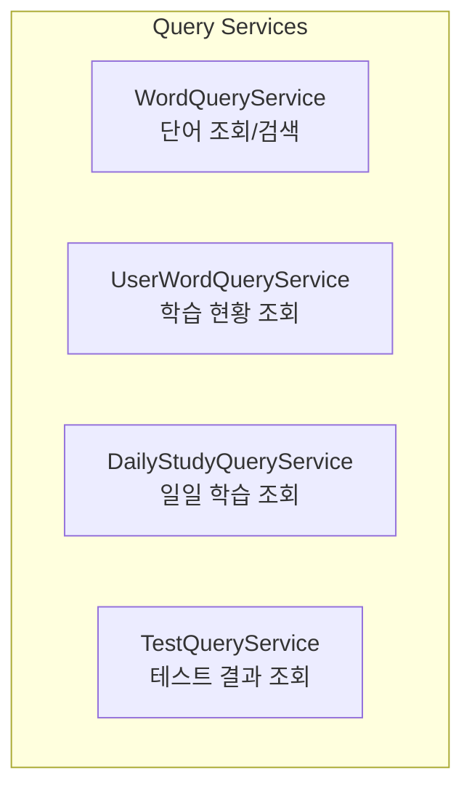

# Vocabulary Domain 세부 보고서

## 1. 개요

Vocabulary 도메인은 AWS Lambda와 DynamoDB를 기반으로 한 영어 단어 학습 시스템입니다. SM-2 Spaced Repetition 알고리즘과 CQRS 패턴을 적용하여 과학적이고 효율적인 단어
암기를 지원합니다.

---

## 2. 전체 아키텍처



---

## 3. 일일 학습 시스템

### 3.1 일일 학습 흐름



### 3.2 Daily Study API

| Method | Endpoint                            | 설명              |
|--------|-------------------------------------|-----------------|
| GET    | /vocab/daily                        | 오늘의 학습 단어 조회/생성 |
| POST   | /vocab/daily/words/{wordId}/learned | 단어 학습 완료 처리     |

### 3.3 응답 예시

```json
{
  "userId": "user123",
  "date": "2026-01-16",
  "newWordIds": [
    "word1",
    "word2",
    ...
  ],
  "reviewWordIds": [
    "word51",
    "word52",
    ...
  ],
  "learnedWordIds": [],
  "totalWords": 55,
  "learnedCount": 0,
  "isCompleted": false,
  "progress": {
    "percentage": 0,
    "learned": 0,
    "total": 55
  }
}
```

---

## 4. SM-2 Spaced Repetition 알고리즘

### 4.1 학습 상태 전이



### 4.2 상태별 로직

| 상태            | 조건          | 정답 시                        | 오답 시                      |
|---------------|-------------|-----------------------------|---------------------------|
| **NEW**       | 신규 단어       | LEARNING, rep=1, interval=1 | LEARNING, easeFactor-=0.2 |
| **LEARNING**  | rep < 2     | rep++, interval 계산          | rep=0, interval=1         |
| **REVIEWING** | 2 ≤ rep < 5 | rep++, interval 증가          | rep=0, LEARNING           |
| **MASTERED**  | rep ≥ 5     | interval 증가, 유지             | rep=0, REVIEWING          |

### 4.3 복습 간격 계산



**핵심 변수:**

- `repetitions`: 연속 정답 횟수 (0~∞)
- `interval`: 복습 간격 (일 단위)
- `easeFactor`: 난이도 계수 (1.3~2.5, 기본 2.5)
- `nextReviewAt`: 다음 복습 예정일

---

## 5. 테스트 시스템

### 5.1 테스트 흐름



### 5.2 문제 생성 알고리즘



### 5.3 Test API

| Method | Endpoint                      | 설명         |
|--------|-------------------------------|------------|
| POST   | /vocab/tests/start            | 테스트 시작     |
| POST   | /vocab/tests/submit           | 테스트 제출     |
| GET    | /vocab/tests/results          | 테스트 결과 목록  |
| GET    | /vocab/tests/results/{testId} | 테스트 상세 결과  |
| GET    | /vocab/tests/tested-words     | 최근 테스트된 단어 |

---

## 6. 단어 관리 시스템

### 6.1 Word API

| Method | Endpoint               | 설명                         |
|--------|------------------------|----------------------------|
| GET    | /vocab/words           | 단어 목록 (level, category 필터) |
| POST   | /vocab/words           | 단어 등록                      |
| GET    | /vocab/words/{wordId}  | 단어 상세                      |
| PUT    | /vocab/words/{wordId}  | 단어 수정                      |
| DELETE | /vocab/words/{wordId}  | 단어 삭제                      |
| GET    | /vocab/words/search    | 키워드 검색                     |
| POST   | /vocab/words/batch     | 배치 등록 (최대 100개)            |
| POST   | /vocab/words/batch/get | 배치 조회                      |

### 6.2 User Word API

| Method | Endpoint                          | 설명          |
|--------|-----------------------------------|-------------|
| GET    | /vocab/user-words                 | 사용자 단어 목록   |
| GET    | /vocab/user-words/{wordId}        | 사용자 단어 상세   |
| PUT    | /vocab/user-words/{wordId}        | 정답/오답 기록    |
| PATCH  | /vocab/user-words/{wordId}/tag    | 북마크, 난이도 설정 |
| PATCH  | /vocab/user-words/{wordId}/status | 상태 수동 변경    |
| GET    | /vocab/wrong-answers              | 오답 단어 목록    |

### 6.3 Word Group API

| Method | Endpoint                               | 설명     |
|--------|----------------------------------------|--------|
| POST   | /vocab/groups                          | 단어장 생성 |
| GET    | /vocab/groups                          | 단어장 목록 |
| GET    | /vocab/groups/{groupId}                | 단어장 상세 |
| PUT    | /vocab/groups/{groupId}                | 단어장 수정 |
| DELETE | /vocab/groups/{groupId}                | 단어장 삭제 |
| POST   | /vocab/groups/{groupId}/words/{wordId} | 단어 추가  |
| DELETE | /vocab/groups/{groupId}/words/{wordId} | 단어 제거  |

---

## 7. TTS 음성 합성

### 7.1 음성 생성 흐름



### 7.2 Voice API

```json
// Request
{
  "wordId": "uuid",
  "voice": "MALE",
  // MALE | FEMALE
  "type": "WORD"
  // WORD | EXAMPLE
}

// Response
{
  "url": "https://s3...presigned-url",
  "expiresIn": 3600
}
```

---

## 8. 데이터 모델

### 8.1 Word

```java

@DynamoDbBean
public class Word {
	String wordId;            // UUID
	String english;           // 영어 단어
	String korean;            // 한국어 뜻
	String example;           // 예문
	String level;             // BEGINNER | INTERMEDIATE | ADVANCED
	String category;          // DAILY | BUSINESS | ACADEMIC | TRAVEL | TECHNOLOGY
	String maleVoiceKey;      // S3 음성 키
	String femaleVoiceKey;
	String maleExampleVoiceKey;
	String femaleExampleVoiceKey;
}
```

**DynamoDB Keys:**

| Key    | 패턴                  | 용도       |
|--------|---------------------|----------|
| PK     | WORD#{wordId}       | 기본 조회    |
| SK     | METADATA            | -        |
| GSI1PK | LEVEL#{level}       | 레벨별 조회   |
| GSI2PK | CATEGORY#{category} | 카테고리별 조회 |

### 8.2 UserWord

```java

@DynamoDbBean
public class UserWord {
	String userId;
	String wordId;
	String status;            // NEW | LEARNING | REVIEWING | MASTERED
	
	// SM-2 알고리즘 필드
	Integer interval;         // 복습 간격 (일)
	Double easeFactor;        // 난이도 계수 (1.3~2.5)
	Integer repetitions;      // 연속 정답 횟수
	String nextReviewAt;      // 다음 복습일 (YYYY-MM-DD)
	
	// 통계
	Integer correctCount;     // 누적 정답
	Integer incorrectCount;   // 누적 오답
	
	// 사용자 설정
	Boolean bookmarked;       // 북마크
	Boolean favorite;         // 즐겨찾기
	String difficulty;        // EASY | NORMAL | HARD
}
```

**DynamoDB Keys:**

| Key    | 패턴                       | 용도           |
|--------|--------------------------|--------------|
| PK     | USER#{userId}            | 기본 조회        |
| SK     | WORD#{wordId}            | -            |
| GSI1PK | USER#{userId}#REVIEW     | 복습 예정 단어     |
| GSI1SK | DATE#{nextReviewAt}      | -            |
| GSI2PK | USER#{userId}#STATUS     | 상태별 조회       |
| GSI2SK | STATUS#{status}          | -            |
| GSI3PK | USER#{userId}#BOOKMARKED | 북마크 (Sparse) |

### 8.3 DailyStudy

```java

@DynamoDbBean
public class DailyStudy {
	String userId;
	String date;              // YYYY-MM-DD
	List<String> newWordIds;      // 신규 단어 50개
	List<String> reviewWordIds;   // 복습 단어 5개
	List<String> learnedWordIds;  // 학습 완료 단어
	Integer totalWords;       // 총 단어 수 (55)
	Integer learnedCount;     // 학습 완료 수
	Boolean isCompleted;      // 완료 여부
}
```

### 8.4 TestResult

```java

@DynamoDbBean
public class TestResult {
	String testId;
	String userId;
	String testType;          // DAILY | WEEKLY | CUSTOM
	Integer totalQuestions;
	Integer correctAnswers;
	Integer incorrectAnswers;
	Double successRate;
	List<String> testedWordIds;
	List<String> incorrectWordIds;
	String startedAt;
	String completedAt;
}
```

---

## 9. 서비스 아키텍처 (CQRS)

### 9.1 Command Services (쓰기)



### 9.2 Query Services (읽기)



---

## 10. 성능 최적화

| 최적화                 | 기법                     | 효과              |
|---------------------|------------------------|-----------------|
| N+1 방지              | BatchGetItem (100개 단위) | DB 호출 90% 감소    |
| TTS 캐싱              | S3 + Presigned URL     | Polly 호출 90% 절감 |
| 페이지네이션              | Cursor 기반 (Base64)     | 대용량 데이터 처리      |
| Sparse Index        | GSI3 (북마크 전용)          | 인덱스 크기 최소화      |
| 비동기 통계              | SNS/SQS                | API 응답 속도 향상    |
| Strongly Consistent | DailyStudy 조회          | 데이터 정합성         |

---

## 11. 파일 구조

```
domain/vocabulary/
├── handler/
│   ├── WordHandler.java
│   ├── UserWordHandler.java
│   ├── DailyStudyHandler.java
│   ├── TestHandler.java
│   ├── WordGroupHandler.java
│   ├── VoiceHandler.java
│   ├── StatsHandler.java
│   └── StatisticsHandler.java (SQS)
├── service/
│   ├── WordCommandService.java
│   ├── WordQueryService.java
│   ├── UserWordCommandService.java
│   ├── UserWordQueryService.java
│   ├── TestCommandService.java
│   ├── TestQueryService.java
│   ├── DailyStudyCommandService.java
│   ├── DailyStudyQueryService.java
│   ├── WordGroupCommandService.java
│   ├── StatsService.java
│   └── StatisticsService.java
├── repository/
│   ├── WordRepository.java
│   ├── UserWordRepository.java
│   ├── DailyStudyRepository.java
│   ├── TestResultRepository.java
│   └── WordGroupRepository.java
├── model/
│   ├── Word.java
│   ├── UserWord.java
│   ├── DailyStudy.java
│   ├── TestResult.java
│   └── WordGroup.java
├── state/
│   ├── WordState.java (interface)
│   ├── NewState.java
│   ├── LearningState.java
│   ├── ReviewingState.java
│   ├── MasteredState.java
│   ├── SpacedRepetitionContext.java
│   └── WordStateFactory.java
└── enums/
    ├── WordStatus.java
    ├── WordCategory.java
    └── TestType.java
```

---

## 12. 기술 스택

- **Runtime:** AWS Lambda (Java 21)
- **Database:** DynamoDB (Single Table Design)
- **TTS:** AWS Polly (남성/여성 음성)
- **Storage:** S3 (음성 캐시)
- **Messaging:** SNS/SQS (비동기 통계)
- **Pattern:** CQRS, State, Repository, Factory
