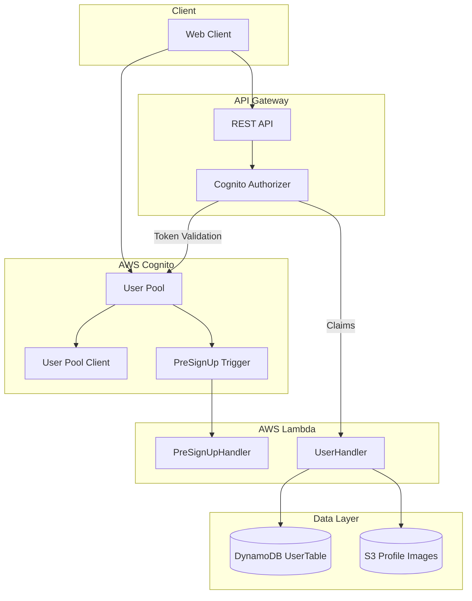
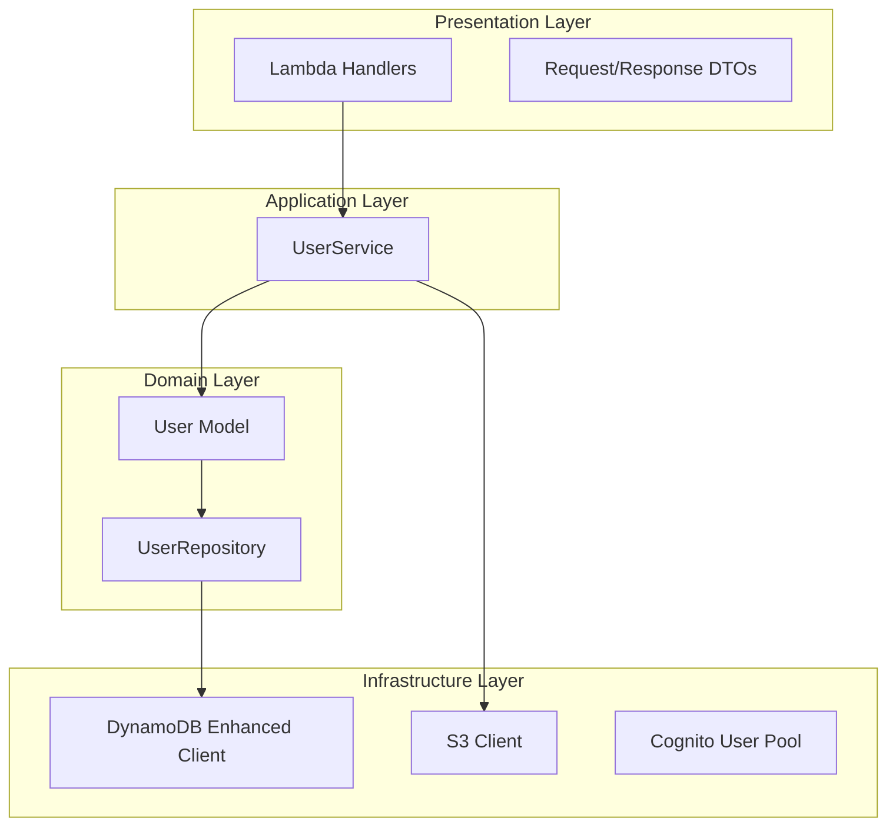
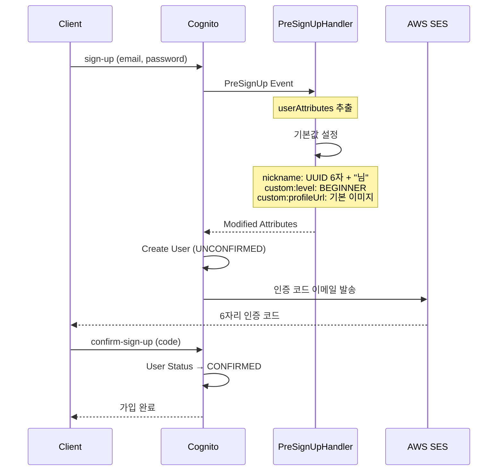
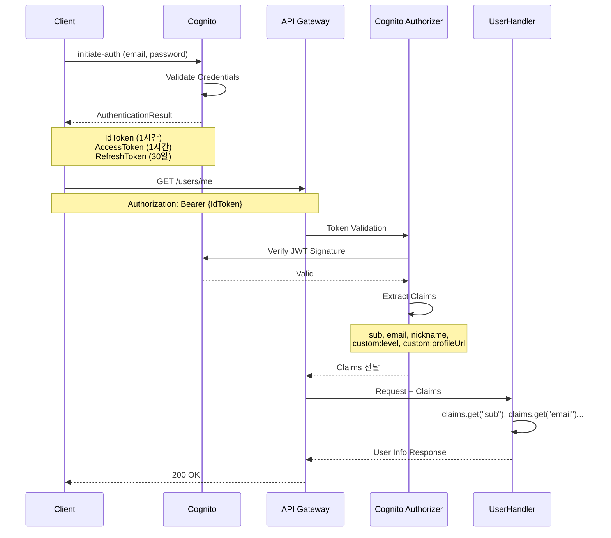
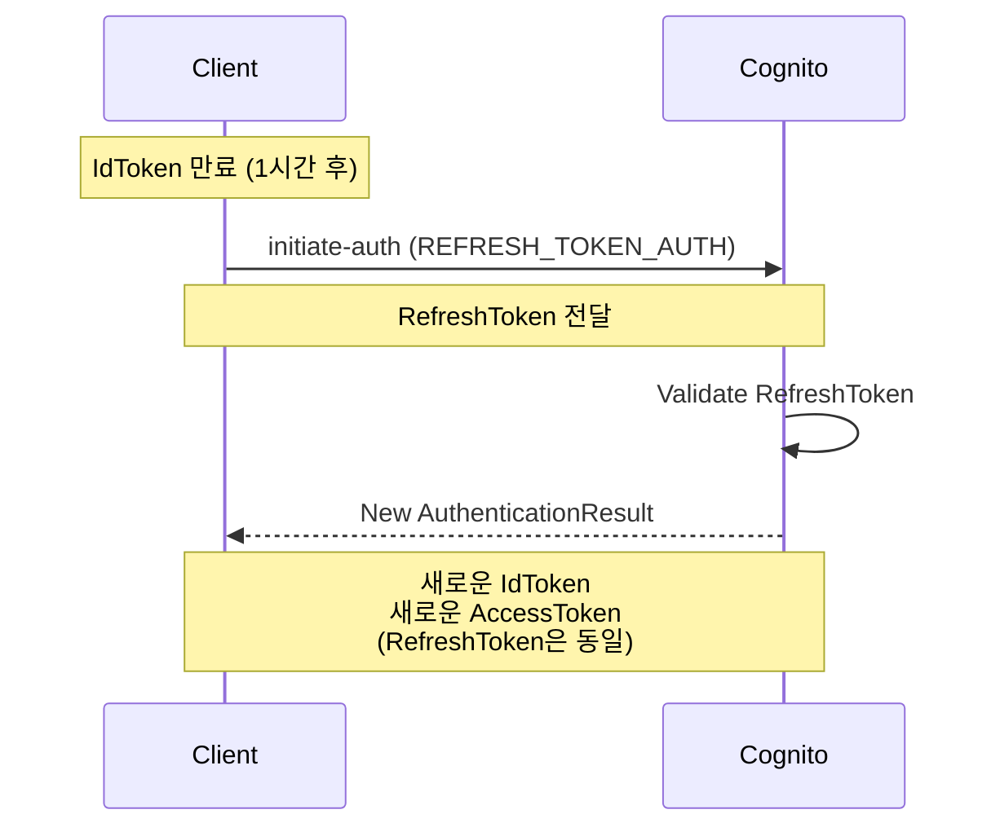
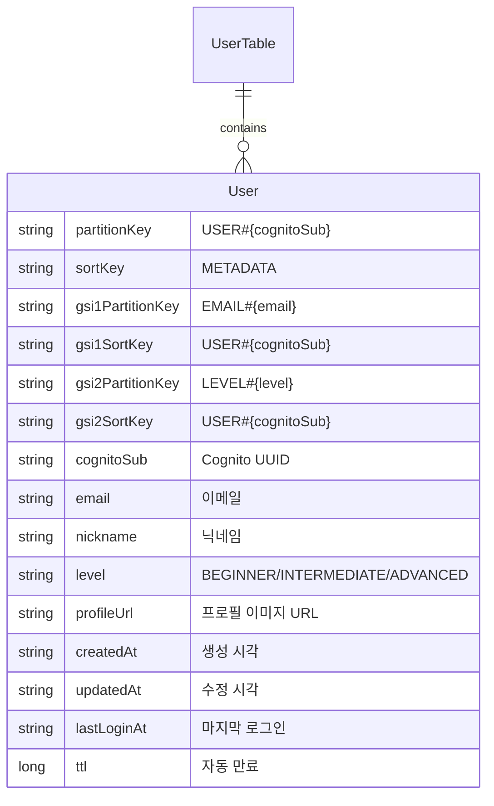
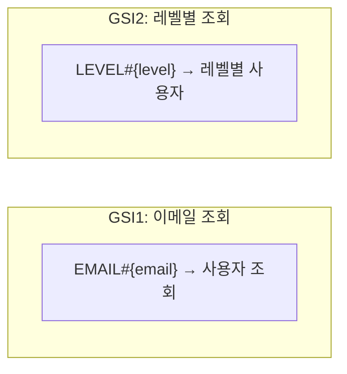

# User Domain 가이드 문서

## 1. 개요

### 1.1 목적

User Server는 영어 회화 학습 플랫폼의 사용자 인증 및 프로필 관리를 담당하는 서버리스 마이크로서비스이다. AWS Cognito를 활용하여 안전한 인증 체계를 제공하고, 사용자별 학습 데이터 및 개인 설정을
관리한다.

### 1.2 주요 기능

| 기능     | 설명                                               |
|--------|--------------------------------------------------|
| 회원가입   | Cognito 기반 이메일 회원가입                              |
| 이메일 인증 | Cognito 자동 인증 코드 발송                              |
| 로그인    | JWT 토큰 발급 (IdToken, AccessToken, RefreshToken)   |
| 프로필 조회 | 인증된 사용자 정보 조회                                    |
| 프로필 수정     | 닉네임, 레벨 변경                                       |
| 프로필 이미지 업로드 | S3 Presigned URL 발급 및 이미지 업로드                    |
| 기본값 설정 | PreSignUp 트리거로 nickname, level, profileUrl 자동 설정 |

### 1.3 기술 스택

| 구분             | 기술                                 |
|----------------|------------------------------------|
| Platform       | AWS Lambda (Serverless)            |
| Language       | Java 21 (Eclipse Temurin)          |
| Authentication | AWS Cognito User Pool              |
| Authorization  | Cognito Built-in Authorizer        |
| Database       | AWS DynamoDB (Single Table Design) |
| Storage        | AWS S3 (프로필 이미지)                   |

---

## 2. 시스템 아키텍처

### 2.1 전체 구조



### 2.2 레이어 아키텍처



### 2.3 회원가입 흐름



### 2.4 로그인 및 토큰 발급 흐름



### 2.5 토큰 갱신 흐름



---

## 3. 데이터 모델

### 3.1 Cognito User Attributes

| Attribute         | Type     | Required | Mutable | 설명                                      |
|-------------------|----------|----------|---------|-----------------------------------------|
| sub               | Standard | Y        | N       | Cognito 고유 ID (UUID)                    |
| email             | Standard | Y        | N       | 이메일 (로그인 ID)                            |
| email_verified    | Standard | Y        | N       | 이메일 인증 여부                               |
| nickname          | Standard | N        | Y       | 닉네임                                     |
| custom:level      | Custom   | N        | Y       | 학습 난이도 (BEGINNER/INTERMEDIATE/ADVANCED) |
| custom:profileUrl | Custom   | N        | Y       | 프로필 이미지 URL                             |

### 3.2 ERD (DynamoDB - 향후 확장용)



| 필드     | 패턴                | 설명      |
|--------|-------------------|---------|
| PK     | USER#{cognitoSub} | 파티션 키   |
| SK     | METADATA          | 정렬 키    |
| GSI1PK | EMAIL#{email}     | 이메일 조회용 |
| GSI1SK | USER#{cognitoSub} | -       |
| GSI2PK | LEVEL#{level}     | 레벨별 조회용 |
| GSI2SK | USER#{cognitoSub} | -       |

### 3.3 GSI (Global Secondary Index) 설계



---

## 4. API 명세

### 4.1 인증 (Cognito SDK 직접 호출)

#### 회원가입 (sign-up)

```bash
aws cognito-idp sign-up \
  --client-id {CognitoClientId} \
  --username {EMAIL} \
  --password {PASSWORD} \
  --user-attributes Name=email,Value={EMAIL}
```

**Response (Success)**

```json
{
    "UserConfirmed": false,
    "CodeDeliveryDetails": {
        "Destination": "h***@g***.com",
        "DeliveryMedium": "EMAIL",
        "AttributeName": "email"
    },
    "UserSub": "d4088d7c-e0f1-70bd-3b7a-eb8b812e3ae4"
}
```

#### 이메일 인증 (confirm-sign-up)

```bash
aws cognito-idp confirm-sign-up \
  --client-id {CognitoClientId} \
  --username {EMAIL} \
  --confirmation-code {6자리 코드}
```

#### 로그인 (initiate-auth)

```bash
aws cognito-idp initiate-auth \
  --client-id {CognitoClientId} \
  --auth-flow USER_PASSWORD_AUTH \
  --auth-parameters USERNAME={EMAIL},PASSWORD={PASSWORD}
```

**Response (Success)**

```json
{
    "ChallengeParameters": {},
    "AuthenticationResult": {
        "AccessToken": "eyJraWQiOiJ1Y2F1aEZCT0o5djV0c29q...",
        "ExpiresIn": 3600,
        "TokenType": "Bearer",
        "RefreshToken": "eyJjdHkiOiJKV1QiLCJlbmMiOiJBMjU2R0NNIi...",
        "IdToken": "eyJraWQiOiJPbFAzMHFxZUxpK1VGMSs4SElVVnBN..."
    }
}
```

**IdToken Payload (Decoded)**

```json
{
    "sub": "d4088d7c-e0f1-70bd-3b7a-eb8b812e3ae4",
    "email_verified": true,
    "iss": "https://cognito-idp.ap-northeast-2.amazonaws.com/ap-northeast-2_ezDwzFCzR",
    "cognito:username": "d4088d7c-e0f1-70bd-3b7a-eb8b812e3ae4",
    "aud": "4ns077jcr1pkue2vvisr6qdpu5",
    "event_id": "1a9b6343-fd03-4de3-b1c1-db52131442d4",
    "token_use": "id",
    "auth_time": 1768103576,
    "exp": 1768107176,
    "iat": 1768103576,
    "email": "hye.ina0130@gmail.com"
}
```

#### 토큰 갱신 (refresh-token)

```bash
aws cognito-idp initiate-auth \
  --client-id 4ns077jcr1pkue2vvisr6qdpu5 \
  --auth-flow REFRESH_TOKEN_AUTH \
  --auth-parameters REFRESH_TOKEN={REFRESH_TOKEN}
```

### 4.2 프로필 API

#### GET /users/profile/me - 내 정보 조회

**Headers**

| Header        | 값                | 필수 |
|---------------|------------------|----|
| Authorization | Bearer {IdToken} | Y  |

**Response (200 OK)**

```json
{
    "success": true,
    "message": "A7K2X9님 환영합니다!",
    "data": {
        "userId": "d4088d7c-e0f1-70bd-3b7a-eb8b812e3ae4",
        "email": "hye.ina0130@gmail.com",
        "nickname": "A7K2X9님"
    }
}
```

---

## 5. 비즈니스 규칙

### 5.1 회원가입 기본값 (PreSignUp Trigger)

| 항목                | 조건            | 기본값           | 예시                                                               |
|-------------------|---------------|---------------|------------------------------------------------------------------|
| nickname          | null 또는 빈 문자열 | UUID 6자 + "님" | "A7K2X9님"                                                        |
| custom:level      | null 또는 빈 문자열 | BEGINNER      | "BEGINNER"                                                       |
| custom:profileUrl | null 또는 빈 문자열 | S3 기본 이미지     | https://group2-englishstudy.s3.amazonaws.com/profile/default.png |

### 5.2 비밀번호 정책 (Cognito)

| 항목    | 요구사항  |
|-------|-------|
| 최소 길이 | 8자    |
| 소문자   | 1개 이상 |
| 숫자    | 1개 이상 |
| 특수문자  | 1개 이상 |

### 5.3 토큰 유효 시간

| 토큰           | 유효 시간       | 용도             |
|--------------|-------------|----------------|
| IdToken      | 1시간 (3600초) | API 인증, 사용자 정보 |
| AccessToken  | 1시간 (3600초) | Cognito API 호출 |
| RefreshToken | 30일         | 토큰 갱신          |

---

## 6. 에러 코드

### 6.1 Cognito 에러

| Error Code                | HTTP | 설명          | 해결 방법       |
|---------------------------|------|-------------|-------------|
| UsernameExistsException   | 400  | 이미 존재하는 이메일 | 다른 이메일 사용   |
| InvalidPasswordException  | 400  | 비밀번호 정책 미충족 | 정책에 맞는 비밀번호 |
| CodeMismatchException     | 400  | 인증 코드 불일치   | 올바른 코드 입력   |
| ExpiredCodeException      | 400  | 인증 코드 만료    | 재발송 요청      |
| NotAuthorizedException    | 401  | 비밀번호 틀림     | 올바른 비밀번호    |
| UserNotConfirmedException | 400  | 이메일 미인증     | 인증 완료 필요    |
| UserNotFoundException     | 400  | 존재하지 않는 사용자 | 회원가입 필요     |

### 6.2 API 에러

| HTTP Code | Error Code | 메시지              |
|-----------|------------|------------------|
| 401       | AUTH_001   | 인증이 필요합니다        |
| 401       | AUTH_003   | 유효하지 않은 토큰입니다    |
| 401       | AUTH_004   | 토큰이 만료되었습니다      |
| 500       | SYSTEM_001 | 내부 서버 오류가 발생했습니다 |

### 6.3 에러 응답 형식

```json
{
    "success": false,
    "error": {
        "code": "AUTH_003",
        "message": "유효하지 않은 토큰입니다"
    }
}
```

---

## 7. 환경 설정

### 7.1 Cognito User Pool (template.yaml)

```yaml
CognitoUserPool:
  Type: AWS::Cognito::UserPool
  Properties:
    UserPoolName: group2-englishstudy-userpool
    AutoVerifiedAttributes:
      - email
    UsernameAttributes:
      - email
    Policies:
      PasswordPolicy:
        MinimumLength: 8
        RequireUppercase: false
        RequireLowercase: true
        RequireNumbers: true
        RequireSymbols: true
    Schema:
      - Name: email
        Required: true
        Mutable: false
      - Name: nickname
        Mutable: true
      - Name: level
        AttributeDataType: String
        Mutable: true
      - Name: profileUrl
        AttributeDataType: String
        Mutable: true
    LambdaConfig:
      PreSignUp: !GetAtt PreSignUpFunction.Arn
```

### 7.2 Cognito User Pool Client

```yaml
CognitoUserPoolClient:
  Type: AWS::Cognito::UserPoolClient
  Properties:
    ClientName: group2-englishstudy-client
    UserPoolId: !Ref CognitoUserPool
    GenerateSecret: false
    ExplicitAuthFlows:
      - ALLOW_USER_PASSWORD_AUTH
      - ALLOW_REFRESH_TOKEN_AUTH
    ReadAttributes:
      - email
      - nickname
      - custom:level
      - custom:profileUrl
    WriteAttributes:
      - email
      - nickname
      - custom:level
      - custom:profileUrl
```

### 7.3 API Gateway Cognito Authorizer

```yaml
MainApi:
  Type: AWS::Serverless::Api
  Properties:
    Auth:
      DefaultAuthorizer: CognitoAuthorizer
      Authorizers:
        CognitoAuthorizer:
          UserPoolArn: !GetAtt CognitoUserPool.Arn
```

### 7.4 환경 변수

```yaml
Environment:
  Variables:
    USER_TABLE_NAME: !Ref UserTable
    DEFAULT_PROFILE_URL: https://group2-englishstudy.s3.amazonaws.com/profile/default.png
```

---

## 8. 프로젝트 구조

```
domain/user/
├── handler/
│   ├── PreSignUpHandler.java      # Cognito PreSignUp 트리거
│   └── UserHandler.java           # REST API - 프로필 조회/수정
│
├── service/
│   └── UserService.java           # 비즈니스 로직 
│
├── repository/
│   └── UserRepository.java        # DynamoDB 데이터 접근
│
├── model/
│   └── User.java                  # 사용자 엔티티
│
└── dto/
  
```

---

## 9. 구현 현황

### Phase 1 - Cognito 인증 (완료)

- [x] Cognito User Pool 생성
- [x] Cognito User Pool Client 생성
- [x] PreSignUp Lambda 트리거 (기본값 설정)
- [x] Cognito Built-in Authorizer 연결
- [x] 회원가입/이메일인증/로그인 테스트
- [x] UserHandler (claims 추출)

### Phase 2 - 프로필 관리 (예정)

- [ ] GET /users/profile/me - 내 프로필 상세 조회
- [ ] PUT /users/profile/me - 프로필 수정 (닉네임, 레벨)
- [ ] POST /users/profile/me/image - 프로필 이미지 업로드 (S3)
- [ ] DynamoDB에 추가 사용자 정보 저장

### Phase 3 - 추가 기능 (예정)

- [ ] 비밀번호 변경
- [ ] 비밀번호 찾기
- [ ] 회원 탈퇴 (delete-user)
- [ ] 학습 통계 연동 (Vocabulary Domain)
- [ ] 사용자 설정 (알림, 학습 목표, 일일 학습량)

### Phase 4 - 최적화

- [ ] 소셜 로그인 (Kakao, Google, Apple)
- [ ] SNS-SQS Fan-out 패턴 (이메일 발송 비동기 처리)
- [ ] 이메일 타임아웃 방안 SQS 마련
- [ ] S3 이벤트 트리거 - 이미지 리사이징 패턴

---

**버전**: 1.0.0  
**최종 업데이트**: 2026-01-11  
**작성자**: hye-inA  
**팀**: MZC 2nd Project Team
