# Vocabulary Server 가이드 문서

## 1. 개요

### 1.1 목적

Vocabulary Server는 영어 단어 학습 플랫폼의 단어 관리 및 학습 기능을 담당하는 서버리스 마이크로서비스이다. Spaced Repetition 알고리즘을 활용한 효율적인 단어 암기, 시험 기능, 일일 학습 추적 등을 제공한다.

### 1.2 주요 기능

| 기능 | 설명 |
|------|------|
| 단어 관리 | CRUD, 배치 생성/조회, 검색 |
| 사용자 학습 | Spaced Repetition 기반 복습 스케줄 |
| 시험 기능 | DAILY, WEEKLY, CUSTOM 테스트 |
| 일일 학습 | 학습 기록 및 진도 추적 |
| 통계 | 학습 통계 및 성취도 분석 |
| TTS | AWS Polly 기반 발음 듣기 |
| 단어 그룹 | 카테고리/레벨별 그룹화 |

### 1.3 기술 스택

| 구분 | 기술 |
|------|------|
| Platform | AWS Lambda (Serverless) |
| Language | Java 21 (Eclipse Temurin) |
| Database | AWS DynamoDB (Single Table Design) |
| TTS | AWS Polly |
| Storage | AWS S3 (음성 캐시) |
| Algorithm | SM-2 기반 Spaced Repetition |

---

## 2. 시스템 아키텍처

### 2.1 전체 구조

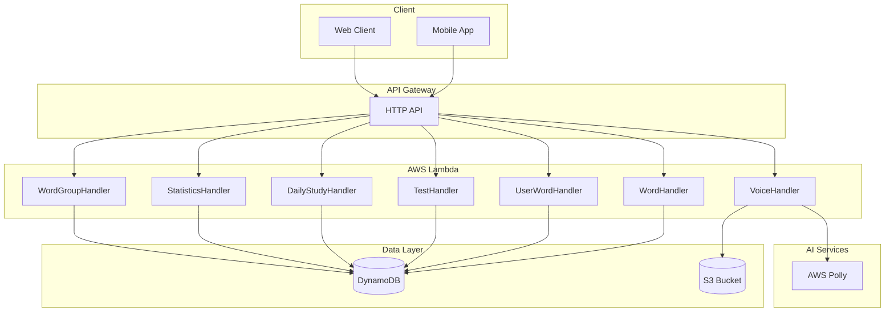

### 2.2 레이어 아키텍처

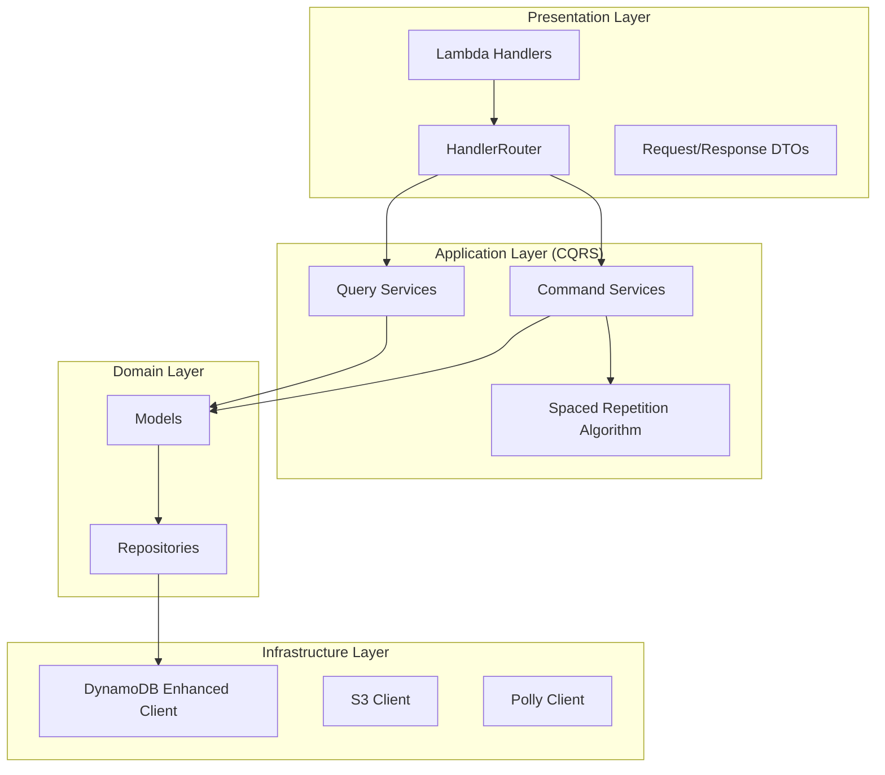

### 2.3 단어 학습 흐름 (Spaced Repetition)

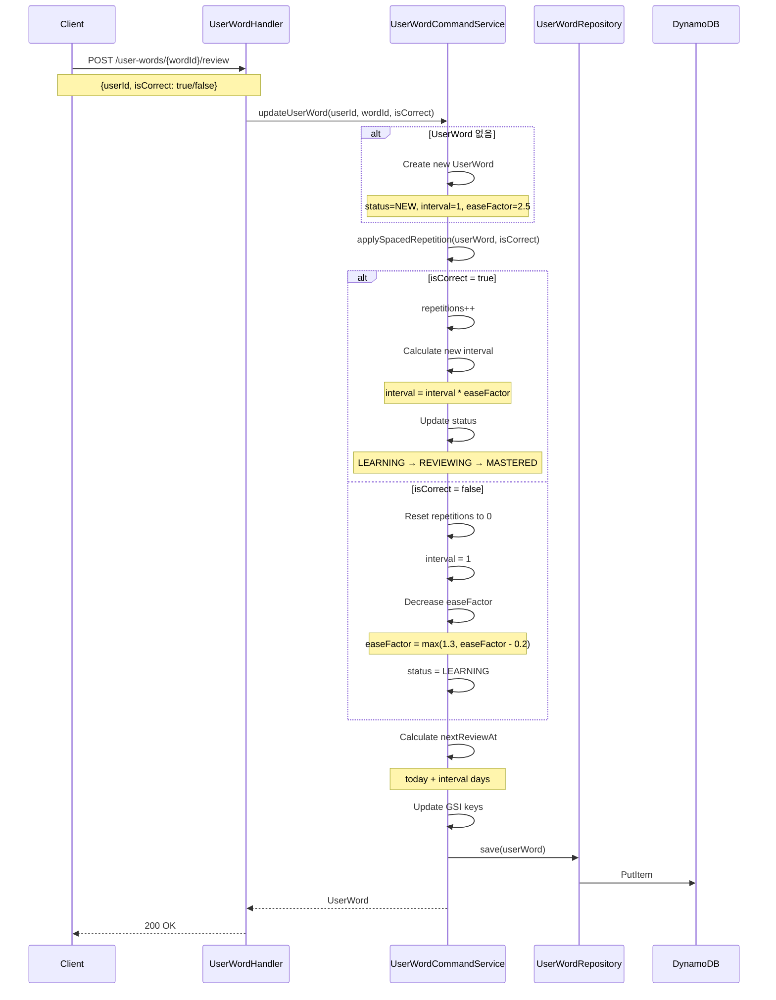

### 2.4 시험 흐름

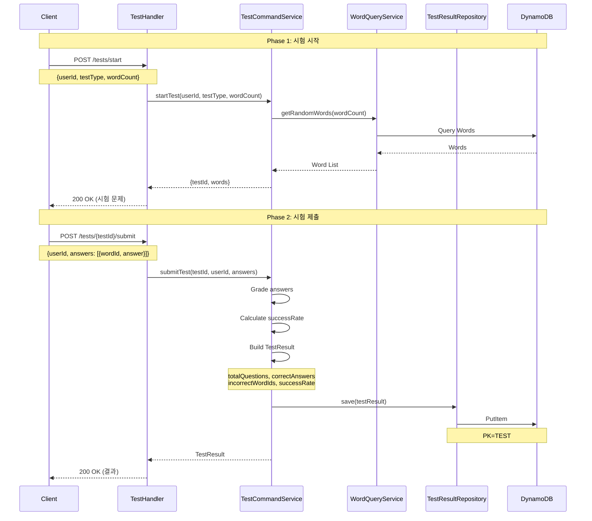

### 2.5 일일 학습 흐름

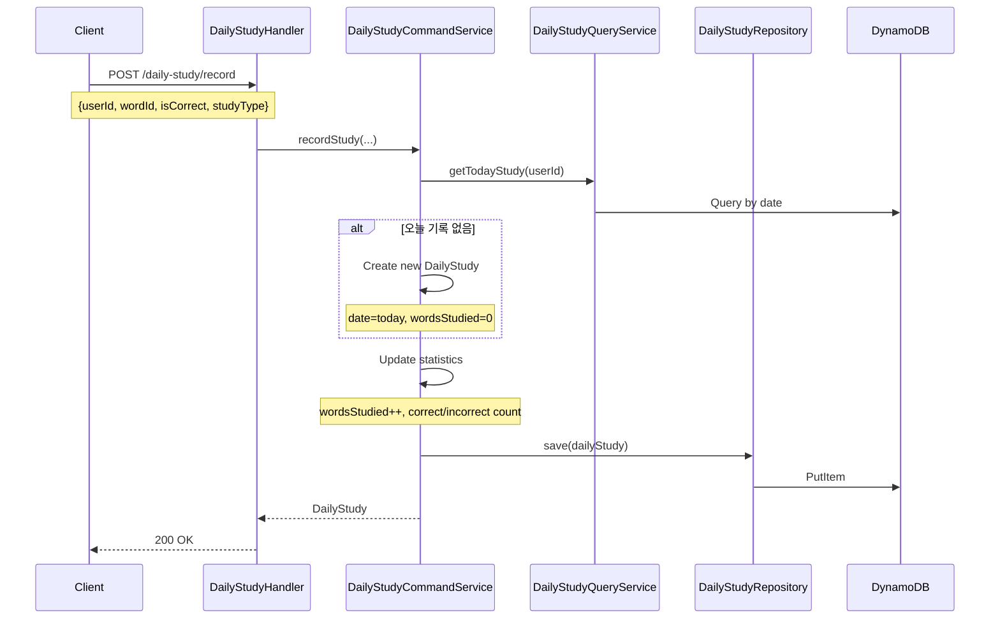

### 2.6 TTS 음성 생성 흐름

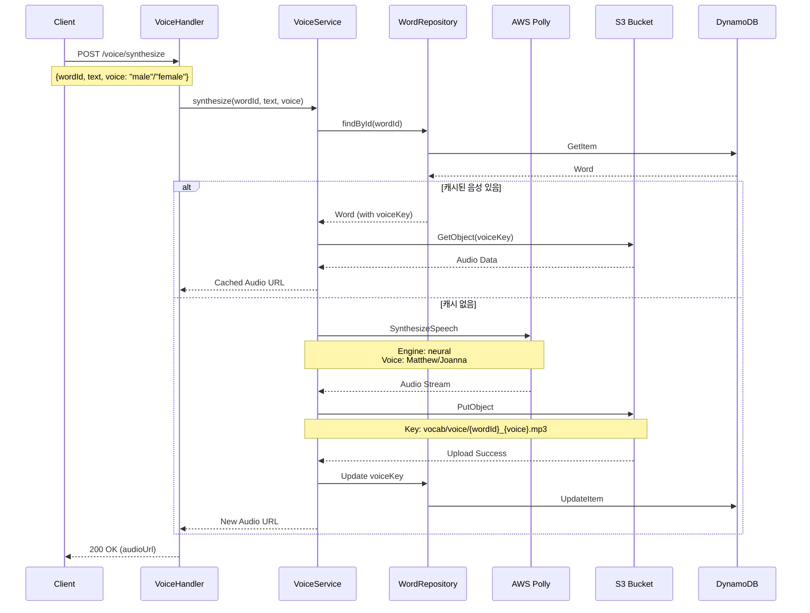

---

## 3. 데이터 모델

### 3.1 ERD (DynamoDB Single Table Design)

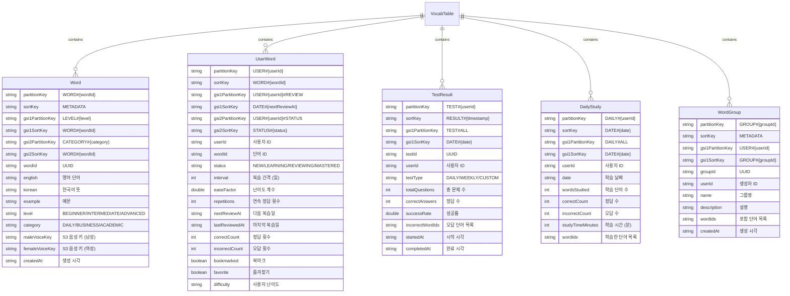

### 3.2 테이블 상세

#### Word (단어)

| 필드 | 타입 | 필수 | 설명 |
|------|------|------|------|
| PK | String | Y | WORD#{wordId} |
| SK | String | Y | METADATA |
| GSI1PK | String | Y | LEVEL#{level} |
| GSI1SK | String | Y | WORD#{wordId} |
| GSI2PK | String | Y | CATEGORY#{category} |
| GSI2SK | String | Y | WORD#{wordId} |
| wordId | String | Y | UUID |
| english | String | Y | 영어 단어 |
| korean | String | Y | 한국어 뜻 |
| example | String | N | 예문 |
| level | String | Y | BEGINNER, INTERMEDIATE, ADVANCED |
| category | String | Y | DAILY, BUSINESS, ACADEMIC |
| maleVoiceKey | String | N | S3 음성 파일 키 (남성) |
| femaleVoiceKey | String | N | S3 음성 파일 키 (여성) |
| maleExampleVoiceKey | String | N | S3 예문 음성 키 (남성) |
| femaleExampleVoiceKey | String | N | S3 예문 음성 키 (여성) |
| createdAt | String | Y | ISO 8601 형식 |

#### UserWord (사용자 학습 상태)

| 필드 | 타입 | 필수 | 설명 |
|------|------|------|------|
| PK | String | Y | USER#{userId} |
| SK | String | Y | WORD#{wordId} |
| GSI1PK | String | Y | USER#{userId}#REVIEW |
| GSI1SK | String | Y | DATE#{nextReviewAt} |
| GSI2PK | String | Y | USER#{userId}#STATUS |
| GSI2SK | String | Y | STATUS#{status} |
| userId | String | Y | 사용자 ID |
| wordId | String | Y | 단어 ID |
| status | String | Y | NEW, LEARNING, REVIEWING, MASTERED |
| interval | Integer | Y | 복습 간격 (일) |
| easeFactor | Double | Y | 난이도 계수 (기본: 2.5) |
| repetitions | Integer | Y | 연속 정답 횟수 |
| nextReviewAt | String | N | 다음 복습 예정일 |
| lastReviewedAt | String | N | 마지막 복습일 |
| correctCount | Integer | Y | 총 정답 횟수 |
| incorrectCount | Integer | Y | 총 오답 횟수 |
| bookmarked | Boolean | N | 북마크 여부 |
| favorite | Boolean | N | 즐겨찾기 여부 |
| difficulty | String | N | EASY, NORMAL, HARD |
| createdAt | String | Y | 생성 시각 |
| updatedAt | String | Y | 수정 시각 |

#### TestResult (시험 결과)

| 필드 | 타입 | 필수 | 설명 |
|------|------|------|------|
| PK | String | Y | TEST#{userId} |
| SK | String | Y | RESULT#{timestamp} |
| GSI1PK | String | Y | TEST#ALL |
| GSI1SK | String | Y | DATE#{date} |
| testId | String | Y | UUID |
| userId | String | Y | 사용자 ID |
| testType | String | Y | DAILY, WEEKLY, CUSTOM |
| totalQuestions | Integer | Y | 총 문제 수 |
| correctAnswers | Integer | Y | 정답 수 |
| incorrectAnswers | Integer | Y | 오답 수 |
| successRate | Double | Y | 성공률 (%) |
| incorrectWordIds | List | N | 오답 단어 ID 목록 |
| startedAt | String | Y | 시험 시작 시각 |
| completedAt | String | Y | 시험 완료 시각 |

### 3.3 Spaced Repetition 알고리즘

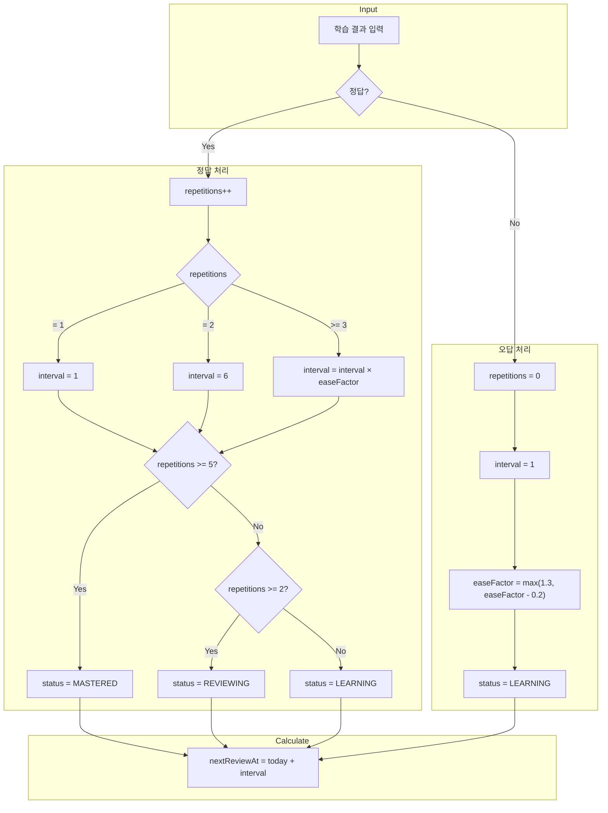

### 3.4 학습 상태 전이

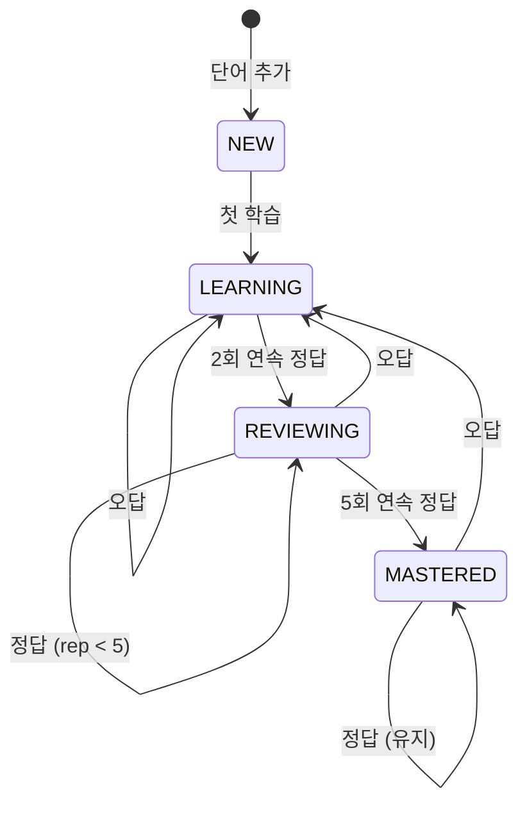

---

## 4. API 명세

### 4.1 단어 생성

#### POST /words

**Request**

```json
{
  "english": "perseverance",
  "korean": "인내, 끈기",
  "example": "Success requires perseverance.",
  "level": "ADVANCED",
  "category": "DAILY"
}
```

**Response (201 Created)**

```json
{
  "success": true,
  "message": "Word created",
  "data": {
    "wordId": "550e8400-e29b-41d4-a716-446655440000",
    "english": "perseverance",
    "korean": "인내, 끈기",
    "example": "Success requires perseverance.",
    "level": "ADVANCED",
    "category": "DAILY",
    "createdAt": "2026-01-09T10:00:00Z"
  }
}
```

### 4.2 단어 목록 조회

#### GET /words

**Query Parameters**

| 파라미터 | 타입 | 필수 | 설명 |
|---------|------|------|------|
| level | String | N | 난이도 필터 |
| category | String | N | 카테고리 필터 |
| cursor | String | N | 페이징 커서 |
| limit | Integer | N | 페이지 크기 (기본: 20, 최대: 50) |

**Response (200 OK)**

```json
{
  "success": true,
  "message": "Words retrieved",
  "data": {
    "words": [
      {
        "wordId": "...",
        "english": "perseverance",
        "korean": "인내, 끈기",
        "level": "ADVANCED",
        "category": "DAILY"
      }
    ],
    "nextCursor": "eyJQSyI6IldPUkQjLi4uIn0=",
    "hasMore": true
  }
}
```

### 4.3 단어 검색

#### GET /words/search

**Query Parameters**

| 파라미터 | 타입 | 필수 | 설명 |
|---------|------|------|------|
| q | String | Y | 검색어 (영어/한국어) |
| cursor | String | N | 페이징 커서 |
| limit | Integer | N | 페이지 크기 (기본: 20) |

**Response (200 OK)**

```json
{
  "success": true,
  "message": "Search completed",
  "data": {
    "words": [...],
    "query": "perseverance",
    "nextCursor": "...",
    "hasMore": false
  }
}
```

### 4.4 배치 단어 생성

#### POST /words/batch

**Request**

```json
{
  "words": [
    {
      "english": "apple",
      "korean": "사과",
      "level": "BEGINNER",
      "category": "DAILY"
    },
    {
      "english": "banana",
      "korean": "바나나",
      "level": "BEGINNER",
      "category": "DAILY"
    }
  ]
}
```

**Response (201 Created)**

```json
{
  "success": true,
  "message": "Batch completed",
  "data": {
    "successCount": 2,
    "failCount": 0,
    "totalRequested": 2
  }
}
```

### 4.5 배치 단어 조회

#### POST /words/batch/get

**Request**

```json
{
  "wordIds": [
    "word-id-1",
    "word-id-2",
    "word-id-3"
  ]
}
```

**Response (200 OK)**

```json
{
  "success": true,
  "message": "Words retrieved",
  "data": {
    "words": [...],
    "requestedCount": 3,
    "retrievedCount": 3
  }
}
```

**제한**: 최대 100개 ID

### 4.6 사용자 단어 학습 업데이트

#### POST /user-words/{wordId}/review

**Request**

```json
{
  "userId": "user123",
  "isCorrect": true
}
```

**Response (200 OK)**

```json
{
  "success": true,
  "message": "Updated user word",
  "data": {
    "userId": "user123",
    "wordId": "word-id-1",
    "status": "REVIEWING",
    "interval": 6,
    "easeFactor": 2.5,
    "repetitions": 2,
    "nextReviewAt": "2026-01-15",
    "lastReviewedAt": "2026-01-09T10:00:00Z",
    "correctCount": 5,
    "incorrectCount": 1
  }
}
```

### 4.7 사용자 단어 태그 업데이트

#### PATCH /user-words/{wordId}/tag

**Request**

```json
{
  "userId": "user123",
  "bookmarked": true,
  "favorite": false,
  "difficulty": "HARD"
}
```

**Response (200 OK)**

```json
{
  "success": true,
  "message": "Updated user word tag",
  "data": {
    "userId": "user123",
    "wordId": "word-id-1",
    "bookmarked": true,
    "favorite": false,
    "difficulty": "HARD"
  }
}
```

### 4.8 복습 예정 단어 조회

#### GET /user-words/review

**Query Parameters**

| 파라미터 | 타입 | 필수 | 설명 |
|---------|------|------|------|
| userId | String | Y | 사용자 ID |
| date | String | N | 조회 날짜 (기본: 오늘) |
| cursor | String | N | 페이징 커서 |
| limit | Integer | N | 페이지 크기 |

**Response (200 OK)**

```json
{
  "success": true,
  "message": "Review words retrieved",
  "data": {
    "words": [
      {
        "wordId": "...",
        "english": "perseverance",
        "korean": "인내, 끈기",
        "status": "REVIEWING",
        "nextReviewAt": "2026-01-09"
      }
    ],
    "nextCursor": "...",
    "hasMore": true
  }
}
```

### 4.9 시험 시작

#### POST /tests/start

**Request**

```json
{
  "userId": "user123",
  "testType": "DAILY",
  "wordCount": 20,
  "level": "INTERMEDIATE"
}
```

**Response (200 OK)**

```json
{
  "success": true,
  "message": "Test started",
  "data": {
    "testId": "test-uuid",
    "testType": "DAILY",
    "words": [
      {
        "wordId": "...",
        "english": "perseverance",
        "options": ["인내", "용기", "지혜", "성실"]
      }
    ],
    "startedAt": "2026-01-09T10:00:00Z"
  }
}
```

### 4.10 시험 제출

#### POST /tests/{testId}/submit

**Request**

```json
{
  "userId": "user123",
  "answers": [
    {"wordId": "word-1", "answer": "인내"},
    {"wordId": "word-2", "answer": "용기"}
  ]
}
```

**Response (200 OK)**

```json
{
  "success": true,
  "message": "Test submitted",
  "data": {
    "testId": "test-uuid",
    "totalQuestions": 20,
    "correctAnswers": 18,
    "incorrectAnswers": 2,
    "successRate": 90.0,
    "incorrectWordIds": ["word-5", "word-12"],
    "completedAt": "2026-01-09T10:15:00Z"
  }
}
```

### 4.11 일일 학습 기록

#### POST /daily-study/record

**Request**

```json
{
  "userId": "user123",
  "wordId": "word-id-1",
  "isCorrect": true,
  "studyType": "REVIEW"
}
```

**Response (200 OK)**

```json
{
  "success": true,
  "message": "Study recorded",
  "data": {
    "userId": "user123",
    "date": "2026-01-09",
    "wordsStudied": 15,
    "correctCount": 12,
    "incorrectCount": 3
  }
}
```

### 4.12 학습 통계 조회

#### GET /statistics

**Query Parameters**

| 파라미터 | 타입 | 필수 | 설명 |
|---------|------|------|------|
| userId | String | Y | 사용자 ID |
| period | String | N | WEEK, MONTH, ALL (기본: WEEK) |

**Response (200 OK)**

```json
{
  "success": true,
  "message": "Statistics retrieved",
  "data": {
    "totalWords": 150,
    "masteredWords": 45,
    "learningWords": 80,
    "newWords": 25,
    "averageSuccessRate": 85.5,
    "studyStreak": 7,
    "dailyStats": [
      {"date": "2026-01-09", "wordsStudied": 20, "successRate": 90.0}
    ]
  }
}
```

### 4.13 음성 합성

#### POST /voice/synthesize

**Request**

```json
{
  "wordId": "word-id-1",
  "text": "perseverance",
  "voice": "male",
  "type": "word"
}
```

**Response (200 OK)**

```json
{
  "success": true,
  "message": "Voice synthesized",
  "data": {
    "audioUrl": "https://s3.amazonaws.com/bucket/vocab/voice/word-id-1_male.mp3",
    "cached": true
  }
}
```

---

## 5. 비즈니스 규칙

### 5.1 Spaced Repetition 규칙

| 조건 | interval 계산 | status 변경 |
|------|--------------|-------------|
| 첫 정답 (rep=1) | 1일 | LEARNING |
| 두번째 정답 (rep=2) | 6일 | REVIEWING |
| 이후 정답 (rep>=3) | interval × easeFactor | REVIEWING |
| 5회 연속 정답 | 유지 | MASTERED |
| 오답 | 1일 (리셋) | LEARNING |

### 5.2 easeFactor 규칙

| 조건 | easeFactor 변경 |
|------|-----------------|
| 초기값 | 2.5 |
| 오답 시 | max(1.3, easeFactor - 0.2) |
| 정답 시 | 유지 |

### 5.3 난이도별 카테고리

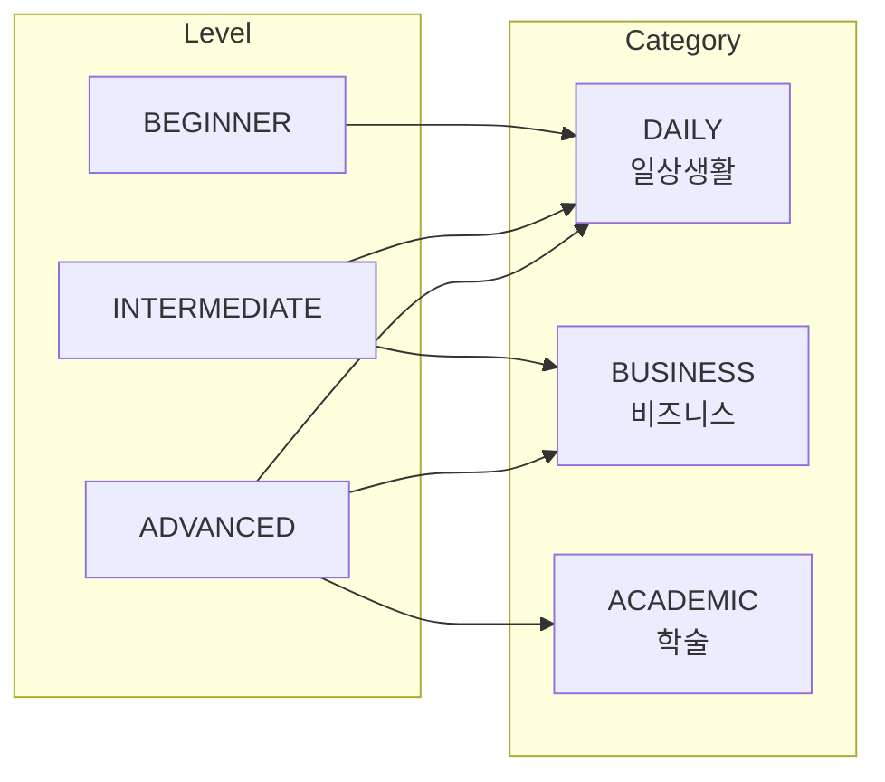

### 5.4 제한 사항

| 항목 | 제한 |
|------|------|
| 단어 목록 페이지 크기 | 최대 50 |
| 배치 조회 ID | 최대 100개 |
| 시험 문제 수 | 최소 5, 최대 50 |
| 사용자 난이도 | EASY, NORMAL, HARD |

---

## 6. 에러 코드

### 6.1 HTTP 에러

| HTTP Code | 설명 | 예시 |
|-----------|------|------|
| 400 | 잘못된 요청 | 필수 파라미터 누락, 잘못된 difficulty 값 |
| 404 | 리소스 없음 | 존재하지 않는 단어 |
| 500 | 서버 오류 | 내부 오류 |

### 6.2 에러 응답 형식

```json
{
  "success": false,
  "error": "Word not found"
}
```

---

## 7. 환경 설정

### 7.1 환경 변수 (template.yaml)

```yaml
Environment:
  Variables:
    VOCAB_TABLE_NAME: VocabTable
    VOCAB_BUCKET_NAME: group2-englishstudy
    AWS_REGION_NAME: ap-northeast-2
```

### 7.2 DynamoDB 테이블 설정

```yaml
VocabTable:
  Type: AWS::DynamoDB::Table
  Properties:
    TableName: VocabTable
    BillingMode: PAY_PER_REQUEST
    AttributeDefinitions:
      - AttributeName: PK
        AttributeType: S
      - AttributeName: SK
        AttributeType: S
      - AttributeName: GSI1PK
        AttributeType: S
      - AttributeName: GSI1SK
        AttributeType: S
      - AttributeName: GSI2PK
        AttributeType: S
      - AttributeName: GSI2SK
        AttributeType: S
    KeySchema:
      - AttributeName: PK
        KeyType: HASH
      - AttributeName: SK
        KeyType: RANGE
    GlobalSecondaryIndexes:
      - IndexName: GSI1
        KeySchema:
          - AttributeName: GSI1PK
            KeyType: HASH
          - AttributeName: GSI1SK
            KeyType: RANGE
        Projection:
          ProjectionType: ALL
      - IndexName: GSI2
        KeySchema:
          - AttributeName: GSI2PK
            KeyType: HASH
          - AttributeName: GSI2SK
            KeyType: RANGE
        Projection:
          ProjectionType: ALL
    TimeToLiveSpecification:
      AttributeName: ttl
      Enabled: true
```

### 7.3 S3 버킷 구조

```
group2-englishstudy/
└── vocab/
    └── voice/
        ├── {wordId}_male.mp3
        ├── {wordId}_female.mp3
        ├── {wordId}_male_example.mp3
        └── {wordId}_female_example.mp3
```

---

## 8. 프로젝트 구조

```
domain/vocabulary/
├── handler/
│   ├── WordHandler.java            # 단어 CRUD
│   ├── UserWordHandler.java        # 사용자 학습 상태
│   ├── TestHandler.java            # 시험 기능
│   ├── DailyStudyHandler.java      # 일일 학습
│   ├── StatisticsHandler.java      # 통계
│   ├── StatsHandler.java           # 간단 통계
│   ├── VoiceHandler.java           # TTS
│   └── WordGroupHandler.java       # 단어 그룹
│
├── service/
│   ├── WordCommandService.java     # 단어 변경 (CQRS)
│   ├── WordQueryService.java       # 단어 조회 (CQRS)
│   ├── WordService.java            # 단어 통합 서비스
│   ├── UserWordCommandService.java # 사용자 학습 변경
│   ├── UserWordQueryService.java   # 사용자 학습 조회
│   ├── UserWordService.java        # 사용자 학습 통합
│   ├── TestCommandService.java     # 시험 변경
│   ├── TestQueryService.java       # 시험 조회
│   ├── TestService.java            # 시험 통합
│   ├── DailyStudyCommandService.java # 일일학습 변경
│   ├── DailyStudyQueryService.java   # 일일학습 조회
│   ├── DailyStudyService.java        # 일일학습 통합
│   ├── WordGroupCommandService.java  # 그룹 변경
│   ├── WordGroupQueryService.java    # 그룹 조회
│   ├── StatisticsService.java        # 통계
│   └── StatsService.java             # 간단 통계
│
├── repository/
│   ├── WordRepository.java         # 단어 데이터 접근
│   ├── UserWordRepository.java     # 사용자 학습 데이터 접근
│   ├── TestResultRepository.java   # 시험 결과 데이터 접근
│   ├── DailyStudyRepository.java   # 일일 학습 데이터 접근
│   └── WordGroupRepository.java    # 그룹 데이터 접근
│
├── model/
│   ├── Word.java                   # 단어 엔티티
│   ├── UserWord.java               # 사용자 학습 엔티티
│   ├── TestResult.java             # 시험 결과 엔티티
│   ├── DailyStudy.java             # 일일 학습 엔티티
│   └── WordGroup.java              # 단어 그룹 엔티티
│
└── dto/
    └── request/
        ├── CreateWordRequest.java
        ├── CreateWordsBatchRequest.java
        ├── BatchGetWordsRequest.java
        ├── UpdateUserWordRequest.java
        ├── UpdateUserWordTagRequest.java
        ├── StartTestRequest.java
        ├── SubmitTestRequest.java
        ├── CreateWordGroupRequest.java
        └── SynthesizeVoiceRequest.java
```

---

## 9. GSI 사용 패턴

### 9.1 Word GSI

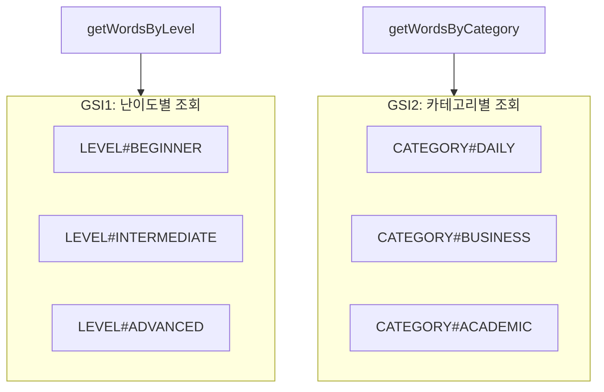

### 9.2 UserWord GSI

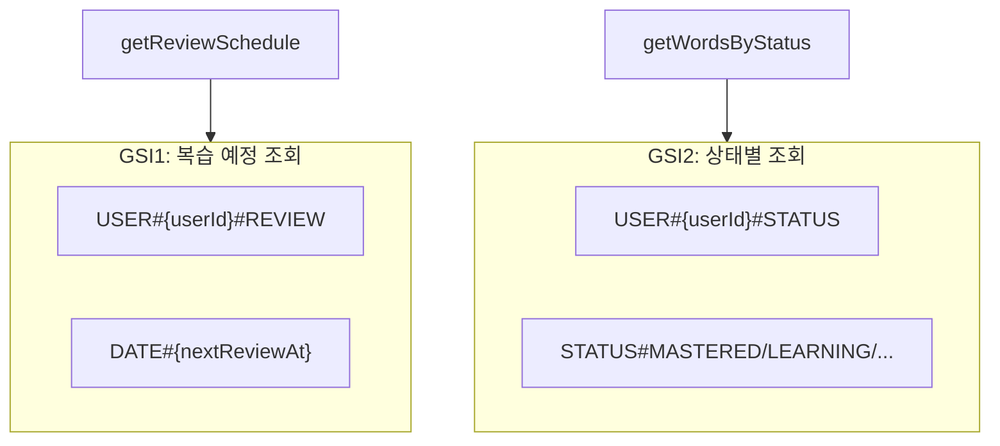

---

## 10. 구현 현황

### Phase 1 - 핵심 기능 (완료)

- [x] 단어 CRUD
- [x] 배치 생성/조회
- [x] 단어 검색
- [x] CQRS 패턴 적용
- [x] 커서 기반 페이징

### Phase 2 - 학습 기능 (완료)

- [x] Spaced Repetition 알고리즘
- [x] UserWord 상태 관리
- [x] 복습 예정 조회
- [x] 북마크/즐겨찾기

### Phase 3 - 시험/통계 (완료)

- [x] 시험 시작/제출
- [x] 시험 결과 저장
- [x] 일일 학습 기록
- [x] 학습 통계

### Phase 4 - 고급 기능 (완료)

- [x] TTS (AWS Polly)
- [x] 음성 캐싱 (S3)
- [x] 단어 그룹

### Phase 5 - 최적화 (진행 중)

- [ ] 복습 알림 (SNS)
- [ ] 성취 배지
- [ ] 랭킹 시스템

---

**버전**: 1.0.0
**최종 업데이트**: 2026-01-09
**팀**: MZC 2nd Project Team
